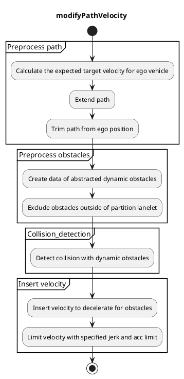
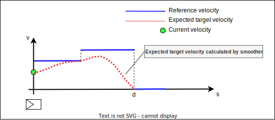
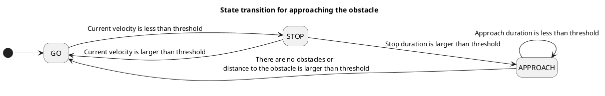

## Run Out

### Role

`run_out` is the module that decelerates and stops for dynamic obstacles such as pedestrians and bicycles.

### Activation Timing

This module is activated if `launch_run_out` becomes true

### Inner-workings / Algorithms

#### Flow chart

#### Preprocess path

##### Calculate the expected target velocity for ego vehicle

Calculate the expected target velocity for the ego vehicle path to calculate time to collision with obstacles more precisely.
The expected target velocity is calculated with [motion velocity smoother module](https://github.com/autowarefoundation/autoware.universe/tree/main/planning/motion_velocity_smoother) by using current velocity, current acceleration and velocity limits directed by the map and external API.

##### Extend the path

The path is extended by the length of base link to front to consider obstacles after the goal.

##### Trim path from ego position

The path is trimmed from ego position to a certain distance to reduce calculation time.
Trimmed distance is specified by parameter of `detection_distance`.

#### Preprocess obstacles

##### Create data of abstracted dynamic obstacle

This module can handle multiple types of obstacles by creating abstracted dynamic obstacle data layer. Currently we have 3 types of detection method (Object, ObjectWithoutPath, Points) to create abstracted obstacle data.

###### Abstracted dynamic obstacle

Abstracted obstacle data has following information.

| Name             | Type                                                                    | Description                                                                                                            |
| ---------------- | ----------------------------------------------------------------------- | ---------------------------------------------------------------------------------------------------------------------- |
| pose             | `geometry_msgs::msg::Pose`                                              | pose of the obstacle                                                                                                   |
| classifications  | `std::vector<autoware_auto_perception_msgs::msg::ObjectClassification>` | classifications with probability                                                                                       |
| shape            | `autoware_auto_perception_msgs::msg::Shape`                             | shape of the obstacle                                                                                                  |
| predicted_paths  | `std::vector<DynamicObstacle::PredictedPath>`                           | predicted paths with confidence. this data doesn't have time step because we use minimum and maximum velocity instead. |
| min_velocity_mps | `float`                                                                 | minimum velocity of the obstacle. specified by parameter of `dynamic_obstacle.min_vel_kmph`                            |
| max_velocity_mps | `float`                                                                 | maximum velocity of the obstacle. specified by parameter of `dynamic_obstacle.max_vel_kmph`                            |

Enter the maximum/minimum velocity of the object as a parameter, adding enough margin to the expected velocity. This parameter is used to create polygons for [collision detection](.#Collision-detection).

Future work: Determine the maximum/minimum velocity from the estimated velocity with covariance of the object

###### 3 types of detection method

We have 3 types of detection method to meet different safety and availability requirements. The characteristics of them are shown in the table below.
Method of `Object` has high availability (less false positive) because it detects only objects whose predicted path is on the lane. However, sometimes it is not safe because perception may fail to detect obstacles or generate incorrect predicted paths.
On the other hand, method of `Points` has high safety (less false negative) because it uses pointcloud as input. Since points don't have a predicted path, the path that moves in the direction normal to the path of ego vehicle is considered to be the predicted path of abstracted dynamic obstacle data. However, without proper adjustment of filter of points, it may detect a lot of points and it will result in very low availability.
Method of `ObjectWithoutPath` has the characteristics of an intermediate of `Object` and `Points`.

| Method            | Description                                                                                                                                                           |
| ----------------- | --------------------------------------------------------------------------------------------------------------------------------------------------------------------- |
| Object            | use an object with the predicted path for collision detection.                                                                                                        |
| ObjectWithoutPath | use an object but not use the predicted path for collision detection. replace the path assuming that an object jumps out to the lane at specified velocity.           |
| Points            | use filtered points for collision detection. the path is created assuming that points jump out to the lane. points are regarded as an small circular shaped obstacle. |

##### Exclude obstacles outside of partition

This module can exclude the obstacles outside of partition such as guardrail, fence, and wall.
We need lanelet map that has the information of partition to use this feature.
By this feature, we can reduce unnecessary deceleration by obstacles that are unlikely to jump out to the lane.
You can choose whether to use this feature by parameter of `use_partition_lanelet`.

#### Collision detection

##### Detect collision with dynamic obstacles

Along the ego vehicle path, determine the points where collision detection is to be performed for each `detection_span`.

The travel times to the each points are calculated from [the expected target velocity](.#Calculate-the-expected-target-velocity-for-ego-vehicle).

For the each points, collision detection is performed using the footprint polygon of the ego vehicle and the polygon of the predicted location of the obstacles.
The predicted location of the obstacles is described as rectangle or polygon that has the range calculated by min velocity, max velocity and the ego vehicle's travel time to the point.
If the input type of the dynamic obstacle is `Points`, the obstacle shape is defined as a small cylinder.

Multiple points are detected as collision points because collision detection is calculated between two polygons.
So we select the point that is on the same side as the obstacle and close to ego vehicle as the collision point.

#### Insert velocity

##### Insert velocity to decelerate for obstacles

If the collision is detected, stop point is inserted on distance of base link to front + stop margin from the selected collision point. The base link to front means the distance between base_link (center of rear-wheel axis) and front of the car. Stop margin is determined by the parameter of `stop_margin`.

#### Insert velocity to approach the obstacles

If you select the method of `Points` or `ObjectWithoutPath`, sometimes ego keeps stopping in front of the obstacle.
To avoid this problem, This feature has option to approach the obstacle with slow velocity after stopping.
If the parameter of `approaching.enable` is set to true, ego will approach the obstacle after ego stopped for `state.stop_time_thresh` seconds.
The maximum velocity of approaching can be specified by the parameter of `approaching.limit_vel_kmph`.
The decision to approach the obstacle is determined by a simple state transition as following image.

##### Limit velocity with specified jerk and acc limit

The maximum slowdown velocity is calculated in order not to slowdown too much.
See the [Occlusion Spot document](../behavior_velocity_occlusion_spot_module/#maximum-slowdown-velocity) for more details.
You can choose whether to use this feature by parameter of `slow_down_limit.enable`.

### Module Parameters

| Parameter               | Type   | Description                                                                                                              |
| ----------------------- | ------ | ------------------------------------------------------------------------------------------------------------------------ |
| `detection_method`      | string | [-] candidate: Object, ObjectWithoutPath, Points                                                                         |
| `use_partition_lanelet` | bool   | [-] whether to use partition lanelet map data                                                                            |
| `specify_decel_jerk`    | bool   | [-] whether to specify jerk when ego decelerates                                                                         |
| `stop_margin`           | double | [m] the vehicle decelerates to be able to stop with this margin                                                          |
| `passing_margin`        | double | [m] the vehicle begins to accelerate if the vehicle's front in predicted position is ahead of the obstacle + this margin |
| `deceleration_jerk`     | double | [m/s^3] ego decelerates with this jerk when stopping for obstacles                                                       |
| `detection_distance`    | double | [m] ahead distance from ego to detect the obstacles                                                                      |
| `detection_span`        | double | [m] calculate collision with this span to reduce calculation time                                                        |
| `min_vel_ego_kmph`      | double | [km/h] min velocity to calculate time to collision                                                                       |

| Parameter /detection_area | Type   | Description                                  |
| ------------------------- | ------ | -------------------------------------------- |
| `margin_ahead`            | double | [m] ahead margin for detection area polygon  |
| `margin_behind`           | double | [m] behind margin for detection area polygon |

| Parameter /dynamic_obstacle          | Type   | Description                                                                                                                   |
| ------------------------------------ | ------ | ----------------------------------------------------------------------------------------------------------------------------- |
| `use_mandatory_area`                 | double | [-] whether to use mandatory detection area                                                                                   |
| `assume_fixed_velocity.enable`       | double | [-] If enabled, the obstacle's velocity is assumed to be within the minimum and maximum velocity values specified below       |
| `assume_fixed_velocity.min_vel_kmph` | double | [km/h] minimum velocity for dynamic obstacles                                                                                 |
| `assume_fixed_velocity.max_vel_kmph` | double | [km/h] maximum velocity for dynamic obstacles                                                                                 |
| `diameter`                           | double | [m] diameter of obstacles. used for creating dynamic obstacles from points                                                    |
| `height`                             | double | [m] height of obstacles. used for creating dynamic obstacles from points                                                      |
| `max_prediction_time`                | double | [sec] create predicted path until this time                                                                                   |
| `time_step`                          | double | [sec] time step for each path step. used for creating dynamic obstacles from points or objects without path                   |
| `points_interval`                    | double | [m] divide obstacle points into groups with this interval, and detect only lateral nearest point. used only for Points method |

| Parameter /approaching | Type   | Description                                           |
| ---------------------- | ------ | ----------------------------------------------------- |
| `enable`               | bool   | [-] whether to enable approaching after stopping      |
| `margin`               | double | [m] distance on how close ego approaches the obstacle |
| `limit_vel_kmph`       | double | [km/h] limit velocity for approaching after stopping  |

| Parameter /state         | Type   | Description                                                                         |
| ------------------------ | ------ | ----------------------------------------------------------------------------------- |
| `stop_thresh`            | double | [m/s] threshold to decide if ego is stopping                                        |
| `stop_time_thresh`       | double | [sec] threshold for stopping time to transit to approaching state                   |
| `disable_approach_dist`  | double | [m] end the approaching state if distance to the obstacle is longer than this value |
| `keep_approach_duration` | double | [sec] keep approach state for this duration to avoid chattering of state transition |

| Parameter /slow_down_limit | Type   | Description                                                   |
| -------------------------- | ------ | ------------------------------------------------------------- |
| `enable`                   | bool   | [-] whether to enable to limit velocity with max jerk and acc |
| `max_jerk`                 | double | [m/s^3] minimum jerk deceleration for safe brake.             |
| `max_acc`                  | double | [m/s^2] minimum accel deceleration for safe brake.            |

| Parameter /ignore_momentary_detection | Type   | Description                                                       |
| ------------------------------------- | ------ | ----------------------------------------------------------------- |
| `enable`                              | bool   | [-] whether to ignore momentary detection                         |
| `time_threshold`                      | double | [sec] ignores detections that persist for less than this duration |

### Future extensions / Unimplemented parts

- Calculate obstacle's min velocity and max velocity from covariance
- Detect collisions with polygon object
- Handle the case when the predicted path of obstacles are not straight line
  - Currently collision check is calculated based on the assumption that the predicted path of the obstacle is a straight line
