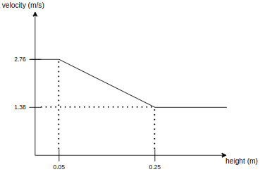

## Speed Bump

### Role

This module plans the velocity of the related part of the path in case there is speed bump
regulatory element referring to it.

### Activation Timing

The manager launch speed bump scene module when there is speed bump regulatory element referring to
the reference path.

### Module Parameters

| Parameter           | Type   | Description                                               |
| ------------------- | ------ | --------------------------------------------------------- |
| `slow_start_margin` | double | [m] margin for ego vehicle to slow down before speed_bump |
| `slow_end_margin`   | double | [m] margin for ego vehicle to accelerate after speed_bump |
| `print_debug_info`  | bool   | whether debug info will be printed or not                 |

#### Speed Calculation

- limits for speed bump height and slow down speed to create a linear equation

| Parameter    | Type   | Description                                       |
| ------------ | ------ | ------------------------------------------------- |
| `min_height` | double | [m] minimum height assumption of the speed bump   |
| `max_height` | double | [m] maximum height assumption of the speed bump   |
| `min_speed`  | double | [m/s] minimum speed assumption of slow down speed |
| `max_speed`  | double | [m/s] maximum speed assumption of slow down speed |

### Inner-workings / Algorithms

- Get speed bump regulatory element on the path from lanelet2 map
- Calculate `slow_down_speed` wrt to `speed_bump_height` specified in regulatory element or
  read `slow_down_speed` tag from speed bump annotation if available

**Note:** If in speed bump annotation `slow_down_speed` tag is used then calculating the speed wrt
the speed bump height will be ignored. In such case, specified `slow_down_speed` value in **[kph]**
is being used.

- Get the intersection points between path and speed bump polygon
- Calculate `slow_start_point` & `slow_end_point` wrt the intersection points and insert them to
  path
- If `slow_start_point` or `slow_end_point` can not be inserted with given/calculated offset values
  check if any path point can be virtually assigned as `slow_start_point` or `slow_end_point`

- Assign `slow_down_speed` to the path points between `slow_start_point` or `slow_end_point`

### Future Work

- In an article [here](https://journals.sagepub.com/doi/10.1155/2014/736576), a bump modeling method
  is proposed. Simply it is based on fitting the bump in a circle and a radius calculation is done
  with it. Although the velocity calculation is based on just the height of the bump in the recent
  implementation, applying this method is intended in the future which will yield more realistic
  results.
