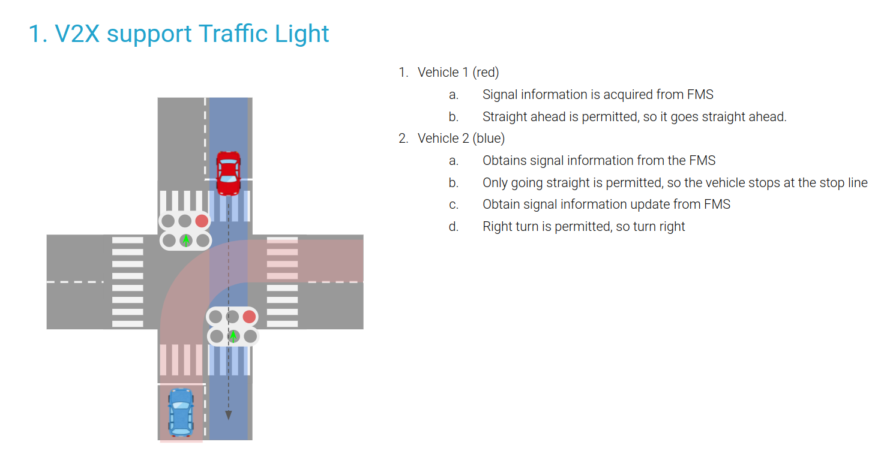
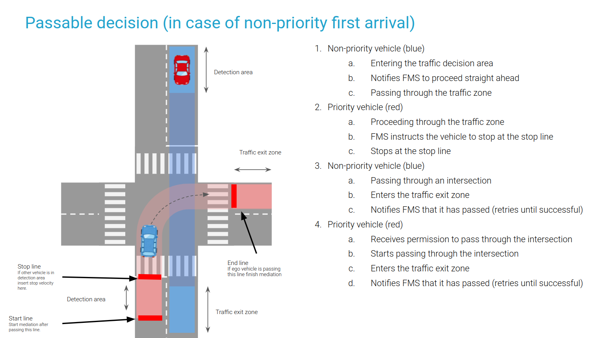
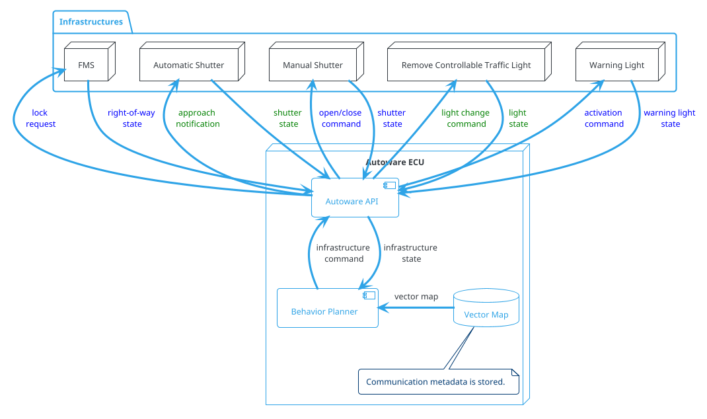
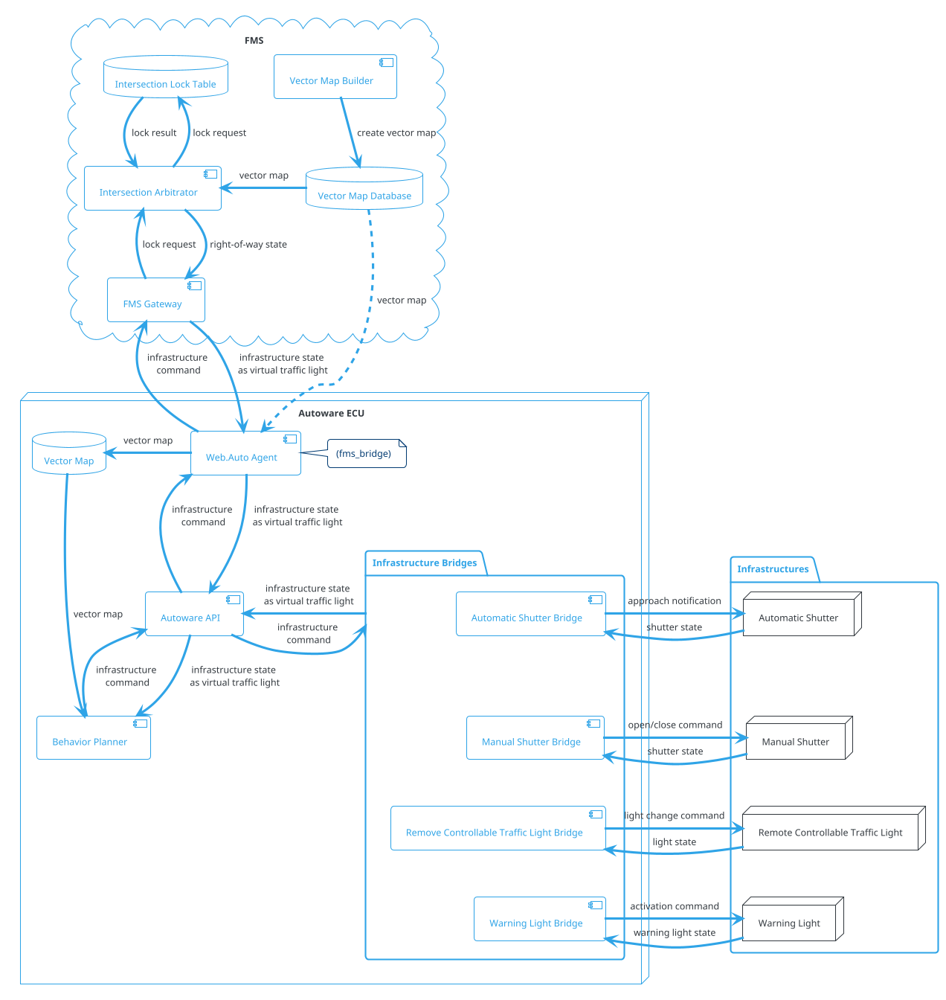
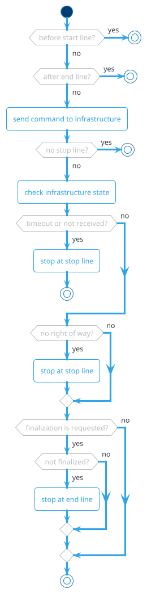

### Virtual Traffic Light

#### Role

Autonomous vehicles have to cooperate with the infrastructures such as:

- Warehouse shutters
- Traffic lights with V2X support
- Communication devices at intersections
- Fleet Management Systems (FMS)

The following items are example cases:

1. Traffic control by traffic lights with V2X support
   

2. Intersection coordination of multiple vehicles by FMS.
   

It's possible to make each function individually, however, the use cases can be generalized with these three elements.

1. `start`: Start a cooperation procedure after the vehicle enters a certain zone.
2. `stop`: Stop at a defined stop line according to the status received from infrastructures.
3. `end`: Finalize the cooperation procedure after the vehicle reaches the exit zone. This should be done within the range of stable communication.

This module sends/receives status from infrastructures and plans the velocity of the cooperation result.

### System Configuration Diagram

Planner and each infrastructure communicate with each other using common abstracted messages.

- Special handling for each infrastructure is not scalable. The interface is defined as an Autoware API.
- The requirements for each infrastructure are slightly different, but will be handled flexibly.

FMS: Intersection coordination when multiple vehicles are in operation and the relevant lane is occupied

- Automatic shutter: Open the shutter when approaching/close it when leaving
- Manual shutter: Have the driver open and close the shutter.
- Remote control signal: Have the driver change the signal status to match the direction of travel.
- Warning light: Activate the warning light

Support different communication methods for different infrastructures

- HTTP
- Bluetooth
- ZigBee

Have different meta-information for each geographic location

- Associated lane ID
- Hardware ID
- Communication method

FMS: Fleet Management System

#### Module Parameters

| Parameter                       | Type   | Description                                                           |
| ------------------------------- | ------ | --------------------------------------------------------------------- |
| `max_delay_sec`                 | double | [s] maximum allowed delay for command                                 |
| `near_line_distance`            | double | [m] threshold distance to stop line to check ego stop.                |
| `dead_line_margin`              | double | [m] threshold distance that this module continue to insert stop line. |
| `hold_stop_margin_distance`     | double | [m] parameter for restart prevention (See following section)          |
| `check_timeout_after_stop_line` | bool   | [-] check timeout to stop when linkage is disconnected                |

#### Restart prevention

If it needs X meters (e.g. 0.5 meters) to stop once the vehicle starts moving due to the poor vehicle control performance, the vehicle goes over the stopping position that should be strictly observed when the vehicle starts to moving in order to approach the near stop point (e.g. 0.3 meters away).

This module has parameter `hold_stop_margin_distance` in order to prevent from these redundant restart. If the vehicle is stopped within `hold_stop_margin_distance` meters from stop point of the module (\_front_to_stop_line < hold_stop_margin_distance), the module judges that the vehicle has already stopped for the module's stop point and plans to keep stopping current position even if the vehicle is stopped due to other factors.

<figure markdown>
  {width=1000}
  <figcaption>parameters</figcaption>
</figure>

<figure markdown>
  {width=1000}
  <figcaption>outside the hold_stop_margin_distance</figcaption>
</figure>

<figure markdown>
  {width=1000}
  <figcaption>inside the hold_stop_margin_distance</figcaption>
</figure>

#### Flowchart

#### Map Format

- To avoid sudden braking, the length between the start line and stop line of a virtual traffic light must be longer than $l_{\mathrm{min}}$ calculated as follows, assuming that $v_0$ is the velocity when passing the start line and $a_{\mathrm{min}}$ is minimum acceleration defined in Autoware.

$$
\begin{align}
l_{\mathrm{min}} = -\frac{v_0^2}{2 a_{\mathrm{min}}}
\end{align}
$$

#### Known Limits

- tbd.
