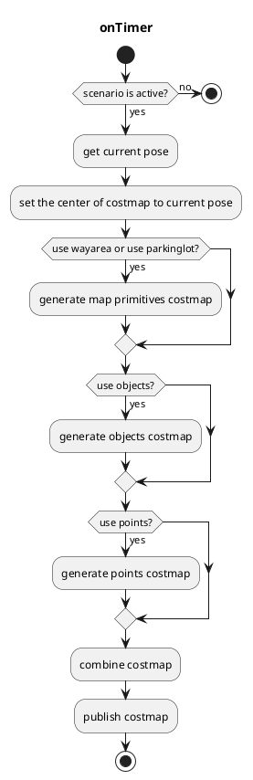

# costmap_generator

## costmap_generator_node

This node reads `PointCloud` and/or `DynamicObjectArray` and creates an `OccupancyGrid` and `GridMap`. `VectorMap(Lanelet2)` is optional.

### Input topics

| Name                      | Type                                            | Description                                                                  |
| ------------------------- | ----------------------------------------------- | ---------------------------------------------------------------------------- |
| `~input/objects`          | autoware_auto_perception_msgs::PredictedObjects | predicted objects, for obstacles areas                                       |
| `~input/points_no_ground` | sensor_msgs::PointCloud2                        | ground-removed points, for obstacle areas which can't be detected as objects |
| `~input/vector_map`       | autoware_auto_mapping_msgs::HADMapBin           | vector map, for drivable areas                                               |
| `~input/scenario`         | tier4_planning_msgs::Scenario                   | scenarios to be activated, for node activation                               |

### Output topics

| Name                     | Type                    | Description                                        |
| ------------------------ | ----------------------- | -------------------------------------------------- |
| `~output/grid_map`       | grid_map_msgs::GridMap  | costmap as GridMap, values are from 0.0 to 1.0     |
| `~output/occupancy_grid` | nav_msgs::OccupancyGrid | costmap as OccupancyGrid, values are from 0 to 100 |

### Output TFs

None

### How to launch

1. Execute the command `source install/setup.bash` to setup the environment

2. Run `ros2 launch costmap_generator costmap_generator.launch.xml` to launch the node

### Parameters

| Name                         | Type   | Description                                                                                    |
| ---------------------------- | ------ | ---------------------------------------------------------------------------------------------- |
| `update_rate`                | double | timer's update rate                                                                            |
| `activate_by_scenario`       | bool   | if true, activate by scenario = parking. Otherwise, activate if vehicle is inside parking lot. |
| `use_objects`                | bool   | whether using `~input/objects` or not                                                          |
| `use_points`                 | bool   | whether using `~input/points_no_ground` or not                                                 |
| `use_wayarea`                | bool   | whether using `wayarea` from `~input/vector_map` or not                                        |
| `use_parkinglot`             | bool   | whether using `parkinglot` from `~input/vector_map` or not                                     |
| `costmap_frame`              | string | created costmap's coordinate                                                                   |
| `vehicle_frame`              | string | vehicle's coordinate                                                                           |
| `map_frame`                  | string | map's coordinate                                                                               |
| `grid_min_value`             | double | minimum cost for gridmap                                                                       |
| `grid_max_value`             | double | maximum cost for gridmap                                                                       |
| `grid_resolution`            | double | resolution for gridmap                                                                         |
| `grid_length_x`              | int    | size of gridmap for x direction                                                                |
| `grid_length_y`              | int    | size of gridmap for y direction                                                                |
| `grid_position_x`            | int    | offset from coordinate in x direction                                                          |
| `grid_position_y`            | int    | offset from coordinate in y direction                                                          |
| `maximum_lidar_height_thres` | double | maximum height threshold for pointcloud data                                                   |
| `minimum_lidar_height_thres` | double | minimum height threshold for pointcloud data                                                   |
| `expand_rectangle_size`      | double | expand object's rectangle with this value                                                      |
| `size_of_expansion_kernel`   | int    | kernel size for blurring effect on object's costmap                                            |

### Flowchart

