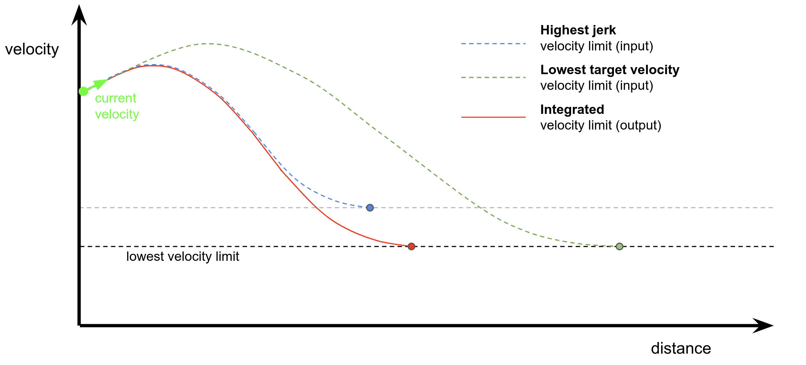

# External Velocity Limit Selector

## Purpose

The `external_velocity_limit_selector_node` is a node that keeps consistency of external velocity limits. This module subscribes

1. velocity limit command sent by **API**,
2. velocity limit command sent by **Autoware internal modules**.

VelocityLimit.msg contains not only **max velocity** but also information about the **acceleration/jerk constraints** on deceleration. The `external_velocity_limit_selector_node` integrates the lowest velocity limit and the highest jerk constraint to calculate the **hardest velocity limit** that protects all the deceleration points and max velocities sent by API and Autoware internal modules.

## Inner-workings / Algorithms

WIP

<!-- Write how this package works. Flowcharts and figures are great. Add sub-sections as you like.

Example:
  ### Flowcharts

  ...(PlantUML or something)

  ### State Transitions

  ...(PlantUML or something)

  ### How to filter target obstacles

  ...

  ### How to optimize trajectory

  ...
-->

## Inputs

| Name                                                | Type                                           | Description                                   |
| --------------------------------------------------- | ---------------------------------------------- | --------------------------------------------- |
| `~input/velocity_limit_from_api`                    | tier4_planning_msgs::VelocityLimit             | velocity limit from api                       |
| `~input/velocity_limit_from_internal`               | tier4_planning_msgs::VelocityLimit             | velocity limit from autoware internal modules |
| `~input/velocity_limit_clear_command_from_internal` | tier4_planning_msgs::VelocityLimitClearCommand | velocity limit clear command                  |

## Outputs

| Name                   | Type                               | Description                                       |
| ---------------------- | ---------------------------------- | ------------------------------------------------- |
| `~output/max_velocity` | tier4_planning_msgs::VelocityLimit | current information of the hardest velocity limit |

## Parameters

{{ json_to_markdown("planning/external_velocity_limit_selector/schema/external_velocity_limit_selector.schema.json") }}

## Assumptions / Known limits

<!-- Write assumptions and limitations of your implementation.

Example:
  This algorithm assumes obstacles are not moving, so if they rapidly move after the vehicle started to avoid them, it might collide with them.
  Also, this algorithm doesn't care about blind spots. In general, since too close obstacles aren't visible due to the sensing performance limit, please take enough margin to obstacles.
-->

## (Optional) Error detection and handling

<!-- Write how to detect errors and how to recover from them.

Example:
  This package can handle up to 20 obstacles. If more obstacles found, this node will give up and raise diagnostic errors.
-->

## (Optional) Performance characterization

<!-- Write performance information like complexity. If it wouldn't be the bottleneck, not necessary.

Example:
  ### Complexity

  This algorithm is O(N).

  ### Processing time

  ...
-->

## (Optional) References/External links

<!-- Write links you referred to when you implemented.

Example:
  [1] {link_to_a_thesis}
  [2] {link_to_an_issue}
-->

## (Optional) Future extensions / Unimplemented parts

<!-- Write future extensions of this package.

Example:
  Currently, this package can't handle the chattering obstacles well. We plan to add some probabilistic filters in the perception layer to improve it.
  Also, there are some parameters that should be global(e.g. vehicle size, max steering, etc.). These will be refactored and defined as global parameters so that we can share the same parameters between different nodes.
-->
