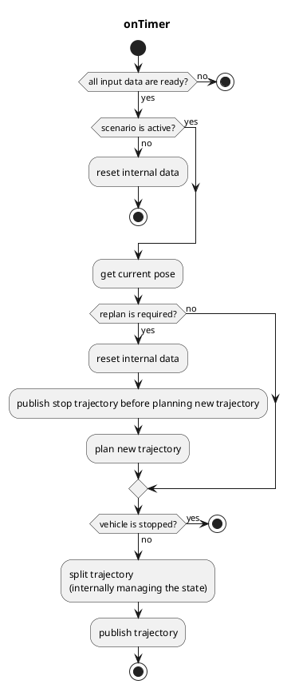

# The `freespace_planner`

## freespace_planner_node

`freespace_planner_node` is a global path planner node that plans trajectory
in the space having static/dynamic obstacles. This node is currently based on
Hybrid A\* search algorithm in `freespace_planning_algorithms` package.
Other algorithms such as rrt\* will be also added and selectable in the future.

**Note**
Due to the constraint of trajectory following, the output trajectory will be split to include only the single direction path.
In other words, the output trajectory doesn't include both forward and backward trajectories at once.

### Input topics

| Name                    | Type                               | Description                                               |
| ----------------------- | ---------------------------------- | --------------------------------------------------------- |
| `~input/route`          | autoware_auto_planning_msgs::Route | route and goal pose                                       |
| `~input/occupancy_grid` | nav_msgs::OccupancyGrid            | costmap, for drivable areas                               |
| `~input/odometry`       | nav_msgs::Odometry                 | vehicle velocity, for checking whether vehicle is stopped |
| `~input/scenario`       | tier4_planning_msgs::Scenario      | scenarios to be activated, for node activation            |

### Output topics

| Name                 | Type                                    | Description                                |
| -------------------- | --------------------------------------- | ------------------------------------------ |
| `~output/trajectory` | autoware_auto_planning_msgs::Trajectory | trajectory to be followed                  |
| `is_completed`       | bool (implemented as rosparam)          | whether all split trajectory are published |

### Output TFs

None

### How to launch

1. Write your remapping info in `freespace_planner.launch` or add args when executing `roslaunch`
2. `roslaunch freespace_planner freespace_planner.launch`

### Parameters

#### Node parameters

| Parameter                    | Type   | Description                                                                     |
| ---------------------------- | ------ | ------------------------------------------------------------------------------- |
| `planning_algorithms`        | string | algorithms used in the node                                                     |
| `vehicle_shape_margin_m`     | float  | collision margin in planning algorithm                                          |
| `update_rate`                | double | timer's update rate                                                             |
| `waypoints_velocity`         | double | velocity in output trajectory (currently, only constant velocity is supported)  |
| `th_arrived_distance_m`      | double | threshold distance to check if vehicle has arrived at the trajectory's endpoint |
| `th_stopped_time_sec`        | double | threshold time to check if vehicle is stopped                                   |
| `th_stopped_velocity_mps`    | double | threshold velocity to check if vehicle is stopped                               |
| `th_course_out_distance_m`   | double | threshold distance to check if vehicle is out of course                         |
| `vehicle_shape_margin_m`     | double | vehicle margin                                                                  |
| `replan_when_obstacle_found` | bool   | whether replanning when obstacle has found on the trajectory                    |
| `replan_when_course_out`     | bool   | whether replanning when vehicle is out of course                                |

#### Planner common parameters

| Parameter                 | Type   | Description                                        |
| ------------------------- | ------ | -------------------------------------------------- |
| `time_limit`              | double | time limit of planning                             |
| `minimum_turning_radius`  | double | minimum turning radius of robot                    |
| `maximum_turning_radius`  | double | maximum turning radius of robot                    |
| `theta_size`              | double | the number of angle's discretization               |
| `lateral_goal_range`      | double | goal range of lateral position                     |
| `longitudinal_goal_range` | double | goal range of longitudinal position                |
| `angle_goal_range`        | double | goal range of angle                                |
| `curve_weight`            | double | additional cost factor for curve actions           |
| `reverse_weight`          | double | additional cost factor for reverse actions         |
| `obstacle_threshold`      | double | threshold for regarding a certain grid as obstacle |

#### A\* search parameters

| Parameter                   | Type   | Description                                             |
| --------------------------- | ------ | ------------------------------------------------------- |
| `only_behind_solutions`     | bool   | whether restricting the solutions to be behind the goal |
| `use_back`                  | bool   | whether using backward trajectory                       |
| `distance_heuristic_weight` | double | heuristic weight for estimating node's cost             |

#### RRT\* search parameters

<!-- cspell:ignore Gammell -->

| Parameter               | Type   | Description                                                                   |
| ----------------------- | ------ | ----------------------------------------------------------------------------- |
| `max planning time`     | double | maximum planning time [msec] (used only when `enable_update` is set `true`)   |
| `enable_update`         | bool   | whether update after feasible solution found until `max_planning time` elapse |
| `use_informed_sampling` | bool   | Use informed RRT\* (of Gammell et al.)                                        |
| `neighbor_radius`       | double | neighbor radius of RRT\* algorithm                                            |
| `margin`                | double | safety margin ensured in path's collision checking in RRT\* algorithm         |

### Flowchart

