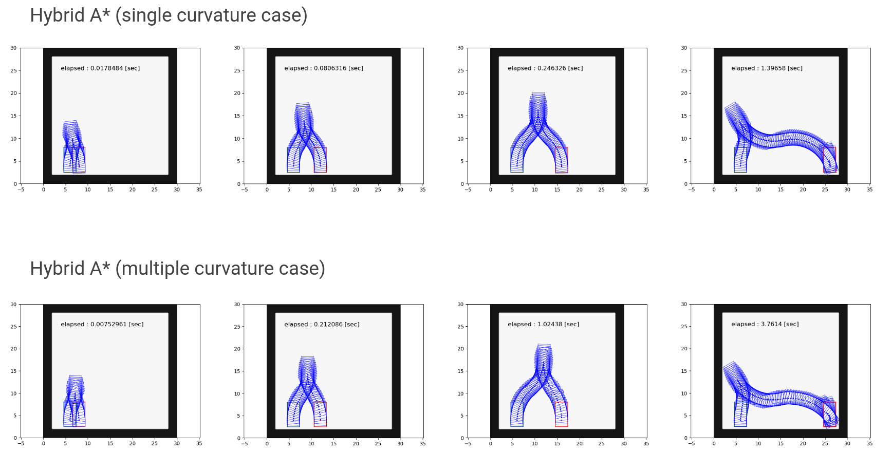

# `freespace planning algorithms`

## Role

This package is for development of path planning algorithms in free space.

### Implemented algorithms

- Hybrid A\*

## Guide to implement a new algorithm

- All planning algorithm class in this package must inherit `AbstractPlanningAlgorithm`
  class. If necessary, please overwrite the virtual functions.
- All algorithms must use `nav_msgs::OccupancyGrid`-typed costmap.
  Thus, `AbstractPlanningAlgorithm` class mainly implements the collision checking
  using the costmap, grid-based indexing, and coordinate transformation related to
  costmap.
- All algorithms must take both `PlannerCommonParam`-typed and algorithm-specific-
  type structs as inputs of the constructor. For example, `AstarSearch` class's
  constructor takes both `PlannerCommonParam` and `AstarParam`.

## Running the standalone tests and visualization

Building the package with ros-test and run tests:

```sh
colcon build --packages-select freespace_planning_algorithms
colcon test --packages-select freespace_planning_algorithms
```

Inside the test, simulation results are stored in `/tmp/result_*.txt`.

Note that the postfix corresponds to the testing scenario (multiple curvatures and single curvature cases).
Loading these resulting files, by using [test/debug_plot.py](test/debug_plot.py),
one can create plots visualizing the path and obstacles as shown
in the figures below.

The created figures are then again saved in `/tmp` with the name like `/tmp/result_multi0.png`.



The black cells, green box, and red box, respectively, indicate obstacles,
start configuration, and goal configuration.
The sequence of the blue boxes indicate the solution path.

## License notice

Files `src/reeds_shepp.cpp` and `include/astar_search/reeds_shepp.h`
are fetched from [pyReedsShepp](https://github.com/ghliu/pyReedsShepp).
Note that the implementation in `pyReedsShepp` is also heavily based on
the code in [ompl](https://github.com/ompl/ompl).
Both `pyReedsShepp` and `ompl` are distributed under 3-clause BSD license.
