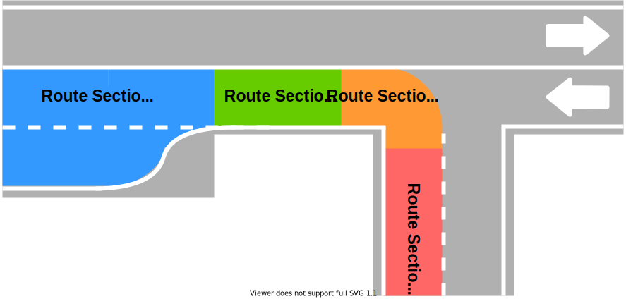
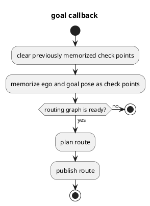
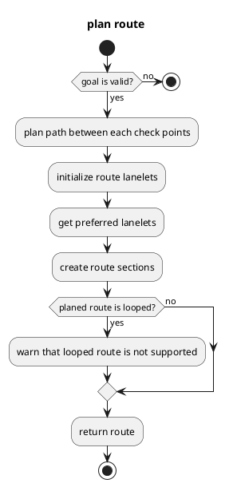

# Mission Planner

## Purpose

`Mission Planner` calculates a route that navigates from the current ego pose to the goal pose following the given check points.
The route is made of a sequence of lanes on a static map.
Dynamic objects (e.g. pedestrians and other vehicles) and dynamic map information (e.g. road construction which blocks some lanes) are not considered during route planning.
Therefore, the output topic is only published when the goal pose or check points are given and will be latched until the new goal pose or check points are given.

The core implementation does not depend on a map format.
In current Autoware.universe, only Lanelet2 map format is supported.

## Interfaces

### Parameters

| Name                      | Type   | Description                       |
| ------------------------- | ------ | --------------------------------- |
| `map_frame`               | string | The frame name for map            |
| `arrival_check_angle_deg` | double | Angle threshold for goal check    |
| `arrival_check_distance`  | double | Distance threshold for goal check |
| `arrival_check_duration`  | double | Duration threshold for goal check |

### Services

| Name                                 | Type                                        | Description                       |
| ------------------------------------ | ------------------------------------------- | --------------------------------- |
| `/planning/routing/clear_route`      | autoware_adapi_v1_msgs::srv::ClearRoute     | route clear request               |
| `/planning/routing/set_route_points` | autoware_adapi_v1_msgs::srv::SetRoutePoints | route request with pose waypoints |
| `/planning/routing/set_route`        | autoware_planning_msgs::srv::SetRoute       | route request with HAD map format |

### Subscriptions

| Name                  | Type                                 | Description                 |
| --------------------- | ------------------------------------ | --------------------------- |
| `input/vector_map`    | autoware_auto_mapping_msgs/HADMapBin | vector map of Lanelet2      |
| `input/modified_goal` | geometry_msgs/PoseStamped            | goal pose for arrival check |

### Publications

| Name                            | Type                                    | Description            |
| ------------------------------- | --------------------------------------- | ---------------------- |
| `/planning/routing/route_state` | autoware_adapi_v1_msgs::msg::RouteState | route state            |
| `/planning/routing/route`       | autoware_planning_msgs/LaneletRoute     | route                  |
| `debug/route_marker`            | visualization_msgs::msg::MarkerArray    | route marker for debug |

## Route section

Route section, whose type is `autoware_planning_msgs/LaneletSegment`, is a "slice" of a road that bundles lane changeable lanes.
Note that the most atomic unit of route is `autoware_auto_mapping_msgs/LaneletPrimitive`, which has the unique id of a lane in a vector map and its type.
Therefore, route message does not contain geometric information about the lane since we did not want to have planning module’s message to have dependency on map data structure.

The ROS message of route section contains following three elements for each route section.

- `preferred_primitive`: Preferred lane to follow towards the goal.
- `primitives`: All neighbor lanes in the same direction including the preferred lane.

## Implementation

### Mission Planner

Two callbacks (goal and check points) are a trigger for route planning.
Routing graph, which plans route in Lanelet2, must be created before those callbacks, and this routing graph is created in vector map callback.

`plan route` is explained in detail in the following section.

### Route Planner

`plan route` is executed with check points including current ego pose and goal pose.

`plan path between each check points` firstly calculates closest lanes to start and goal pose.
Then routing graph of Lanelet2 plans the shortest path from start and goal pose.

`initialize route lanelets` initializes route handler, and calculates `route_lanelets`.
`route_lanelets`, all of which will be registered in route sections, are lanelets next to the lanelets in the planned path, and used when planning lane change.
To calculate `route_lanelets`,

1. All the neighbor (right and left) lanes for the planned path which is lane-changeable is memorized as `route_lanelets`.
2. All the neighbor (right and left) lanes for the planned path which is not lane-changeable is memorized as `candidate_lanelets`.
3. If the following and previous lanelets of each `candidate_lanelets` are `route_lanelets`, the `candidate_lanelet` is registered as `route_lanelets`
   - This is because even though `candidate_lanelet` (an adjacent lane) is not lane-changeable, we can pass the `candidate_lanelet` without lane change if the following and previous lanelets of the `candidate_lanelet` are `route_lanelets`

`get preferred lanelets` extracts `preferred_primitive` from `route_lanelets` with the route handler.

`create route sections` extracts `primitives` from `route_lanelets` for each route section with the route handler, and creates route sections.

## Limitations

- Dynamic objects (e.g. pedestrians and other vehicles) and dynamic map information (e.g. road construction which blocks some lanes) are not considered during route planning.
- Looped route is not supported.
