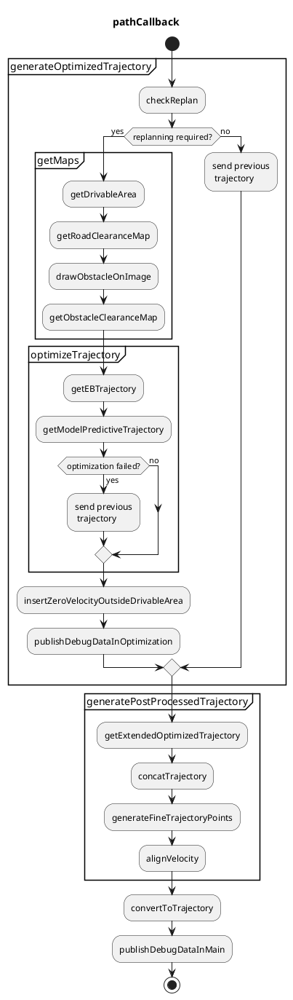
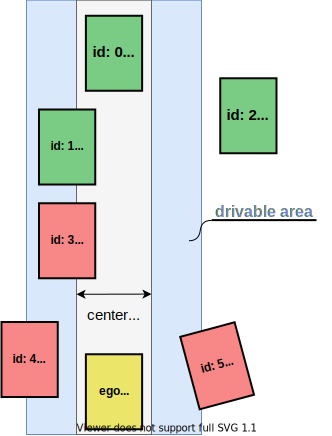

## Purpose

This package generates a trajectory that is feasible to drive and collision free based on a reference path, drivable area, and static/dynamic obstacles.
Only position and orientation of trajectory are calculated in this module (velocity is just aligned from the one in the path), and velocity or acceleration will be updated in the latter modules.

## Feature

This package is able to

- follow the behavior path smoothly
- make the trajectory inside the drivable area as much as possible
- insert stop point if its trajectory point is outside the drivable area

## Inputs / Outputs

### input

| Name                                                                   | Type                                           | Description                                        |
| ---------------------------------------------------------------------- | ---------------------------------------------- | -------------------------------------------------- |
| `~/input/path`                                                         | autoware_auto_planning_msgs/Path               | Reference path and the corresponding drivable area |
| `~/input/objects`                                                      | autoware_auto_perception_msgs/PredictedObjects | Recognized objects around the vehicle              |
| `/localization/kinematic_kinematics`                                   | nav_msgs/Odometry                              | Current Velocity of ego vehicle                    |
| `/planning/scenario_planning/lane_driving/obstacle_avoidance_approval` | tier4_planning_msgs/EnableAvoidance            | Approval to execute obstacle avoidance             |

### output

| Name                  | Type                                   | Description                                                       |
| --------------------- | -------------------------------------- | ----------------------------------------------------------------- |
| `~/output/trajectory` | autoware_auto_planning_msgs/Trajectory | Optimized trajectory that is feasible to drive and collision-free |

## Flowchart

Flowchart of functions is explained here.

### checkReplan

When one of the following conditions are realized, callback function to generate a trajectory is called and publish the trajectory.
Otherwise, previously generated (optimized) trajectory is published just with aligning the velocity from the latest behavior path.

- Ego moves a certain distance compared to the previous ego pose (default: 3.0 [m])
- Time passes (default: 1.0 [s])
- Ego is far from the previously generated trajectory

### getRoadClearanceMap

Cost map is generated according to the distance to the road boundaries.

These cost maps are used in the optimization to generate a collision-free trajectory.

### drawObstacleOnImage

Only obstacles that are static and locate in a shoulder lane is decided to avoid.
In detail, this equals to the following three conditions at the same time, and the red obstacles in the figure (id: 3, 4, 5) is to be avoided.

- Velocity is under a certain value (default: 0.1 [m/s])
- CoG of the obstacles is not on the center line
  - so that the ego will not avoid the car in front of the ego in the same lane.
- At least one point of the obstacle polygon is outside the drivable area.

### getObstacleClearanceMap

Cost map is generated according to the distance to the target obstacles to be avoided.

### getEBTrajectory

The latter optimization (MPT) assumes that the reference path is smooth enough.
Therefore the path from behavior is made smooth here, and send to the optimization as a format of trajectory.
Obstacles are ignored in this function.

More details can be seen in the Elastic Band section.

### getModelPredictiveTrajectory

This module makes the trajectory kinematically-feasible and collision-free.
We define vehicle pose in the frenet coordinate, and minimize tracking errors by optimization.
This optimization considers vehicle kinematics and collision checking with road boundary and obstacles.
To decrease the computation cost, the optimization is applied to the shorter trajectory (default: 50 [m]) than the whole trajectory, and concatenate the remained trajectory with the optimized one at last.

The trajectory just in front of the ego must not be changed a lot so that the steering wheel will be stable.
Therefore, we use the previously generated trajectory in front of the ego.

Optimization center on the vehicle, that tries to locate just on the trajectory, can be tuned along side the vehicle vertical axis.
This parameter `mpt.kinematics.optimization center offset` is defined as the signed length from the back-wheel center to the optimization center.
Some examples are shown in the following figure, and it is shown that the trajectory of vehicle shape differs according to the optimization center even if the reference trajectory (green one) is the same.

More details can be seen in the Model Predictive Trajectory section.

### insertZeroVelocityOutsideDrivableArea

Optimized trajectory is too short for velocity planning, therefore extend the trajectory by concatenating the optimized trajectory and the behavior path considering drivability.
Generated trajectory is checked if it is inside the drivable area or not, and if outside drivable area, output a trajectory inside drivable area with the behavior path or the previously generated trajectory.

As described above, the behavior path is separated into two paths: one is for optimization and the other is the remain. The first path becomes optimized trajectory, and the second path just is transformed to a trajectory. Then a trajectory inside the drivable area is calculated as follows.

- If optimized trajectory is **inside the drivable area**, and the remained trajectory is inside/outside the drivable area,
  - the output trajectory will be just concatenation of those two trajectories.
  - In this case, we do not care if the remained trajectory is inside or outside the drivable area since generally it is outside the drivable area (especially in a narrow road), but we want to pass a trajectory as long as possible to the latter module.
- If optimized trajectory is **outside the drivable area**, and the remained trajectory is inside/outside the drivable area,
  - and if the previously generated trajectory **is memorized**,
    - the output trajectory will be the previously generated trajectory, where zero velocity is inserted to the point firstly going outside the drivable area.
  - and if the previously generated trajectory **is not memorized**,
    - the output trajectory will be a part of trajectory just transformed from the behavior path, where zero velocity is inserted to the point firstly going outside the drivable area.

Optimization failure is dealt with the same as if the optimized trajectory is outside the drivable area.
The output trajectory is memorized as a previously generated trajectory for the next cycle.

_Rationale_
In the current design, since there are some modelling errors, the constraints are considered to be soft constraints.
Therefore, we have to make sure that the optimized trajectory is inside the drivable area or not after optimization.

### alignVelocity

Velocity is assigned in the result trajectory from the velocity in the behavior path.
The shapes of the trajectory and the path are different, therefore the each nearest trajectory point to the path is searched and interpolated linearly.

## Algorithms

In this section, Elastic band (to make the path smooth) and Model Predictive Trajectory (to make the trajectory kinematically feasible and collision-free) will be explained in detail.

### Elastic band

#### Abstract

Elastic band smooths the path generated in the behavior.
Since the latter process of optimization uses the curvature and normal vector of the reference path, smoothing should be applied here so that the optimization will be stable.

This smoothing process does not consider collision.
Therefore the output path may have a collision with road boundaries or obstacles.

#### Formulation

We formulate a QP problem minimizing the distance between the previous point and the next point for each point.
Conditions that each point can move to a certain extent are used so that the path will not changed a lot but will be smoother.

For $k$'th point ($\boldsymbol{p}_k = (x_k, y_k)$), the objective function is as follows.
The beginning and end point are fixed during the optimization.

$$
\begin{align}
\ J & = \min \sum_{k=1}^{n-1} ||(\boldsymbol{p}_{k+1} - \boldsymbol{p}_{k}) - (\boldsymbol{p}_{k} - \boldsymbol{p}_{k-1})||^2 \\
\ & = \min \sum_{k=1}^{n-1} ||\boldsymbol{p}_{k+1} - 2 \boldsymbol{p}_{k} + \boldsymbol{p}_{k-1}||^2 \\
\ & = \min \sum_{k=1}^{n-1} \{(x_{k+1} - x_k + x_{k-1})^2 + (y_{k+1} - y_k + y_{k-1})^2\} \\
\ & = \min
    \begin{pmatrix}
        \ x_0 \\
        \ x_1 \\
        \ x_2 \\
        \vdots \\
        \ x_{n-2}\\
        \ x_{n-1} \\
        \ x_{n} \\
        \ y_0 \\
        \ y_1 \\
        \ y_2 \\
        \vdots \\
        \ y_{n-2}\\
        \ y_{n-1} \\
        \ y_{n} \\
    \end{pmatrix}^T
    \begin{pmatrix}
      1 & -2 & 1 & 0 & \dots& \\
      -2 & 5 & -4 & 1 & 0 &\dots   \\
      1 & -4 & 6 & -4 & 1 & \\
      0 & 1 & -4 & 6 & -4 &   \\
      \vdots & 0 & \ddots&\ddots& \ddots   \\
      & \vdots & & & \\
      & & & 1 & -4 & 6 & -4 & 1 \\
      & & & & 1 & -4 & 5 & -2 \\
      & & & & & 1 & -2 &  1& \\
      & & & & & & & &1 & -2 & 1 & 0 & \dots& \\
      & & & & & & & &-2 & 5 & -4 & 1 & 0 &\dots   \\
      & & & & & & & &1 & -4 & 6 & -4 & 1 & \\
      & & & & & & & &0 & 1 & -4 & 6 & -4 &   \\
      & & & & & & & &\vdots & 0 & \ddots&\ddots& \ddots   \\
      & & & & & & & & & \vdots & & & \\
      & & & & & & & & & & & 1 & -4 & 6 & -4 & 1 \\
      & & & & & & & & & & & & 1 & -4 & 5 & -2 \\
      & & & & & & & & & & & & & 1 & -2 &  1& \\
    \end{pmatrix}
    \begin{pmatrix}
        \ x_0 \\
        \ x_1 \\
        \ x_2 \\
        \vdots \\
        \ x_{n-2}\\
        \ x_{n-1} \\
        \ x_{n} \\
        \ y_0 \\
        \ y_1 \\
        \ y_2 \\
        \vdots \\
        \ y_{n-2}\\
        \ y_{n-1} \\
        \ y_{n} \\
    \end{pmatrix}
\end{align}
$$

### Model predictive trajectory

#### Abstract

Model Predictive Trajectory (MPT) calculates the trajectory that realizes the following conditions.

- Kinematically feasible for linear vehicle kinematics model
- Collision free with obstacles and road boundaries

Conditions for collision free is considered to be not hard constraints but soft constraints.
When the optimization failed or the optimized trajectory is not collision free, the output trajectory will be previously generated trajectory.

Trajectory near the ego must be stable, therefore the condition where trajectory points near the ego are the same as previously generated trajectory is considered, and this is the only hard constraints in MPT.

#### Vehicle kinematics

As the following figure, we consider the bicycle kinematics model in the frenet frame to track the reference path.
At time step $k$, we define lateral distance to the reference path, heading angle against the reference path, and steer angle as $y_k$, $\theta_k$, and $\delta_k$ respectively.

Assuming that the commanded steer angle is $\delta_{des, k}$, the kinematics model in the frenet frame is formulated as follows.
We also assume that the steer angle $\delta_k$ is first-order lag to the commanded one.

$$
\begin{align}
y_{k+1} & = y_{k} + v \sin \theta_k dt \\
\theta_{k+1} & = \theta_k + \frac{v \tan \delta_k}{L}dt - \kappa_k v \cos \theta_k dt \\
\delta_{k+1} & = \delta_k - \frac{\delta_k - \delta_{des,k}}{\tau}dt
\end{align}
$$

##### Linearization

Then we linearize these equations.
$y_k$ and $\theta_k$ are tracking errors, so we assume that those are small enough.
Therefore $\sin \theta_k \approx \theta_k$.

Since $\delta_k$ is a steer angle, it is not always small.
By using a reference steer angle $\delta_{\mathrm{ref}, k}$ calculated by the reference path curvature $\kappa_k$, we express $\delta_k$ with a small value $\Delta \delta_k$.

Note that the steer angle $\delta_k$ is within the steer angle limitation $\delta_{\max}$.
When the reference steer angle $\delta_{\mathrm{ref}, k}$ is larger than the steer angle limitation $\delta_{\max}$, and $\delta_{\mathrm{ref}, k}$ is used to linearize the steer angle, $\Delta \delta_k$ is $\Delta \delta_k = \delta - \delta_{\mathrm{ref}, k} = \delta_{\max} - \delta_{\mathrm{ref}, k}$, and the absolute $\Delta \delta_k$ gets larger.
Therefore, we have to apply the steer angle limitation to $\delta_{\mathrm{ref}, k}$ as well.

$$
\begin{align}
\delta_{\mathrm{ref}, k} & = \mathrm{clamp}(\arctan(L \kappa_k), -\delta_{\max}, \delta_{\max}) \\
\delta_k & = \delta_{\mathrm{ref}, k} + \Delta \delta_k, \ \Delta \delta_k \ll 1 \\
\end{align}
$$

$\mathrm{clamp}(v, v_{\min}, v_{\max})$ is a function to convert $v$ to be larger than $v_{\min}$ and smaller than $v_{\max}$.

Using this $\delta_{\mathrm{ref}, k}$, $\tan \delta_k$ is linearized as follows.

$$
\begin{align}
\tan \delta_k & \approx \tan \delta_{\mathrm{ref}, k} + \left.\frac{d \tan \delta}{d \delta}\right|_{\delta = \delta_{\mathrm{ref}, k}} \Delta \delta_k \\
& = \tan \delta_{\mathrm{ref}, k} + \left.\frac{d \tan \delta}{d \delta}\right|_{\delta = \delta_{\mathrm{ref}, k}} (\delta_{\mathrm{ref}, k} - \delta_k) \\
& = \tan \delta_{\mathrm{ref}, k} - \frac{\delta_{\mathrm{ref}, k}}{\cos^2 \delta_{\mathrm{ref}, k}} + \frac{1}{\cos^2 \delta_{\mathrm{ref}, k}} \delta_k
\end{align}
$$

##### One-step state equation

Based on the linearization, the error kinematics is formulated with the following linear equations,

$$
\begin{align}
    \begin{pmatrix}
        y_{k+1} \\
        \theta_{k+1}
    \end{pmatrix}
    =
    \begin{pmatrix}
        1 & v dt \\
        0 & 1 \\
    \end{pmatrix}
    \begin{pmatrix}
        y_k \\
        \theta_k \\
    \end{pmatrix}
    +
    \begin{pmatrix}
        0 \\
        \frac{v dt}{L \cos^{2} \delta_{\mathrm{ref}, k}} \\
    \end{pmatrix}
    \delta_{k}
    +
    \begin{pmatrix}
        0 \\
        \frac{v \tan(\delta_{\mathrm{ref}, k}) dt}{L} - \frac{v \delta_{\mathrm{ref}, k} dt}{L \cos^{2} \delta_{\mathrm{ref}, k}} - \kappa_k v dt\\
    \end{pmatrix}
\end{align}
$$

which can be formulated as follows with the state $\boldsymbol{x}$, control input $u$ and some matrices, where $\boldsymbol{x} = (y_k, \theta_k)$

$$
\begin{align}
  \boldsymbol{x}_{k+1} = A_k \boldsymbol{x}_k + \boldsymbol{b}_k u_k + \boldsymbol{w}_k
\end{align}
$$

##### Time-series state equation

Then, we formulate time-series state equation by concatenating states, control inputs and matrices respectively as

$$
\begin{align}
  \boldsymbol{x} = A \boldsymbol{x}_0 + B \boldsymbol{u} + \boldsymbol{w}
\end{align}
$$

where

$$
\begin{align}
\boldsymbol{x} = (\boldsymbol{x}^T_1, \boldsymbol{x}^T_2, \boldsymbol{x}^T_3, \dots, \boldsymbol{x}^T_{n-1})^T \\
\boldsymbol{u} = (u_0, u_1, u_2, \dots, u_{n-2})^T \\
\boldsymbol{w} = (\boldsymbol{w}^T_0, \boldsymbol{w}^T_1, \boldsymbol{w}^T_2, \dots, \boldsymbol{w}^T_{n-1})^T. \\
\end{align}
$$

In detail, each matrices are constructed as follows.

$$
\begin{align}
    \begin{pmatrix}
        \boldsymbol{x}_1 \\
        \boldsymbol{x}_2 \\
        \boldsymbol{x}_3 \\
        \vdots \\
        \boldsymbol{x}_{n-1}
    \end{pmatrix}
    =
    \begin{pmatrix}
        A_0 \\
        A_1 A_0 \\
        A_2 A_1 A_0\\
        \vdots \\
        \prod\limits_{k=0}^{n-1} A_{k}
    \end{pmatrix}
    \boldsymbol{x}_0
    +
    \begin{pmatrix}
      B_0 & 0 & & \dots & 0 \\
      A_0 B_0 & B_1 & 0 & \dots & 0 \\
      A_1 A_0 B_0 & A_0 B_1 & B_2 & \dots & 0 \\
      \vdots & \vdots & & \ddots & 0 \\
      \prod\limits_{k=0}^{n-3} A_k B_0 & \prod\limits_{k=0}^{n-4} A_k B_1 & \dots & A_0 B_{n-3} & B_{n-2}
    \end{pmatrix}
    \begin{pmatrix}
        u_0 \\
        u_1 \\
        u_2 \\
        \vdots \\
        u_{n-2}
    \end{pmatrix}
    +
    \begin{pmatrix}
      I & 0 & & \dots & 0 \\
      A_0 & I & 0 & \dots & 0 \\
      A_1 A_0 & A_0 & I & \dots & 0 \\
      \vdots & \vdots & & \ddots & 0 \\
      \prod\limits_{k=0}^{n-3} A_k & \prod\limits_{k=0}^{n-4} A_k & \dots & A_0 & I
    \end{pmatrix}
    \begin{pmatrix}
        \boldsymbol{w}_0 \\
        \boldsymbol{w}_1 \\
        \boldsymbol{w}_2 \\
        \vdots \\
        \boldsymbol{w}_{n-2}
    \end{pmatrix}
\end{align}
$$

##### Free-boundary-conditioned time-series state equation

For path planning which does not start from the current ego pose, $\boldsymbol{x}_0$ should be the design variable of optimization.
Therefore, we make $\boldsymbol{u}'$ by concatenating $\boldsymbol{x}_0$ and $\boldsymbol{u}$, and redefine $\boldsymbol{x}$ as follows.

$$
\begin{align}
  \boldsymbol{u}' & = (\boldsymbol{x}^T_0, \boldsymbol{u}^T)^T \\
  \boldsymbol{x} & = (\boldsymbol{x}^T_0, \boldsymbol{x}^T_1, \boldsymbol{x}^T_2, \dots, \boldsymbol{x}^T_{n-1})^T
\end{align}
$$

Then we get the following state equation

$$
\begin{align}
  \boldsymbol{x}' = B \boldsymbol{u}' + \boldsymbol{w},
\end{align}
$$

which is in detail

$$
\begin{align}
    \begin{pmatrix}
        \boldsymbol{x}_0 \\
        \boldsymbol{x}_1 \\
        \boldsymbol{x}_2 \\
        \boldsymbol{x}_3 \\
        \vdots \\
        \boldsymbol{x}_{n-1}
    \end{pmatrix}
    =
    \begin{pmatrix}
      I & 0 & \dots & & & 0 \\
      A_0 & B_0 & 0 & & \dots & 0 \\
      A_1 A_0 & A_0 B_0 & B_1 & 0 & \dots & 0 \\
      A_2 A_1 A_0 & A_1 A_0 B_0 & A_0 B_1 & B_2 & \dots & 0 \\
      \vdots & \vdots & \vdots & & \ddots & 0 \\
      \prod\limits_{k=0}^{n-1} A_k & \prod\limits_{k=0}^{n-3} A_k B_0 & \prod\limits_{k=0}^{n-4} A_k B_1 & \dots & A_0 B_{n-3} & B_{n-2}
    \end{pmatrix}
    \begin{pmatrix}
        \boldsymbol{x}_0 \\
        u_0 \\
        u_1 \\
        u_2 \\
        \vdots \\
        u_{n-2}
    \end{pmatrix}
    +
    \begin{pmatrix}
      0 & \dots & & & 0 \\
      I & 0 & & \dots & 0 \\
      A_0 & I & 0 & \dots & 0 \\
      A_1 A_0 & A_0 & I & \dots & 0 \\
      \vdots & \vdots & & \ddots & 0 \\
      \prod\limits_{k=0}^{n-3} A_k & \prod\limits_{k=0}^{n-4} A_k & \dots & A_0 & I
    \end{pmatrix}
    \begin{pmatrix}
        \boldsymbol{w}_0 \\
        \boldsymbol{w}_1 \\
        \boldsymbol{w}_2 \\
        \vdots \\
        \boldsymbol{w}_{n-2}
    \end{pmatrix}.
\end{align}
$$

#### Objective function

The objective function for smoothing and tracking is shown as follows, which can be formulated with value function matrices $Q, R$.

$$
\begin{align}
J_1 (\boldsymbol{x}', \boldsymbol{u}') & = w_y \sum_{k} y_k^2 + w_{\theta} \sum_{k} \theta_k^2 + w_{\delta} \sum_k \delta_k^2 + w_{\dot{\delta}} \sum_k \dot{\delta}_k^2 + w_{\ddot{\delta}} \sum_k \ddot{\delta}_k^2 \\
& = \boldsymbol{x}'^T Q \boldsymbol{x}' + \boldsymbol{u}'^T R \boldsymbol{u}' \\
& = \boldsymbol{u}'^T H \boldsymbol{u}' + \boldsymbol{u}'^T \boldsymbol{f}
\end{align}
$$

As mentioned before, the constraints to be collision free with obstacles and road boundaries are formulated to be soft constraints.
Assuming that the lateral distance to the road boundaries or obstacles from the back wheel center, front wheel center, and the point between them are $y_{\mathrm{base}, k}, y_{\mathrm{top}, k}, y_{\mathrm{mid}, k}$ respectively, and slack variables for each point are $\lambda_{\mathrm{base}}, \lambda_{\mathrm{top}}, \lambda_{\mathrm{mid}}$, the soft constraints can be formulated as follows.

$$
y_{\mathrm{base}, k, \min} - \lambda_{\mathrm{base}, k} \leq y_{\mathrm{base}, k} (y_k)  \leq y_{\mathrm{base}, k, \max} + \lambda_{\mathrm{base}, k}\\
y_{\mathrm{top}, k, \min} - \lambda_{\mathrm{top}, k} \leq y_{\mathrm{top}, k} (y_k) \leq y_{\mathrm{top}, k, \max} + \lambda_{\mathrm{top}, k}\\
y_{\mathrm{mid}, k, \min} - \lambda_{\mathrm{mid}, k} \leq y_{\mathrm{mid}, k} (y_k) \leq y_{\mathrm{mid}, k, \max} + \lambda_{\mathrm{mid}, k} \\
0 \leq \lambda_{\mathrm{base}, k} \\
0 \leq \lambda_{\mathrm{top}, k} \\
0 \leq \lambda_{\mathrm{mid}, k}
$$

Since $y_{\mathrm{base}, k}, y_{\mathrm{top}, k}, y_{\mathrm{mid}, k}$ is formulated as a linear function of $y_k$, the objective function for soft constraints is formulated as follows.

$$
\begin{align}
J_2 & (\boldsymbol{\lambda}_\mathrm{base}, \boldsymbol{\lambda}_\mathrm{top}, \boldsymbol {\lambda}_\mathrm{mid})\\
& = w_{\mathrm{base}} \sum_{k} \lambda_{\mathrm{base}, k} + w_{\mathrm{mid}} \sum_k \lambda_{\mathrm{mid}, k} + w_{\mathrm{top}} \sum_k \lambda_{\mathrm{top}, k}
\end{align}
$$

Slack variables are also design variables for optimization.
We define a vector $\boldsymbol{v}$, that concatenates all the design variables.

$$
\begin{align}
\boldsymbol{v} =
\begin{pmatrix}
  \boldsymbol{u}'^T & \boldsymbol{\lambda}_\mathrm{base}^T & \boldsymbol{\lambda}_\mathrm{top}^T & \boldsymbol{\lambda}_\mathrm{mid}^T
\end{pmatrix}^T
\end{align}
$$

The summation of these two objective functions is the objective function for the optimization problem.

$$
\begin{align}
\min_{\boldsymbol{v}} J (\boldsymbol{v}) = \min_{\boldsymbol{v}} J_1 (\boldsymbol{u}') + J_2 (\boldsymbol{\lambda}_\mathrm{base}, \boldsymbol{\lambda}_\mathrm{top}, \boldsymbol{\lambda}_\mathrm{mid})
\end{align}
$$

As mentioned before, we use hard constraints where some trajectory points in front of the ego are the same as the previously generated trajectory points.
This hard constraints is formulated as follows.

$$
\begin{align}
\delta_k = \delta_{k}^{\mathrm{prev}} (0 \leq i \leq N_{\mathrm{fix}})
\end{align}
$$

Finally we transform those objective functions to the following QP problem, and solve it.

$$
\begin{align}
\min_{\boldsymbol{v}} \ & \frac{1}{2} \boldsymbol{v}^T \boldsymbol{H} \boldsymbol{v} + \boldsymbol{f} \boldsymbol{v} \\
\mathrm{s.t.} \ & \boldsymbol{b}_{lower} \leq \boldsymbol{A} \boldsymbol{v} \leq \boldsymbol{b}_{upper}
\end{align}
$$

#### Constraints

##### Steer angle limitation

Steer angle has a certain limitation ($\delta_{max}$, $\delta_{min}$).
Therefore we add linear inequality equations.

$$
\begin{align}
\delta_{min} \leq \delta_i \leq \delta_{max}
\end{align}
$$

##### Collision free

To realize collision-free path planning, we have to formulate constraints that the vehicle is inside the road (moreover, a certain meter far from the road boundary) and does not collide with obstacles in linear equations.
For linearity, we chose a method to approximate the vehicle shape with a set of circles, that is reliable and easy to implement.

Now we formulate the linear constraints where a set of circles on each trajectory point is collision-free.
For collision checking, we have a drivable area in the format of an image where walls or obstacles are filled with a color.
By using this drivable area, we calculate upper (left) and lower (right) boundaries along reference points so that we can interpolate boundaries on any position on the trajectory.

Assuming that upper and lower boundaries are $b_l$, $b_u$ respectively, and $r$ is a radius of a circle, lateral deviation of the circle center $y'$ has to be

$$
b_l + r \leq y' \leq b_u - r.
$$

Based on the following figure, $y'$ can be formulated as follows.

$$
\begin{align}
y' & = L \sin(\theta + \beta) + y \cos \beta - l \sin(\gamma - \phi_a) \\
& = L \sin \theta \cos \beta + L \cos \theta \sin \beta + y \cos \beta - l \sin(\gamma - \phi_a) \\
& \approx L \theta \cos \beta + L \sin \beta + y \cos \beta - l \sin(\gamma - \phi_a)
\end{align}
$$

$$
b_l + r - \lambda \leq y' \leq b_u - r + \lambda.
$$

$$
\begin{align}
y' & = C_1 \boldsymbol{x} + C_2 \\
& = C_1 (B \boldsymbol{v} + \boldsymbol{w}) + C_2 \\
& = C_1 B \boldsymbol{v} + \boldsymbol{w} + C_2
\end{align}
$$

Note that longitudinal position of the circle center and the trajectory point to calculate boundaries are different.
But each boundaries are vertical against the trajectory, resulting in less distortion by the longitudinal position difference since road boundaries does not change so much.
For example, if the boundaries are not vertical against the trajectory and there is a certain difference of longitudinal position between the circe center and the trajectory point, we can easily guess that there is much more distortion when comparing lateral deviation and boundaries.

$$
\begin{align}
    A_{blk} & =
    \begin{pmatrix}
        C_1 B & O & \dots & O & I_{N_{ref} \times N_{ref}} & O \dots & O\\
        -C_1 B & O & \dots & O & I & O \dots & O\\
        O & O & \dots & O & I & O \dots & O
    \end{pmatrix}
    \in \boldsymbol{R}^{3 N_{ref} \times D_v + N_{circle} N_{ref}} \\
    \boldsymbol{b}_{lower, blk} & =
    \begin{pmatrix}
        \boldsymbol{b}_{lower} - C_1 \boldsymbol{w} - C_2 \\
        -\boldsymbol{b}_{upper} + C_1 \boldsymbol{w} + C_2 \\
        O
    \end{pmatrix}
    \in \boldsymbol{R}^{3 N_{ref}} \\
    \boldsymbol{b}_{upper, blk} & = \boldsymbol{\infty}
    \in \boldsymbol{R}^{3 N_{ref}}
\end{align}
$$

We will explain options for optimization.

###### L-infinity optimization

The above formulation is called L2 norm for slack variables.
Instead, if we use L-infinity norm where slack variables are shared by enabling `l_inf_norm`.

$$
\begin{align}
    A_{blk} =
    \begin{pmatrix}
        C_1 B & I_{N_{ref} \times N_{ref}} \\
        -C_1 B & I \\
        O & I
    \end{pmatrix}
\in \boldsymbol{R}^{3N_{ref} \times D_v + N_{ref}}
\end{align}
$$

###### Two-step soft constraints

$$
\begin{align}
\boldsymbol{v}' =
  \begin{pmatrix}
    \boldsymbol{v} \\
    \boldsymbol{\lambda}^{soft_1} \\
    \boldsymbol{\lambda}^{soft_2} \\
  \end{pmatrix}
  \in \boldsymbol{R}^{D_v + 2N_{slack}}
\end{align}
$$

$*$ depends on whether to use L2 norm or L-infinity optimization.

$$
\begin{align}
    A_{blk} & =
    \begin{pmatrix}
        A^{soft_1}_{blk} \\
        A^{soft_2}_{blk} \\
    \end{pmatrix}\\
    & =
    \begin{pmatrix}
        C_1^{soft_1} B & & \\
        -C_1^{soft_1} B & \Huge{*} & \Huge{O} \\
        O & & \\
        C_1^{soft_2} B & & \\
        -C_1^{soft_2} B & \Huge{O} & \Huge{*} \\
        O & &
    \end{pmatrix}
    \in \boldsymbol{R}^{6 N_{ref} \times D_v + 2 N_{slack}}
\end{align}
$$

$N_{slack}$ is $N_{circle}$ when L2 optimization, or $1$ when L-infinity optimization.
$N_{circle}$ is the number of circles to check collision.

## Tuning

### Vehicle

- max steering wheel degree
  - `mpt.kinematics.max_steer_deg`

### Boundary search

- `advanced.mpt.bounds_search_widths`
  - In order to efficiently search precise lateral boundaries on each trajectory point, different resolutions of search widths are defined.
  - By default, [0.45, 0.15, 0.05, 0.01] is used. In this case, the goal is to get the boundaries' length on each trajectory point with 0.01 [m] resolution.
  - Firstly, lateral boundaries are searched with a rough resolution (= 0.45 [m]).
  - Then, within its 0.45 [m] resolution which boundaries are inside, they are searched again with a bit precise resolution (= 0.15 [m]).
  - Following this rule, finally boundaries with 0.01 [m] will be found.

### Assumptions

- EB optimized trajectory length should be longer than MPT optimized trajectory length
  - since MPT result may be jerky because of non-fixed reference path (= EB optimized trajectory)
  - At least, EB fixed optimized trajectory length must be longer than MPT fixed optimization trajectory length
    - This causes the case that there is a large difference between MPT fixed optimized point and MPT optimized point just after the point.

### Drivability in narrow roads

- set `option.drivability_check.use_vehicle_circles` true
  - use a set of circles as a shape of the vehicle when checking if the generated trajectory will be outside the drivable area.
- make `mpt.clearance.soft_clearance_from_road` smaller
- make `mpt.kinematics.optimization_center_offset` different

  - The point on the vehicle, offset forward from the base link` tries to follow the reference path.

  - This may cause the a part of generated trajectory will be outside the drivable area.

### Computation time

- Loose EB optimization

  - 1. make `eb.common.delta_arc_length_for_eb` large and `eb.common.num_sampling_points_for_eb` small
    - This makes the number of design variables smaller
    - Be careful about the trajectory length between MPT and EB as shown in Assumptions.
    - However, empirically this causes large turn at the corner (e.g. The vehicle turns a steering wheel to the opposite side (=left) a bit just before the corner turning to right)
  - 2. make `eb.qp.eps_abs` and `eb.qp.eps_rel` small
    - This causes very unstable reference path generation for MPT, or turning a steering wheel a little bit larger

- Enable computation reduction flag

  - 1. set l_inf_norm true (by default)
    - use L-inf norm optimization for MPT w.r.t. slack variables, resulting in lower number of design variables
  - 2. set enable_warm_start true
  - 3. set enable_manual_warm_start true (by default)
  - 4. set steer_limit_constraint false
    - This causes no assumption for trajectory generation where steering angle will not exceeds its hardware limitation
  - 5. make the number of collision-free constraints small
    - How to change parameters depend on the type of collision-free constraints
      - If
    - This may cause the trajectory generation where a part of ego vehicle is out of drivable area

- Disable publishing debug visualization markers
  - set `option.is_publishing_*` false

### Robustness

- Check if the trajectory before EB, after EB, or after MPT is not robust
  - if the trajectory before EB is not robust
  - if the trajectory after EB is not robust
  - if the trajectory after MPT is not robust
    - make `mpt.weight.steer_input_weight` or `mpt.weight.steer_rate_weight` larger, which are stability of steering wheel along the trajectory.

### Other options

- `option.skip_optimization` skips EB and MPT optimization.
- `option.enable_pre_smoothing` enables EB which is smoothing the trajectory for MPT.
  - EB is not required if the reference path for MPT is smooth enough and does not change its shape suddenly
- `option.is_showing_calculation_time` enables showing each calculation time for functions and total calculation time on the terminal.
- `option.is_stopping_if_outside_drivable_area` enables stopping just before the generated trajectory point will be outside the drivable area.
- `mpt.option.plan_from_ego` enables planning from the ego pose when the ego's velocity is zero.
- `mpt.option.max_plan_from_ego_length` maximum length threshold to plan from ego. it is enabled when the length of trajectory is shorter than this value.
- `mpt.option.two_step_soft_constraint` enables two step of soft constraints for collision free
  - `mpt.option.soft_clearance_from_road` and `mpt.option.soft_second_clearance_from_road` are the weight.

## Limitation

- When turning right or left in the intersection, the output trajectory is close to the outside road boundary.
- Roles of planning for behavior_path_planner and obstacle_avoidance_planner are not decided clearly.
- High computation cost

## Comparison to other methods

Planning a trajectory that satisfies kinematic feasibility and collision-free has two main characteristics that makes hard to be solved: one is non-convex and the other is high dimension.
According to the characteristics, we investigate pros and cons of the typical planning methods: optimization-based, sampling-based, and learning-based method.

### Optimization-based method

- pros: comparatively fast against high dimension by leveraging the gradient descent
- cons: often converge to the local minima in the non-convex problem

### Sampling-based method

- pros: realize global optimization
- cons: high computation cost especially in the complex case

### Learning-based method

under research yet

Based on these pros/cons, we chose the optimization-based planner first.
Although it has a cons to converge to the local minima, it can get a good solution by the preprocessing to approximate the convex problem that almost equals to the original non-convex problem.

# Debug

Debug information are written [here](debug.md).
