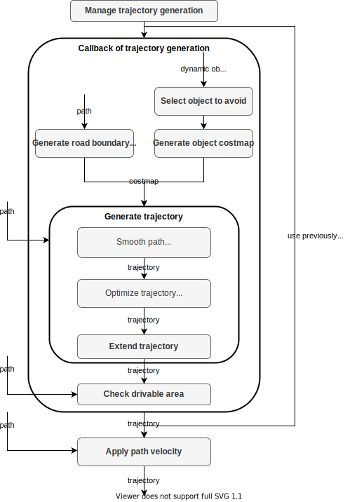
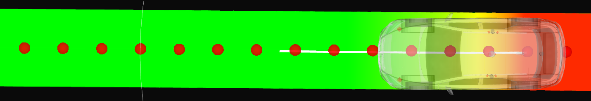
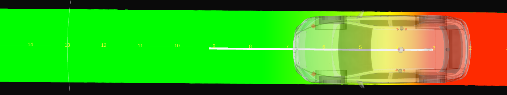
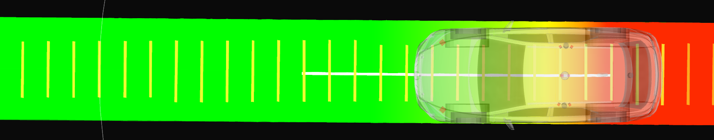
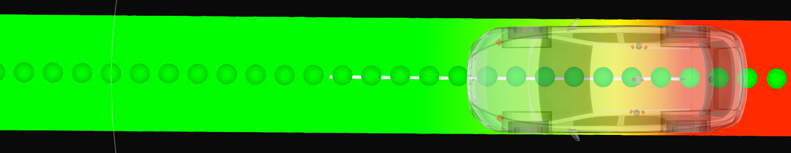
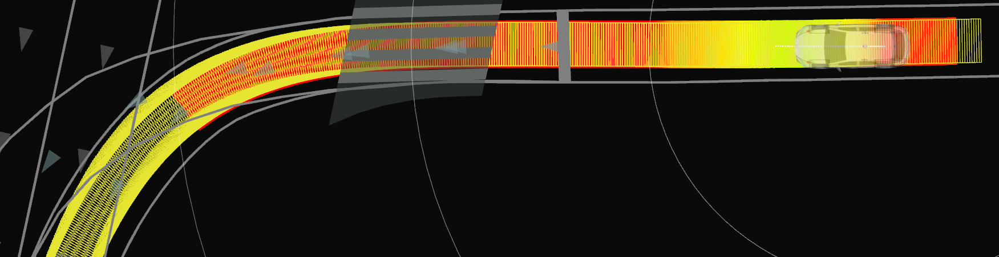
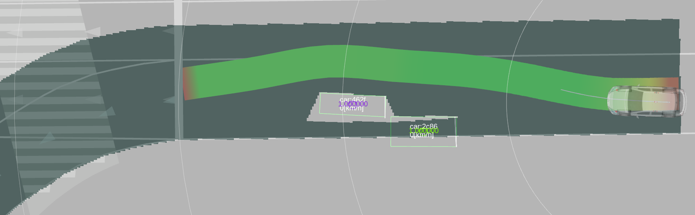
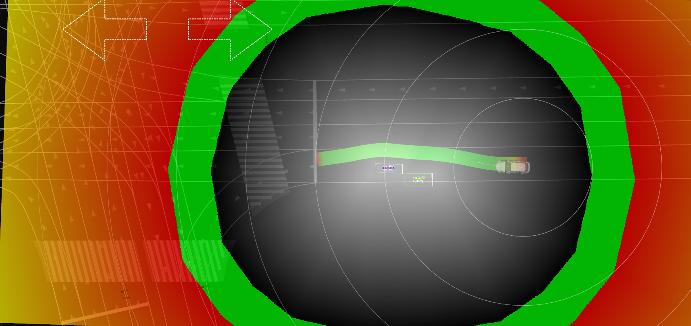
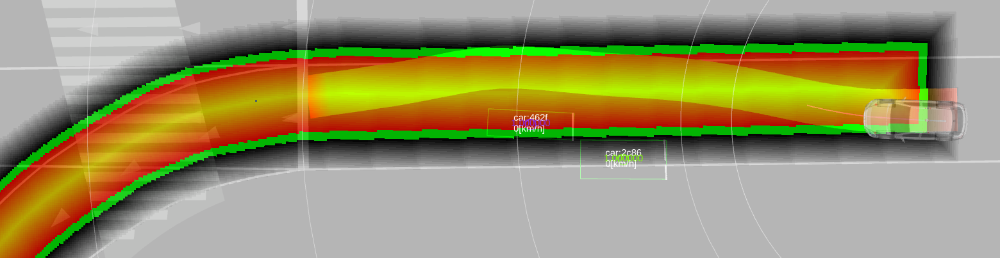

# Obstacle Avoidance Planner

## Purpose

This package generates a trajectory that is feasible to drive and collision free based on a reference path, drivable area, and static/dynamic obstacles.
Only position and orientation of trajectory are calculated in this module, and velocity or acceleration will be updated in the latter modules.

## Inputs / Outputs

### input

| Name                                                                   | Type                                           | Description                                        |
| ---------------------------------------------------------------------- | ---------------------------------------------- | -------------------------------------------------- |
| `~/input/path`                                                         | autoware_auto_planning_msgs/Path               | Reference path and the corresponding drivable area |
| `~/input/objects`                                                      | autoware_auto_perception_msgs/PredictedObjects | Recognized objects around the vehicle              |
| `/localization/kinematic_state`                                        | nav_msgs/Odometry                              | Current Velocity of ego vehicle                    |
| `/planning/scenario_planning/lane_driving/obstacle_avoidance_approval` | autoware_planning_msgs/EnableAvoidance         | Approval to execute obstacle avoidance             |

### output

| Name            | Type                                   | Description                                                       |
| --------------- | -------------------------------------- | ----------------------------------------------------------------- |
| `~/output/path` | autoware_auto_planning_msgs/Trajectory | Optimized trajectory that is feasible to drive and collision-free |

## Flowchart

Each module is explained briefly here based on the flowchart.

### Manage trajectory generation

When one of the following conditions area realized, callback function to generate a trajectory is called and publish the trajectory.
Otherwise, previously generated trajectory is published.

- Ego moves a certain distance compared to the previous ego pose (default: 10.0 [m])
- Time passes (default: 1.0 [s])
- The path shape is changed (e.g. when starting planning lane change)
- Ego is far from the previously generated trajectory

The previously generated trajectory is memorized, but it is not when the path shape is changed and ego is far from the previously generated trajectory.

### Select objects to avoid

Only obstacles that are static and locate in a shoulder lane is decided to avoid.
In detail, this equals to the following three conditions at the same time, and the red obstacles in the figure (id: 3, 4, 5) is to be avoided.

- Velocity is under a certain value (default: 0.1 [m/s])
- CoG of the obstacles is not on the center line
  - so that the ego will not avoid the car in front of the ego in the same lane.
- At least one point of the obstacle polygon is outside the drivable area.

### Generate object costmap

Cost map is generated according to the distance to the target obstacles to be avoided.

### Generate road boundary costmap

Cost map is generated according to the distance to the road boundaries.

These cost maps area used in the optimization to generate a collision-free trajectory.

### Smooth path

The latter optimization assumes that the reference path is smooth enough.
Therefore the path from behavior is smoothed here, and send to the optimization as a format of trajectory.
Obstacles are not considered.

### Optimize trajectory

This module makes the trajectory kinematically-feasible and collision-free.
We define vehicle pose in the frenet coordinate, and minimize tracking errors by optimization.
This optimization also considers vehicle kinematics and collision checking with road boundary and obstacles.
To decrease the computation cost, the optimization is applied to the shorter trajectory than the whole trajectory, and concatenate the remained trajectory with the optimized one at last.

The trajectory just in front of the ego must not be changed a lot so that the steering wheel will be stable.
Therefore, we use the previously generated trajectory in front of the ego.

Optimization center on the vehicle, that tries to locate just on the trajectory, can be tuned along side the vehicle vertical axis.
This parameter `optimization center offset` is defined as the signed length from the back-wheel center to the optimization center.
Some examples are shown in the following figure, and it is shown that the trajectory of vehicle shape differs according to the optimization center even if the reference trajectory (green one) is the same.

### Check drivability, and extend trajectory

Optimized trajectory is too short for velocity planning, therefore extend the trajectory by concatenating the optimized trajectory and the behavior path considering drivability.
Generated trajectory is checked if it is inside the drivable area or not, and if outside drivable area, output a trajectory inside drivable area with the behavior path or the previously generated trajectory.

As described above, the behavior path is separated into two paths: one is for optimization and the other is the remain. The first path becomes optimized trajectory, and the second path just is transformed to a trajectory. Then a trajectory inside the drivable area is calculated as follows.

- If optimized trajectory is **inside the drivable area**, and the remained trajectory is inside/outside the drivable area,
  - the output trajectory will be just concatenation of those two trajectories.
  - In this case, we do not care if the remained trajectory is inside or outside the drivable area since generally it is outside the drivable area (especially in a narrow road), but we want to pass a trajectory as long as possible to the latter module.
- If optimized trajectory is **outside the drivable area**, and the remained trajectory is inside/outside the drivable area,
  - and if the previously generated trajectory **is memorized**,
    - the output trajectory will be a part of previously generated trajectory, whose end firstly goes outside the drivable area.
  - and if the previously generated trajectory **is not memorized**,
    - the output trajectory will be a part of trajectory just transformed from the behavior path, whose end firstly goes outside the drivable area.

Optimization failure is dealt with the same as if the optimized trajectory is outside the drivable area.
The output trajectory is memorized as a previously generated trajectory for the next cycle.

_Rationale_
In the current design, since there are some modelling errors, the constraints are considered to be soft constraints.
Therefore, we have to make sure that the optimized trajectory is inside the drivable area or not after optimization.

### Assign trajectory velocity

Velocity is assigned in the result trajectory by the behavior path.
The shapes of the trajectory and the path are different, therefore the each nearest trajectory point to the path is searched and interpolated linearly.

## Algorithms

In this section, Elastic band (to smooth the path) and Model Predictive Trajectory (to optimize the trajectory) will be explained in detail.

### Elastic band

#### Abstract

Elastic band smooths the path generated in the behavior.
Since the latter process of optimization uses the curvature and normal vector of the reference path, smoothing should be applied here so that the optimization will be stable.

This smoothing process does not consider collision.
Therefore the output path may have a collision with road boundaries or obstacles.

#### Formulation

We formulate a QP problem minimizing the distance between the previous point and the next point for each point.
Conditions that each point can move to a certain extent are used so that the path will not changed a lot but will be smoother.

For $k$'th point ($\boldsymbol{p}_k$), the objective function is as follows.
The beginning and end point are fixed during the optimization.

$$
\min \sum_{k=1}^{n-1} |\boldsymbol{p}_{k+1} - \boldsymbol{p}_{k}| - |\boldsymbol{p}_{k} - \boldsymbol{p}_{k-1}|
$$

### Model predictive trajectory

#### Abstract

Model Predictive Trajectory (MPT) calculates the trajectory that realizes the following conditions.

- Kinematically feasible for linear vehicle kinematics model
- Collision free with obstacles and road boundaries

Conditions for collision free is considered to be not hard constraints but soft constraints.
When the optimization failed or the optimized trajectory is not collision free, the output trajectory will be previously generated trajectory.

Trajectory near the ego must be stable, therefore the condition where trajectory points near the ego are the same as previously generated trajectory is considered, and this is the only hard constraints in MPT.

#### Formulation

As the following figure, we consider the bicycle kinematics model in the frenet frame to track the reference path.
At time step $k$, we define lateral distance to the reference path, heading angle against the reference path, and steer angle as $y_k$, $\theta_k$, and $\delta_k$ respectively.

Assuming that the commanded steer angle is $\delta_{des, k}$, the kinematics model in the frenet frame is formulated as follows.
We also assume that the steer angle $\delta_k$ is first-order lag to the commanded one.

$$
\begin{align}
y_{k+1} & = y_{k} + v \sin \theta_k dt \\
\theta_{k+1} & = \theta_k + \frac{v \tan \delta_k}{L}dt - \kappa_k v \cos \theta_k dt \\
\delta_{k+1} & = \delta_k - \frac{\delta_k - \delta_{des,k}}{\tau}dt
\end{align}
$$

Then we linearize these equations.
$y_k$ and $\theta_k$ are tracking errors, so we assume that those are small enough.
Therefore $\sin \theta_k \approx \theta_k$.

Since $\delta_k$ is a steer angle, it is not always small.
By using a reference steer angle $\delta_{\mathrm{ref}, k}$ calculated by the reference path curvature $\kappa_k$, we express $\delta_k$ with a small value $\Delta \delta_k$.

Note that the steer angle $\delta_k$ is within the steer angle limitation $\delta_{\max}$.
When the reference steer angle $\delta_{\mathrm{ref}, k}$ is larger than the steer angle limitation $\delta_{\max}$, and $\delta_{\mathrm{ref}, k}$ is used to linearize the steer angle, $\Delta \delta_k$ is $\Delta \delta_k = \delta - \delta_{\mathrm{ref}, k} = \delta_{\max} - \delta_{\mathrm{ref}, k}$, and the absolute $\Delta \delta_k$ gets larger.
Therefore, we have to apply the steer angle limitation to $\delta_{\mathrm{ref}, k}$ as well.

$$
\begin{align}
\delta_{\mathrm{ref}, k} & = \mathrm{clamp}(\arctan(L \kappa_k), -\delta_{\max}, \delta_{\max}) \\
\delta_k & = \delta_{\mathrm{ref}, k} + \Delta \delta_k, \ \Delta \delta_k \ll 1 \\
\end{align}
$$

$\mathrm{clamp}(v, v_{\min}, v_{\max})$ is a function to convert $v$ to be larger than $v_{\min}$ and smaller than $v_{\max}$.

Using this $\delta_{\mathrm{ref}, k}$, $\tan \delta_k$ is linearized as follows.

$$
\begin{align}
\tan \delta_k & \approx \tan \delta_{\mathrm{ref}, k} + \left.\frac{d \tan \delta}{d \delta}\right|_{\delta = \delta_{\mathrm{ref}, k}} \Delta \delta_k \\
& = \tan \delta_{\mathrm{ref}, k} + \left.\frac{d \tan \delta}{d \delta}\right|_{\delta = \delta_{\mathrm{ref}, k}} (\delta_{\mathrm{ref}, k} - \delta_k) \\
& = \tan \delta_{\mathrm{ref}, k} - \frac{\delta_{\mathrm{ref}, k}}{\cos^2 \delta_{\mathrm{ref}, k}} + \frac{1}{\cos^2 \delta_{\mathrm{ref}, k}} \delta_k
\end{align}
$$

Based on the linearization, the error kinematics is formulated with the following linear equations.

$$
\begin{align}
    \begin{pmatrix}
        y_{k+1} \\
        \theta_{k+1} \\
        \delta_{k+1}
    \end{pmatrix}
    =
    \begin{pmatrix}
        1 & v dt & 0 \\
        0 & 1 & \frac{v dt}{L \cos^{2} \delta_{\mathrm{ref}, k}} \\
        0 & 0 & 1 - \frac{dt}{\tau}
    \end{pmatrix}
    \begin{pmatrix}
        y_k \\
        \theta_k \\
        \delta_k
    \end{pmatrix}
    +
    \begin{pmatrix}
        0 \\
        0 \\
        \frac{dt}{\tau}
    \end{pmatrix}
    \delta_{des}
    +
    \begin{pmatrix}
        0 \\
        \frac{v \tan(\delta_{\mathrm{ref}, k}) dt}{L} - \frac{v \delta_{\mathrm{ref}, k} dt}{L \cos^{2} \delta_{\mathrm{ref}, k}} - \kappa_k v dt\\
        0
    \end{pmatrix}
\end{align}
$$

The objective function for smoothing and tracking is shown as follows.

$$
\begin{align}
J_1 & (y_{0...N-1}, \theta_{0...N-1}, \delta_{0...N-1}) \\ & = w_y \sum_{k} y_k^2 + w_{\theta} \sum_{k} \theta_k^2 + w_{\delta} \sum_k \delta_k^2 + w_{\dot{\delta}} \sum_k \dot{\delta}_k^2 + w_{\ddot{\delta}} \sum_k \ddot{\delta}_k^2
\end{align}
$$

As mentioned before, the constraints to be collision free with obstacles and road boundaries are formulated to be soft constraints.
Assuming that the lateral distance to the road boundaries or obstacles from the back wheel center, front wheel center, and the point between them are $y_{\mathrm{base}, k}, y_{\mathrm{top}, k}, y_{\mathrm{mid}, k}$ respectively, and slack variables for each point are $\lambda_{\mathrm{base}}, \lambda_{\mathrm{top}}, \lambda_{\mathrm{mid}}$, the soft constraints can be formulated as follows.

$$
y_{\mathrm{base}, k, \min} - \lambda_{\mathrm{base}, k} \leq y_{\mathrm{base}, k} (y_k)  \leq y_{\mathrm{base}, k, \max} + \lambda_{\mathrm{base}, k}\\
y_{\mathrm{top}, k, \min} - \lambda_{\mathrm{top}, k} \leq y_{\mathrm{top}, k} (y_k) \leq y_{\mathrm{top}, k, \max} + \lambda_{\mathrm{top}, k}\\
y_{\mathrm{mid}, k, \min} - \lambda_{\mathrm{mid}, k} \leq y_{\mathrm{mid}, k} (y_k) \leq y_{\mathrm{mid}, k, \max} + \lambda_{\mathrm{mid}, k}
$$

Since $y_{\mathrm{base}, k}, y_{\mathrm{top}, k}, y_{\mathrm{mid}, k}$ is formulated as a linear function of $y_k$, the objective function for soft constraints is formulated as follows.

$$
\begin{align}
J_2 & (\lambda_{\mathrm{base}, 0...N-1}, \lambda_{\mathrm{mid}, 0...N-1}, \lambda_{\mathrm{top}, 0...N-1}) \\ & = w_{\mathrm{base}} \sum_{k} \lambda_{\mathrm{base}, k}^2 + w_{\mathrm{mid}} \sum_k \lambda_{\mathrm{mid}, k}^2 + w_{\mathrm{top}} \sum_k \lambda_{\mathrm{top}, k}^2
\end{align}
$$

Slack variables are also design variables for optimization.
We define a vector $\boldsymbol{x}$, that concatenates all the design variables.

$$
\begin{align}
\boldsymbol{x} =
\begin{pmatrix}
... & y_k & \lambda_{\mathrm{base}, k} & \lambda_{\mathrm{top}, k} & \lambda_{\mathrm{mid}, k} &  ...
\end{pmatrix}^T
\end{align}
$$

The summation of these two objective functions is the objective function for the optimization problem.

$$
\begin{align}
\min_{\boldsymbol{x}} J (\boldsymbol{x}) = \min_{\boldsymbol{x}} J_1 & (y_{0...N-1}, \theta_{0...N-1}, \delta_{0...N-1}) + J_2 (\lambda_{\mathrm{base}, 0...N-1}, \lambda_{\mathrm{mid}, 0...N-1}, \lambda_{\mathrm{top}, 0...N-1})
\end{align}
$$

As mentioned before, we use hard constraints where some trajectory points in front of the ego are the same as the previously generated trajectory points.
This hard constraints is formulated as follows.

$$
\begin{align}
\delta_k = \delta_{k}^{\mathrm{prev}} (0 \leq i \leq N_{\mathrm{fix}})
\end{align}
$$

Finally we transform those objective functions to the following QP problem, and solve it.

$$
\begin{align}
\min_{\boldsymbol{x}} \ & \frac{1}{2} \boldsymbol{x}^T \boldsymbol{P} \boldsymbol{x} + \boldsymbol{q} \boldsymbol{x} \\
\mathrm{s.t.} \ & \boldsymbol{b}_l \leq \boldsymbol{A} \boldsymbol{x} \leq \boldsymbol{b}_u
\end{align}
$$

## Limitation

- When turning right or left in the intersection, the output trajectory is close to the outside road boundary.
- Roles of planning for behavior_path_planner and obstacle_avoidance_planner are not decided clearly.
- High computation cost

## Comparison to other methods

Planning a trajectory that satisfies kinematic feasibility and collision-free has two main characteristics that makes hard to be solved: one is non-convex and the other is high dimension.
According to the characteristics, we investigate pros and cons of the typical planning methods: optimization-based, sampling-based, and learning-based method.

### Optimization-based method

- pros: comparatively fast against high dimension by leveraging the gradient descent
- cons: often converge to the local minima in the non-convex problem

### Sampling-based method

- pros: realize global optimization
- cons: high computation cost especially in the complex case

### Learning-based method

under research yet

Based on these pros/cons, we chose the optimization-based planner first.
Although it has a cons to converge to the local minima, it can get a good solution by the preprocessing to approximate the convex problem that almost equals to the original non-convex problem.

## How to debug

Topics for debugging will be explained in this section.

- **interpolated_points_marker**
  - Trajectory points that is resampled from the input trajectory of obstacle avoidance planner. Whether this trajectory is inside the drivable area, smooth enough can be checked.

- **smoothed_points_text**
  - The output trajectory points from Elastic Band. Not points but small numbers are visualized. Whether these smoothed points are distorted or not can be checked.

- **(base/top/mid)\_bounds_line**
  - Lateral Distance to the road boundaries to check collision in MPT (More precisely, - vehicle_width / 2.0).
  - This collision check is done with three points on the vehicle (base = back wheel center, top, mid), therefore three line markers are visualized for each trajectory point.
  - If the distance between the edge of line markers and the road boundaries is not about the half width of the vehicle, collision check will fail.

- **optimized_points_marker**
  - The output trajectory points from MPT. Whether the trajectory is outside the drivable area can be checked.

- **Trajectory with footprint**
  - Trajectory footprints can be visualized by TrajectoryFootprint of rviz_plugin. Whether trajectory footprints of input/output of obstacle_avoidance_planner is inside the drivable area or not can be checked.

- **Drivable Area**
  - Drivable area. When drivable area generation failed, the drawn area may be distorted.
  - `nav_msgs/msg/OccupancyGrid`
  - topic name: `/planning/scenario_planning/lane_driving/behavior_planning/behavior_path_planner/debug/drivable_area`

- **area_with_objects**
  - Area where obstacles are removed from the drivable area
  - `nav_msgs/msg/OccupancyGrid`

- **object_clearance_map**
  - Cost map for obstacles (distance to the target obstacles to be avoided)
  - `nav_msgs/msg/OccupancyGrid`

- **clearance_map**
  - Cost map for drivable area (distance to the road boundaries)
  - `nav_msgs/msg/OccupancyGrid`

