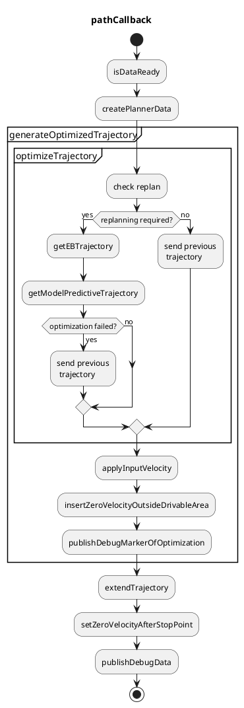

# Obstacle Avoidance Planner

## Purpose

This package generates a trajectory that is kinematically-feasible to drive and collision-free based on the input path, drivable area.
Only position and orientation of trajectory are updated in this module, and velocity is just taken over from the one in the input path.

## Feature

This package is able to

- make the trajectory inside the drivable area as much as possible
  - NOTE: Static obstacles to avoid can be removed from the drivable area.
- insert stop point before the planned footprint will be outside the drivable area

Note that the velocity is just taken over from the input path.

## Inputs / Outputs

### input

| Name               | Type                                 | Description                                        |
| ------------------ | ------------------------------------ | -------------------------------------------------- |
| `~/input/path`     | autoware_auto_planning_msgs/msg/Path | Reference path and the corresponding drivable area |
| `~/input/odometry` | nav_msgs/msg/Odometry                | Current Velocity of ego vehicle                    |

### output

| Name                  | Type                                       | Description                                                       |
| --------------------- | ------------------------------------------ | ----------------------------------------------------------------- |
| `~/output/trajectory` | autoware_auto_planning_msgs/msg/Trajectory | Optimized trajectory that is feasible to drive and collision-free |

## Flowchart

Flowchart of functions is explained here.



### createPlannerData

The following data for planning is created.

```cpp
struct PlannerData
{
  // input
  Header header;
  std::vector<TrajectoryPoint> traj_points; // converted from the input path
  std::vector<geometry_msgs::msg::Point> left_bound;
  std::vector<geometry_msgs::msg::Point> right_bound;

  // ego
  geometry_msgs::msg::Pose ego_pose;
  double ego_vel;
};
```

### check replan

When one of the following conditions are met, trajectory optimization will be executed.
Otherwise, previously optimized trajectory is used with updating the velocity from the latest input path.

max_path_shape_around_ego_lat_dist

- Ego moves longer than `replan.max_ego_moving_dist` in one cycle. (default: 3.0 [m])
  - This is for when the ego pose is set again in the simulation.
- Trajectory's end, which is considered as the goal pose, moves longer than `replan.max_goal_moving_dist` in one cycle. (default: 15.0 [ms])
  - When the goal pose is set again, the planning should be reset.
- Time passes. (default: 1.0 [s])
  - The optimization is skipped for a while sine the optimization is sometimes heavy.
- The input path changes laterally longer than `replan.max_path_shape_around_ego_lat_dist` in one cycle. (default: 2.0)

### getModelPredictiveTrajectory

This module makes the trajectory kinematically-feasible and collision-free.
We define vehicle pose in the frenet coordinate, and minimize tracking errors by optimization.
This optimization considers vehicle kinematics and collision checking with road boundary and obstacles.
To decrease the computation cost, the optimization is applied to the shorter trajectory (default: 50 [m]) than the whole trajectory, and concatenate the remained trajectory with the optimized one at last.

The trajectory just in front of the ego must not be changed a lot so that the steering wheel will be stable.
Therefore, we use the previously generated trajectory in front of the ego.

Optimization center on the vehicle, that tries to locate just on the trajectory, can be tuned along side the vehicle vertical axis.
This parameter `mpt.kinematics.optimization center offset` is defined as the signed length from the back-wheel center to the optimization center.
Some examples are shown in the following figure, and it is shown that the trajectory of vehicle shape differs according to the optimization center even if the reference trajectory (green one) is the same.


More details can be seen [here](docs/mpt.md).

### applyInputVelocity

Velocity is assigned in the optimized trajectory from the velocity in the behavior path.
The shapes of the optimized trajectory and the path are different, therefore the each nearest trajectory point to the path is searched and the velocity is interpolated with zero-order hold.

### insertZeroVelocityOutsideDrivableArea

Optimized trajectory is too short for velocity planning, therefore extend the trajectory by concatenating the optimized trajectory and the behavior path considering drivability.
Generated trajectory is checked if it is inside the drivable area or not, and if outside drivable area, output a trajectory inside drivable area with the behavior path or the previously generated trajectory.

As described above, the behavior path is separated into two paths: one is for optimization and the other is the remain. The first path becomes optimized trajectory, and the second path just is transformed to a trajectory. Then a trajectory inside the drivable area is calculated as follows.

- If optimized trajectory is **inside the drivable area**, and the remained trajectory is inside/outside the drivable area,
  - the output trajectory will be just concatenation of those two trajectories.
  - In this case, we do not care if the remained trajectory is inside or outside the drivable area since generally it is outside the drivable area (especially in a narrow road), but we want to pass a trajectory as long as possible to the latter module.
- If optimized trajectory is **outside the drivable area**, and the remained trajectory is inside/outside the drivable area,
  - and if the previously generated trajectory **is memorized**,
    - the output trajectory will be the previously generated trajectory, where zero velocity is inserted to the point firstly going outside the drivable area.
  - and if the previously generated trajectory **is not memorized**,
    - the output trajectory will be a part of trajectory just transformed from the behavior path, where zero velocity is inserted to the point firstly going outside the drivable area.

Optimization failure is dealt with the same as if the optimized trajectory is outside the drivable area.
The output trajectory is memorized as a previously generated trajectory for the next cycle.

_Rationale_
In the current design, since there are some modelling errors, the constraints are considered to be soft constraints.
Therefore, we have to make sure that the optimized trajectory is inside the drivable area or not after optimization.

## Limitation

- Computation cost is sometimes high.
- Because of the approximation such as linearization, some narrow roads cannot be run by the planner.
- Roles of planning for `behavior_path_planner` and `obstacle_avoidance_planner` are not decided clearly. Both can avoid obstacles.

## Comparison to other methods

Trajectory planning problem that satisfies kinematically-feasibility and collision-free has two main characteristics that makes hard to be solved: one is non-convex and the other is high dimension.
Based on the characteristics, we investigate pros/cons of the typical planning methods: optimization-based, sampling-based, and learning-based method.

### Optimization-based method

- pros: comparatively fast against high dimension by leveraging the gradient descent
- cons: often converge to the local minima in the non-convex problem

### Sampling-based method

- pros: realize global optimization
- cons: high computation cost especially in the complex case

### Learning-based method

- under research yet

Based on these pros/cons, we chose the optimization-based planner first.
Although it has a cons to converge to the local minima, it can get a good solution by the preprocessing to approximate the problem to convex that almost equals to the original non-convex problem.

## How to Tune Parameters

### Drivability in narrow roads

- modify `mpt.clearance.soft_clearance_from_road`
  - This parameter describes how much margin to make between the trajectory and road boundaries.
  - Due to the model error for optimization, the constraint such as collision-free is not fully met.
    - By making this parameter larger, the is for narrow-road driving may be resolved. 12180
- modify `mpt.kinematics.optimization_center_offset`

  - The point on the vehicle, offset forward with this parameter from the base link` tries to follow the reference path.

- change or tune the method to approximate footprints with a set of circles.
  - See [here](https://autowarefoundation.github.io/autoware.universe/main/planning/obstacle_avoidance_planner/docs/mpt/#collision-free)
  - Tuning means changing the ratio of circle's radius.

### Computation time

- under construction

### Robustness

- Check if the trajectory before or after MPT is not robust
  - if the trajectory before MPT is not robust
  - if the trajectory after MPT is not robust
    - make `mpt.weight.steer_input_weight` or `mpt.weight.steer_rate_weight` larger, which are stability of steering wheel along the trajectory.

### Other options

- `option.enable_skip_optimization` skips MPT optimization.
- `option.enable_calculation_time_info` enables showing each calculation time for functions and total calculation time on the terminal.
- `option.enable_outside_drivable_area_stop` enables stopping just before the generated trajectory point will be outside the drivable area.

## How To Debug

How to debug can be seen [here](docs/debug.md).
