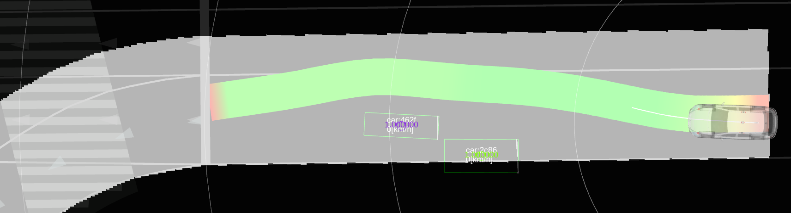
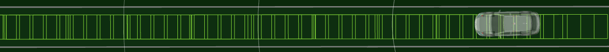
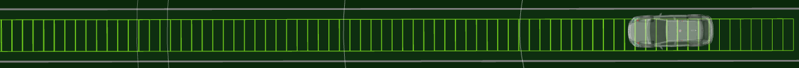
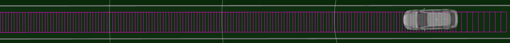
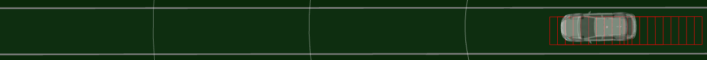
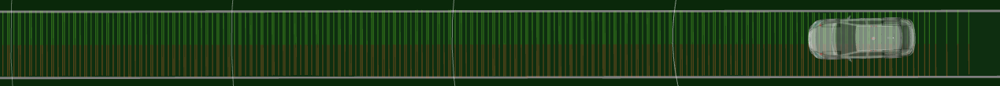
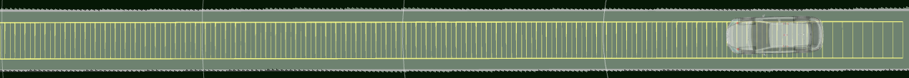
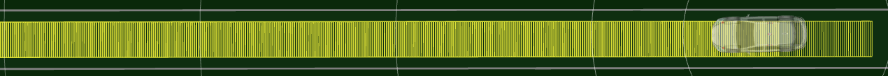
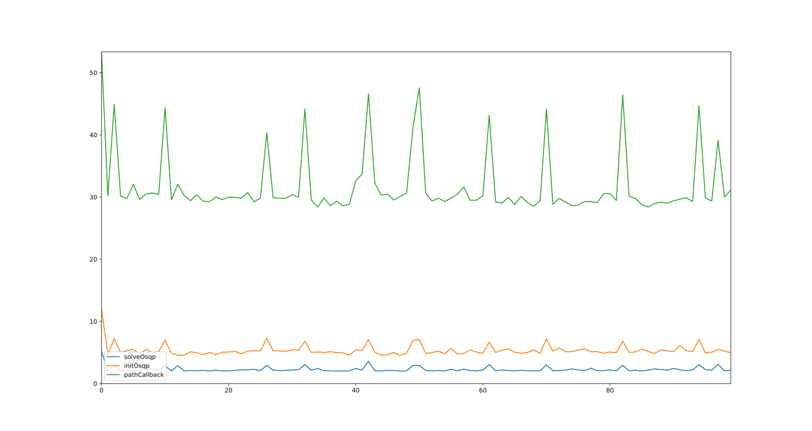

# Debug

## Debug visualization

Topics for debugging will be explained in this section.

- **Drivable area**
  - Drivable area to cover the road. Whether this area is continuous and covers the road can be checked.
  - `/planning/scenario_planning/lane_driving/behavior_planning/behavior_path_planner/debug/drivable_area`, whose type is `nav_msgs/msg/OccupancyGrid`



- **Path from behavior**
  - The input path of obstacle_avoidance_planner. Whether this path is continuous and the curvature is not so high can be checked.
  - `Path` or `PathFootprint` rviz plugin.



- **EB trajectory**
  - The output trajectory of elastic band. Whether this trajectory is very smooth and a sampling width is constant can be checked.
  - `Trajectory` or `TrajectoryFootprint` rviz plugin.



- **MPT reference trajectory**
  - The reference trajectory of model predictive trajectory. Whether this trajectory is very smooth and a sampling width is constant can be checked.
  - `Trajectory` or `TrajectoryFootprint` rviz plugin.



- **MPT fixed trajectory**
  - The fixed trajectory around the ego of model predictive trajectory.
  - `Trajectory` or `TrajectoryFootprint` rviz plugin.



- **bounds**
  - Lateral Distance to the road or object boundaries to check collision in model predictive trajectory.
  - Whether these lines' ends align the road or obstacle boundaries can be checked.
  - `bounds*` of `/planning/scenario_planning/lane_driving/motion_planning/obstacle_avoidance_planner/debug/marker` whose type is `visualization_msgs/msg/MarkerArray`



- **MPT trajectory**
  - The output of model predictive trajectory. Whether this trajectory is smooth enough and inside the drivable area can be checked.
  - `Trajectory` or `TrajectoryFootprint` rviz plugin.



- **Output trajectory**
  - The output of obstacle_avoidance_planner. Whether this trajectory is smooth enough can be checked.
  - `Trajectory` or `TrajectoryFootprint` rviz plugin.



## Calculation cost

Obstacle avoidance planner consists of many functions such as clearance map generation, boundary search, reference path smoothing, trajectory optimization, ...
We can see the calculation time for each function as follows.

### Raw data

```sh
$ ros2 topic echo /planning/scenario_planning/lane_driving/motion_planning/obstacle_avoidance_planner/debug/calculation_time --field data

      getDrivableAreaInCV:= 0.21 [ms]
      getClearanceMap:= 1.327 [ms]
      drawObstaclesOnImage:= 0.436 [ms]
      getAreaWithObjects:= 0.029 [ms]
      getClearanceMap:= 2.186 [ms]
    getMaps:= 4.213 [ms]
          calculateTrajectory:= 2.417 [ms]
        getOptimizedTrajectory:= 5.203 [ms]
      getEBTrajectory:= 5.231 [ms]
          calcBounds:= 0.821 [ms]
          calcVehicleBounds:= 0.27 [ms]
        getReferencePoints:= 2.866 [ms]
        generateMPTMatrix:= 0.195 [ms]
        generateValueMatrix:= 0.019 [ms]
          getObjectiveMatrix:= 0.559 [ms]
          getConstraintMatrix:= 1.776 [ms]
          initOsqp:= 9.074 [ms]
          solveOsqp:= 3.809 [ms]
        executeOptimization:= 15.46 [ms]
        getMPTPoints:= 0.049 [ms]
      getModelPredictiveTrajectory:= 18.928 [ms]
    optimizeTrajectory:= 24.234 [ms]
    insertZeroVelocityOutsideDrivableArea:= 0.023 [ms]
      getDebugVisualizationMarker:= 0.446 [ms]
      publishDebugVisualizationMarker:= 2.146 [ms]
      getDebugVisualizationWallMarker:= 0.001 [ms]
      publishDebugVisualizationWallMarker:= 0.013 [ms]
    publishDebugDataInOptimization:= 2.696 [ms]
    getExtendedTrajectory:= 0.016 [ms]
    generateFineTrajectoryPoints:= 0.118 [ms]
    alignVelocity:= 1.227 [ms]
  generatePostProcessedTrajectory:= 1.375 [ms]
    makePrevTrajectories:= 1.411 [ms]
  generateOptimizedTrajectory:= 33.284 [ms]
    getExtendedTrajectory:= 0.018 [ms]
    generateFineTrajectoryPoints:= 0.084 [ms]
    alignVelocity:= 1.109 [ms]
  generatePostProcessedTrajectory:= 1.217 [ms]
    getDebugCostMap * 3:= 0 [ms]
  publishDebugDataInMain:= 0.023 [ms]
pathCallback:= 34.614 [ms]
```

### Plot

With a script, we can plot some of above time as follows.

```sh
python3 scripts/calclation_time_analyzer.py -f "solveOsqp,initOsqp,pathCallback"
```


