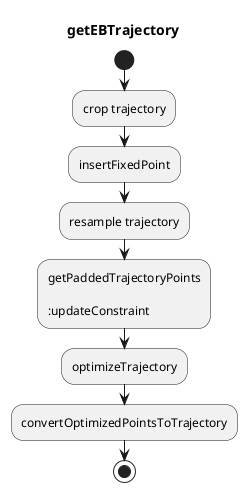

# Elastic band

## Abstract

Elastic band smooths the input path.
Since the latter optimization (model predictive trajectory) is calculated on the frenet frame, path smoothing is applied here so that the latter optimization will be stable.

Note that this smoothing process does not consider collision checking.
Therefore the output path may have a collision with road boundaries or obstacles.

## Flowchart

## Formulation

We formulate a quadratic problem minimizing the diagonal length of the rhombus on each point generated by the current point and its previous and next points, shown as the red vector's length.

{: style="width:600px"}

Assuming that $k$'th point is $\boldsymbol{p}_k = (x_k, y_k)$, the objective function is as follows.

$$
\begin{align}
\ J & = \min \sum_{k=1}^{n-2} ||(\boldsymbol{p}_{k+1} - \boldsymbol{p}_{k}) - (\boldsymbol{p}_{k} - \boldsymbol{p}_{k-1})||^2 \\
\ & = \min \sum_{k=1}^{n-2} ||\boldsymbol{p}_{k+1} - 2 \boldsymbol{p}_{k} + \boldsymbol{p}_{k-1}||^2 \\
\ & = \min \sum_{k=1}^{n-2} \{(x_{k+1} - x_k + x_{k-1})^2 + (y_{k+1} - y_k + y_{k-1})^2\} \\
\ & = \min
    \begin{pmatrix}
        \ x_0 \\
        \ x_1 \\
        \ x_2 \\
        \vdots \\
        \ x_{n-3}\\
        \ x_{n-2} \\
        \ x_{n-1} \\
        \ y_0 \\
        \ y_1 \\
        \ y_2 \\
        \vdots \\
        \ y_{n-3}\\
        \ y_{n-2} \\
        \ y_{n-1} \\
    \end{pmatrix}^T
    \begin{pmatrix}
      1 & -2 & 1 & 0 & \dots& \\
      -2 & 5 & -4 & 1 & 0 &\dots   \\
      1 & -4 & 6 & -4 & 1 & \\
      0 & 1 & -4 & 6 & -4 &   \\
      \vdots & 0 & \ddots&\ddots& \ddots   \\
      & \vdots & & & \\
      & & & 1 & -4 & 6 & -4 & 1 \\
      & & & & 1 & -4 & 5 & -2 \\
      & & & & & 1 & -2 &  1& \\
      & & & & & & & &1 & -2 & 1 & 0 & \dots& \\
      & & & & & & & &-2 & 5 & -4 & 1 & 0 &\dots   \\
      & & & & & & & &1 & -4 & 6 & -4 & 1 & \\
      & & & & & & & &0 & 1 & -4 & 6 & -4 &   \\
      & & & & & & & &\vdots & 0 & \ddots&\ddots& \ddots   \\
      & & & & & & & & & \vdots & & & \\
      & & & & & & & & & & & 1 & -4 & 6 & -4 & 1 \\
      & & & & & & & & & & & & 1 & -4 & 5 & -2 \\
      & & & & & & & & & & & & & 1 & -2 &  1& \\
    \end{pmatrix}
    \begin{pmatrix}
        \ x_0 \\
        \ x_1 \\
        \ x_2 \\
        \vdots \\
        \ x_{n-3}\\
        \ x_{n-2} \\
        \ x_{n-1} \\
        \ y_0 \\
        \ y_1 \\
        \ y_2 \\
        \vdots \\
        \ y_{n-3}\\
        \ y_{n-2} \\
        \ y_{n-1} \\
    \end{pmatrix}
\end{align}
$$

Regarding the constraint, the distance that each point can move is limited so that the path will not changed a lot but will be smoother.
In detail, the longitudinal distance that each point can move is zero, and the lateral distance is parameterized as `eb.clearance.clearance_for_fix`, `eb.clearance.clearance_for_joint` and `eb.clearance.clearance_for_smooth`.

The following figure describes how to constrain the lateral distance to move.
The red line is where the point can move. The points for the upper and lower bound are described as $(x_k^u, y_k^u)$ and $(x_k^l, y_k^l)$, respectively.

{: style="width:700px"}

Based on the line equation whose slope angle is $\theta_k$ and that passes through $(x_k, y_k)$, $(x_k^u, y_k^u)$ and $(x_k^l, y_k^l)$, the lateral constraint is formulated as follows.

$$
C_k^l \leq C_k \leq C_k^u
$$

In addition, the beginning point is fixed and the end point as well if the end point is considered as the goal.
This constraint can be applied with the upper equation by changing the distance that each point can move.
