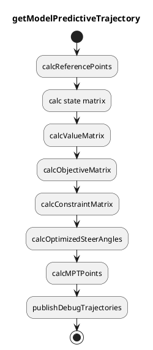
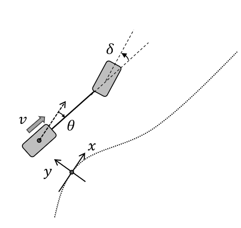

# Model predictive trajectory

## Abstract

Model Predictive Trajectory (MPT) calculates the trajectory that meets the following conditions.

- Kinematically feasible for linear vehicle kinematics model
- Collision free with obstacles and road boundaries

Conditions for collision free is considered to be not hard constraints but soft constraints.
When the optimization failed or the optimized trajectory is not collision free, the output trajectory will be previously generated trajectory.

Trajectory near the ego must be stable, therefore the condition where trajectory points near the ego are the same as previously generated trajectory is considered, and this is the only hard constraints in MPT.

## Flowchart

## Vehicle kinematics

As the following figure, we consider the bicycle kinematics model in the frenet frame to track the reference path.
At time step $k$, we define lateral distance to the reference path, heading angle against the reference path, and steer angle as $y_k$, $\theta_k$, and $\delta_k$ respectively.

Assuming that the commanded steer angle is $\delta_{des, k}$, the kinematics model in the frenet frame is formulated as follows.
We also assume that the steer angle $\delta_k$ is first-order lag to the commanded one.

$$
\begin{align}
y_{k+1} & = y_{k} + v \sin \theta_k dt \\
\theta_{k+1} & = \theta_k + \frac{v \tan \delta_k}{L}dt - \kappa_k v \cos \theta_k dt \\
\delta_{k+1} & = \delta_k - \frac{\delta_k - \delta_{des,k}}{\tau}dt
\end{align}
$$

### Linearization

Then we linearize these equations.
$y_k$ and $\theta_k$ are tracking errors, so we assume that those are small enough.
Therefore $\sin \theta_k \approx \theta_k$.

Since $\delta_k$ is a steer angle, it is not always small.
By using a reference steer angle $\delta_{\mathrm{ref}, k}$ calculated by the reference path curvature $\kappa_k$, we express $\delta_k$ with a small value $\Delta \delta_k$.

Note that the steer angle $\delta_k$ is within the steer angle limitation $\delta_{\max}$.
When the reference steer angle $\delta_{\mathrm{ref}, k}$ is larger than the steer angle limitation $\delta_{\max}$, and $\delta_{\mathrm{ref}, k}$ is used to linearize the steer angle, $\Delta \delta_k$ is $\Delta \delta_k = \delta - \delta_{\mathrm{ref}, k} = \delta_{\max} - \delta_{\mathrm{ref}, k}$, and the absolute $\Delta \delta_k$ gets larger.
Therefore, we have to apply the steer angle limitation to $\delta_{\mathrm{ref}, k}$ as well.

$$
\begin{align}
\delta_{\mathrm{ref}, k} & = \mathrm{clamp}(\arctan(L \kappa_k), -\delta_{\max}, \delta_{\max}) \\
\delta_k & = \delta_{\mathrm{ref}, k} + \Delta \delta_k, \ \Delta \delta_k \ll 1 \\
\end{align}
$$

$\mathrm{clamp}(v, v_{\min}, v_{\max})$ is a function to convert $v$ to be larger than $v_{\min}$ and smaller than $v_{\max}$.

Using this $\delta_{\mathrm{ref}, k}$, $\tan \delta_k$ is linearized as follows.

$$
\begin{align}
\tan \delta_k & \approx \tan \delta_{\mathrm{ref}, k} + \left.\frac{d \tan \delta}{d \delta}\right|_{\delta = \delta_{\mathrm{ref}, k}} \Delta \delta_k \\
& = \tan \delta_{\mathrm{ref}, k} + \left.\frac{d \tan \delta}{d \delta}\right|_{\delta = \delta_{\mathrm{ref}, k}} (\delta_{\mathrm{ref}, k} - \delta_k) \\
& = \tan \delta_{\mathrm{ref}, k} - \frac{\delta_{\mathrm{ref}, k}}{\cos^2 \delta_{\mathrm{ref}, k}} + \frac{1}{\cos^2 \delta_{\mathrm{ref}, k}} \delta_k
\end{align}
$$

### One-step state equation

Based on the linearization, the error kinematics is formulated with the following linear equations,

$$
\begin{align}
    \begin{pmatrix}
        y_{k+1} \\
        \theta_{k+1}
    \end{pmatrix}
    =
    \begin{pmatrix}
        1 & v dt \\
        0 & 1 \\
    \end{pmatrix}
    \begin{pmatrix}
        y_k \\
        \theta_k \\
    \end{pmatrix}
    +
    \begin{pmatrix}
        0 \\
        \frac{v dt}{L \cos^{2} \delta_{\mathrm{ref}, k}} \\
    \end{pmatrix}
    \delta_{k}
    +
    \begin{pmatrix}
        0 \\
        \frac{v \tan(\delta_{\mathrm{ref}, k}) dt}{L} - \frac{v \delta_{\mathrm{ref}, k} dt}{L \cos^{2} \delta_{\mathrm{ref}, k}} - \kappa_k v dt\\
    \end{pmatrix}
\end{align}
$$

which can be formulated as follows with the state $\boldsymbol{x}$, control input $u$ and some matrices, where $\boldsymbol{x} = (y_k, \theta_k)$

$$
\begin{align}
  \boldsymbol{x}_{k+1} = A_k \boldsymbol{x}_k + \boldsymbol{b}_k u_k + \boldsymbol{w}_k
\end{align}
$$

### Time-series state equation

Then, we formulate time-series state equation by concatenating states, control inputs and matrices respectively as

$$
\begin{align}
  \boldsymbol{x} = A \boldsymbol{x}_0 + B \boldsymbol{u} + \boldsymbol{w}
\end{align}
$$

where

$$
\begin{align}
\boldsymbol{x} = (\boldsymbol{x}^T_1, \boldsymbol{x}^T_2, \boldsymbol{x}^T_3, \dots, \boldsymbol{x}^T_{n-1})^T \\
\boldsymbol{u} = (u_0, u_1, u_2, \dots, u_{n-2})^T \\
\boldsymbol{w} = (\boldsymbol{w}^T_0, \boldsymbol{w}^T_1, \boldsymbol{w}^T_2, \dots, \boldsymbol{w}^T_{n-1})^T. \\
\end{align}
$$

In detail, each matrices are constructed as follows.

$$
\begin{align}
    \begin{pmatrix}
        \boldsymbol{x}_1 \\
        \boldsymbol{x}_2 \\
        \boldsymbol{x}_3 \\
        \vdots \\
        \boldsymbol{x}_{n-1}
    \end{pmatrix}
    =
    \begin{pmatrix}
        A_0 \\
        A_1 A_0 \\
        A_2 A_1 A_0\\
        \vdots \\
        \prod\limits_{k=0}^{n-1} A_{k}
    \end{pmatrix}
    \boldsymbol{x}_0
    +
    \begin{pmatrix}
      B_0 & 0 & & \dots & 0 \\
      A_0 B_0 & B_1 & 0 & \dots & 0 \\
      A_1 A_0 B_0 & A_0 B_1 & B_2 & \dots & 0 \\
      \vdots & \vdots & & \ddots & 0 \\
      \prod\limits_{k=0}^{n-3} A_k B_0 & \prod\limits_{k=0}^{n-4} A_k B_1 & \dots & A_0 B_{n-3} & B_{n-2}
    \end{pmatrix}
    \begin{pmatrix}
        u_0 \\
        u_1 \\
        u_2 \\
        \vdots \\
        u_{n-2}
    \end{pmatrix}
    +
    \begin{pmatrix}
      I & 0 & & \dots & 0 \\
      A_0 & I & 0 & \dots & 0 \\
      A_1 A_0 & A_0 & I & \dots & 0 \\
      \vdots & \vdots & & \ddots & 0 \\
      \prod\limits_{k=0}^{n-3} A_k & \prod\limits_{k=0}^{n-4} A_k & \dots & A_0 & I
    \end{pmatrix}
    \begin{pmatrix}
        \boldsymbol{w}_0 \\
        \boldsymbol{w}_1 \\
        \boldsymbol{w}_2 \\
        \vdots \\
        \boldsymbol{w}_{n-2}
    \end{pmatrix}
\end{align}
$$

### Free-boundary-conditioned time-series state equation

For path planning which does not start from the current ego pose, $\boldsymbol{x}_0$ should be the design variable of optimization.
Therefore, we make $\boldsymbol{u}'$ by concatenating $\boldsymbol{x}_0$ and $\boldsymbol{u}$, and redefine $\boldsymbol{x}$ as follows.

$$
\begin{align}
  \boldsymbol{u}' & = (\boldsymbol{x}^T_0, \boldsymbol{u}^T)^T \\
  \boldsymbol{x} & = (\boldsymbol{x}^T_0, \boldsymbol{x}^T_1, \boldsymbol{x}^T_2, \dots, \boldsymbol{x}^T_{n-1})^T
\end{align}
$$

Then we get the following state equation

$$
\begin{align}
  \boldsymbol{x}' = B \boldsymbol{u}' + \boldsymbol{w},
\end{align}
$$

which is in detail

$$
\begin{align}
    \begin{pmatrix}
        \boldsymbol{x}_0 \\
        \boldsymbol{x}_1 \\
        \boldsymbol{x}_2 \\
        \boldsymbol{x}_3 \\
        \vdots \\
        \boldsymbol{x}_{n-1}
    \end{pmatrix}
    =
    \begin{pmatrix}
      I & 0 & \dots & & & 0 \\
      A_0 & B_0 & 0 & & \dots & 0 \\
      A_1 A_0 & A_0 B_0 & B_1 & 0 & \dots & 0 \\
      A_2 A_1 A_0 & A_1 A_0 B_0 & A_0 B_1 & B_2 & \dots & 0 \\
      \vdots & \vdots & \vdots & & \ddots & 0 \\
      \prod\limits_{k=0}^{n-1} A_k & \prod\limits_{k=0}^{n-3} A_k B_0 & \prod\limits_{k=0}^{n-4} A_k B_1 & \dots & A_0 B_{n-3} & B_{n-2}
    \end{pmatrix}
    \begin{pmatrix}
        \boldsymbol{x}_0 \\
        u_0 \\
        u_1 \\
        u_2 \\
        \vdots \\
        u_{n-2}
    \end{pmatrix}
    +
    \begin{pmatrix}
      0 & \dots & & & 0 \\
      I & 0 & & \dots & 0 \\
      A_0 & I & 0 & \dots & 0 \\
      A_1 A_0 & A_0 & I & \dots & 0 \\
      \vdots & \vdots & & \ddots & 0 \\
      \prod\limits_{k=0}^{n-3} A_k & \prod\limits_{k=0}^{n-4} A_k & \dots & A_0 & I
    \end{pmatrix}
    \begin{pmatrix}
        \boldsymbol{w}_0 \\
        \boldsymbol{w}_1 \\
        \boldsymbol{w}_2 \\
        \vdots \\
        \boldsymbol{w}_{n-2}
    \end{pmatrix}.
\end{align}
$$

## Objective function

The objective function for smoothing and tracking is shown as follows, which can be formulated with value function matrices $Q, R$.

$$
\begin{align}
J_1 (\boldsymbol{x}', \boldsymbol{u}') & = w_y \sum_{k} y_k^2 + w_{\theta} \sum_{k} \theta_k^2 + w_{\delta} \sum_k \delta_k^2 + w_{\dot{\delta}} \sum_k \dot{\delta}_k^2 + w_{\ddot{\delta}} \sum_k \ddot{\delta}_k^2 \\
& = \boldsymbol{x}'^T Q \boldsymbol{x}' + \boldsymbol{u}'^T R \boldsymbol{u}' \\
& = \boldsymbol{u}'^T H \boldsymbol{u}' + \boldsymbol{u}'^T \boldsymbol{f}
\end{align}
$$

As mentioned before, the constraints to be collision free with obstacles and road boundaries are formulated to be soft constraints.
Assuming that the lateral distance to the road boundaries or obstacles from the back wheel center, front wheel center, and the point between them are $y_{\mathrm{base}, k}, y_{\mathrm{top}, k}, y_{\mathrm{mid}, k}$ respectively, and slack variables for each point are $\lambda_{\mathrm{base}}, \lambda_{\mathrm{top}}, \lambda_{\mathrm{mid}}$, the soft constraints can be formulated as follows.

$$
y_{\mathrm{base}, k, \min} - \lambda_{\mathrm{base}, k} \leq y_{\mathrm{base}, k} (y_k)  \leq y_{\mathrm{base}, k, \max} + \lambda_{\mathrm{base}, k}\\
y_{\mathrm{top}, k, \min} - \lambda_{\mathrm{top}, k} \leq y_{\mathrm{top}, k} (y_k) \leq y_{\mathrm{top}, k, \max} + \lambda_{\mathrm{top}, k}\\
y_{\mathrm{mid}, k, \min} - \lambda_{\mathrm{mid}, k} \leq y_{\mathrm{mid}, k} (y_k) \leq y_{\mathrm{mid}, k, \max} + \lambda_{\mathrm{mid}, k} \\
0 \leq \lambda_{\mathrm{base}, k} \\
0 \leq \lambda_{\mathrm{top}, k} \\
0 \leq \lambda_{\mathrm{mid}, k}
$$

Since $y_{\mathrm{base}, k}, y_{\mathrm{top}, k}, y_{\mathrm{mid}, k}$ is formulated as a linear function of $y_k$, the objective function for soft constraints is formulated as follows.

$$
\begin{align}
J_2 & (\boldsymbol{\lambda}_\mathrm{base}, \boldsymbol{\lambda}_\mathrm{top}, \boldsymbol {\lambda}_\mathrm{mid})\\
& = w_{\mathrm{base}} \sum_{k} \lambda_{\mathrm{base}, k} + w_{\mathrm{mid}} \sum_k \lambda_{\mathrm{mid}, k} + w_{\mathrm{top}} \sum_k \lambda_{\mathrm{top}, k}
\end{align}
$$

Slack variables are also design variables for optimization.
We define a vector $\boldsymbol{v}$, that concatenates all the design variables.

$$
\begin{align}
\boldsymbol{v} =
\begin{pmatrix}
  \boldsymbol{u}'^T & \boldsymbol{\lambda}_\mathrm{base}^T & \boldsymbol{\lambda}_\mathrm{top}^T & \boldsymbol{\lambda}_\mathrm{mid}^T
\end{pmatrix}^T
\end{align}
$$

The summation of these two objective functions is the objective function for the optimization problem.

$$
\begin{align}
\min_{\boldsymbol{v}} J (\boldsymbol{v}) = \min_{\boldsymbol{v}} J_1 (\boldsymbol{u}') + J_2 (\boldsymbol{\lambda}_\mathrm{base}, \boldsymbol{\lambda}_\mathrm{top}, \boldsymbol{\lambda}_\mathrm{mid})
\end{align}
$$

As mentioned before, we use hard constraints where some trajectory points in front of the ego are the same as the previously generated trajectory points.
This hard constraints is formulated as follows.

$$
\begin{align}
\delta_k = \delta_{k}^{\mathrm{prev}} (0 \leq i \leq N_{\mathrm{fix}})
\end{align}
$$

Finally we transform those objective functions to the following QP problem, and solve it.

$$
\begin{align}
\min_{\boldsymbol{v}} \ & \frac{1}{2} \boldsymbol{v}^T \boldsymbol{H} \boldsymbol{v} + \boldsymbol{f} \boldsymbol{v} \\
\mathrm{s.t.} \ & \boldsymbol{b}_{lower} \leq \boldsymbol{A} \boldsymbol{v} \leq \boldsymbol{b}_{upper}
\end{align}
$$

## Constraints

### Steer angle limitation

Steer angle has a limitation $\delta_{max}$ and $\delta_{min}$.
Therefore we add linear inequality equations.

$$
\begin{align}
\delta_{min} \leq \delta_i \leq \delta_{max}
\end{align}
$$

### Collision free

To realize collision-free trajectory planning, we have to formulate constraints that the vehicle is inside the road and also does not collide with obstacles in linear equations.
For linearity, we implemented some methods to approximate the vehicle shape with a set of circles, that is reliable and easy to implement.

- 1. Bicycle Model
- 2. Uniform Circles
- 3. Fitting Uniform Circles

Now we formulate the linear constraints where a set of circles on each trajectory point is collision-free.
By using the drivable area, we calculate upper and lower boundaries along reference points, which will be interpolated on any position on the trajectory.
NOTE that upper and lower boundary is left and right, respectively.

Assuming that upper and lower boundaries are $b_l$, $b_u$ respectively, and $r$ is a radius of a circle, lateral deviation of the circle center $y'$ has to be

$$
b_l + r \leq y' \leq b_u - r.
$$

Based on the following figure, $y'$ can be formulated as follows.

$$
\begin{align}
y' & = L \sin(\theta + \beta) + y \cos \beta - l \sin(\gamma - \phi_a) \\
& = L \sin \theta \cos \beta + L \cos \theta \sin \beta + y \cos \beta - l \sin(\gamma - \phi_a) \\
& \approx L \theta \cos \beta + L \sin \beta + y \cos \beta - l \sin(\gamma - \phi_a)
\end{align}
$$

$$
b_l + r - \lambda \leq y' \leq b_u - r + \lambda.
$$

$$
\begin{align}
y' & = C_1 \boldsymbol{x} + C_2 \\
& = C_1 (B \boldsymbol{v} + \boldsymbol{w}) + C_2 \\
& = C_1 B \boldsymbol{v} + \boldsymbol{w} + C_2
\end{align}
$$

Note that longitudinal position of the circle center and the trajectory point to calculate boundaries are different.
But each boundaries are vertical against the trajectory, resulting in less distortion by the longitudinal position difference since road boundaries does not change so much.
For example, if the boundaries are not vertical against the trajectory and there is a certain difference of longitudinal position between the circe center and the trajectory point, we can easily guess that there is much more distortion when comparing lateral deviation and boundaries.

$$
\begin{align}
    A_{blk} & =
    \begin{pmatrix}
        C_1 B & O & \dots & O & I_{N_{ref} \times N_{ref}} & O \dots & O\\
        -C_1 B & O & \dots & O & I & O \dots & O\\
        O & O & \dots & O & I & O \dots & O
    \end{pmatrix}
    \in \boldsymbol{R}^{3 N_{ref} \times D_v + N_{circle} N_{ref}} \\
    \boldsymbol{b}_{lower, blk} & =
    \begin{pmatrix}
        \boldsymbol{b}_{lower} - C_1 \boldsymbol{w} - C_2 \\
        -\boldsymbol{b}_{upper} + C_1 \boldsymbol{w} + C_2 \\
        O
    \end{pmatrix}
    \in \boldsymbol{R}^{3 N_{ref}} \\
    \boldsymbol{b}_{upper, blk} & = \boldsymbol{\infty}
    \in \boldsymbol{R}^{3 N_{ref}}
\end{align}
$$

We will explain options for optimization.

#### L-infinity optimization

The above formulation is called L2 norm for slack variables.
Instead, if we use L-infinity norm where slack variables are shared by enabling `l_inf_norm`.

$$
\begin{align}
    A_{blk} =
    \begin{pmatrix}
        C_1 B & I_{N_{ref} \times N_{ref}} \\
        -C_1 B & I \\
        O & I
    \end{pmatrix}
\in \boldsymbol{R}^{3N_{ref} \times D_v + N_{ref}}
\end{align}
$$

## Tips for stable trajectory planning

In order to make the trajectory optimization problem stabler to solve, the boundary constraint which the trajectory footprints should be inside and optimization weights are modified.

### Keep minimum boundary width

The drivable area's width is sometimes smaller than the vehicle width since the behavior module does not consider the width.
To realize the stable trajectory optimization, the drivable area's width is guaranteed to be larger than the vehicle width and an additional margin in a rule-based way.

We cannot distinguish the boundary by roads from the boundary by obstacles for avoidance in the motion planner, the drivable area is modified in the following multi steps assuming that $l_{width}$ is the vehicle width and $l_{margin}$ is an additional margin.

### Extend violated boundary

### Avoid sudden steering

When the obstacle suddenly appears which is determined to avoid by the behavior module, the drivable area's shape just in front of the ego will change, resulting in the sudden steering.
To prevent this, the drivable area's shape close to the ego is fixed as previous drivable area's shape.

Assume that $v_{ego}$ is the ego velocity, and $t_{fix}$ is the time to fix the forward drivable area's shape.

### Calculate avoidance cost

### Change optimization weights

$$
\begin{align}
r & = \mathrm{lerp}(w^{\mathrm{steer}}_{\mathrm{normal}}, w^{\mathrm{steer}}_{\mathrm{avoidance}}, c) \\
w^{\mathrm{lat}} & = \mathrm{lerp}(w^{\mathrm{lat}}_{\mathrm{normal}}, w^{\mathrm{lat}}_{\mathrm{avoidance}}, r) \\
w^{\mathrm{yaw}} & = \mathrm{lerp}(w^{\mathrm{yaw}}_{\mathrm{normal}}, w^{\mathrm{yaw}}_{\mathrm{avoidance}}, r)
\end{align}
$$

Assume that $c$ is the normalized avoidance cost, $w^{\mathrm{lat}}$ is the weight for lateral error, $w^{\mathrm{yaw}}$ is the weight for yaw error, and other variables are as follows.

| Parameter                                 | Type   | Description                                              |
| ----------------------------------------- | ------ | -------------------------------------------------------- |
| $w^{\mathrm{steer}}_{\mathrm{normal}}$    | double | weight for steering minimization in normal cases         |
| $w^{\mathrm{steer}}_{\mathrm{avoidance}}$ | double | weight for steering minimization in avoidance cases      |
| $w^{\mathrm{lat}}_{\mathrm{normal}}$      | double | weight for lateral error minimization in normal cases    |
| $w^{\mathrm{lat}}_{\mathrm{avoidance}}$   | double | weight for lateral error minimization in avoidance cases |
| $w^{\mathrm{yaw}}_{\mathrm{normal}}$      | double | weight for yaw error minimization in normal cases        |
| $w^{\mathrm{yaw}}_{\mathrm{avoidance}}$   | double | weight for yaw error minimization in avoidance cases     |
