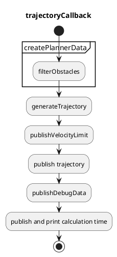
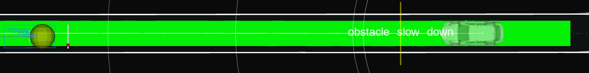
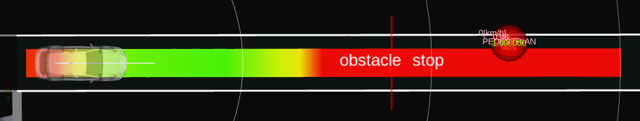

# Obstacle Cruise Planner

## Overview

The `obstacle_cruise_planner` package has following modules.

- obstacle stop planning
  - inserting a stop point in the trajectory when there is a static obstacle on the trajectory.
- adaptive cruise planning
  - sending an external velocity limit to `motion_velocity_smoother` when there is a dynamic obstacle to cruise on the trajectory

## Interfaces

### Input topics

| Name                          | Type                                            | Description                       |
| ----------------------------- | ----------------------------------------------- | --------------------------------- |
| `~/input/trajectory`          | autoware_auto_planning_msgs::Trajectory         | input trajectory                  |
| `~/input/smoothed_trajectory` | autoware_auto_planning_msgs::Trajectory         | trajectory with smoothed velocity |
| `~/input/objects`             | autoware_auto_perception_msgs::PredictedObjects | dynamic objects                   |
| `~/input/odometry`            | nav_msgs::msg::Odometry                         | ego odometry                      |

### Output topics

| Name                           | Type                                           | Description                           |
| ------------------------------ | ---------------------------------------------- | ------------------------------------- |
| `~output/trajectory`           | autoware_auto_planning_msgs::Trajectory        | output trajectory                     |
| `~output/velocity_limit`       | tier4_planning_msgs::VelocityLimit             | velocity limit for cruising           |
| `~output/clear_velocity_limit` | tier4_planning_msgs::VelocityLimitClearCommand | clear command for velocity limit      |
| `~output/stop_reasons`         | tier4_planning_msgs::StopReasonArray           | reasons that make the vehicle to stop |

## Design

Design for the following functions is defined here.

- Obstacle candidates selection
- Obstacle stop planning
- Adaptive cruise planning

A data structure for cruise and stop planning is as follows.
This planner data is created first, and then sent to the planning algorithm.

```cpp
struct ObstacleCruisePlannerData
{
  rclcpp::Time current_time;
  autoware_auto_planning_msgs::msg::Trajectory traj;
  geometry_msgs::msg::Pose current_pose;
  double current_vel;
  double current_acc;
  std::vector<TargetObstacle> target_obstacles;
};
```

```cpp
struct TargetObstacle
{
  rclcpp::Time time_stamp;
  bool orientation_reliable;
  geometry_msgs::msg::Pose pose;
  bool velocity_reliable;
  float velocity;
  bool is_classified;
  ObjectClassification classification;
  Shape shape;
  std::vector<PredictedPath> predicted_paths;
  geometry_msgs::msg::Point collision_point;
};
```

### Obstacle candidates selection

In this function, target obstacles for stopping or cruising are selected based on their pose and velocity.

By default, objects that realize one of the following conditions are considered to be the target obstacle candidates.
Some terms will be defined in the following subsections.

- Vehicle objects "inside the detection area" other than "far crossing vehicles".
- non vehicle objects "inside the detection area"
- "Near cut-in vehicles" outside the detection area

Note that currently the obstacle candidates selection algorithm is for autonomous driving.
However, we have following parameters as well for stop and cruise respectively so that we can extend the obstacles candidates selection algorithm for non vehicle robots.
By default, unknown and vehicles are obstacles to cruise and stop, and non vehicles are obstacles just to stop.

| Parameter                      | Type | Description                                       |
| ------------------------------ | ---- | ------------------------------------------------- |
| `cruise_obstacle_type.unknown` | bool | flag to consider unknown objects as being cruised |
| `cruise_obstacle_type.car`     | bool | flag to consider unknown objects as being cruised |
| `cruise_obstacle_type.truck`   | bool | flag to consider unknown objects as being cruised |
| ...                            | bool | ...                                               |
| `stop_obstacle_type.unknown`   | bool | flag to consider unknown objects as being stopped |
| ...                            | bool | ...                                               |

#### Inside the detection area

To calculate obstacles inside the detection area, firstly, obstacles whose distance to the trajectory is less than `rough_detection_area_expand_width` are selected.
Then, the detection area, which is a trajectory with some lateral margin, is calculated as shown in the figure.
The detection area width is a vehicle's width + `detection_area_expand_width`, and it is represented as a polygon resampled with `decimate_trajectory_step_length` longitudinally.
The roughly selected obstacles inside the detection area are considered as inside the detection area.


This two-step detection is used for calculation efficiency since collision checking of polygons is heavy.
Boost.Geometry is used as a library to check collision among polygons.

In the `obstacle_filtering` namespace,

| Parameter                           | Type   | Description                                                                         |
| ----------------------------------- | ------ | ----------------------------------------------------------------------------------- |
| `rough_detection_area_expand_width` | double | rough lateral margin for rough detection area expansion [m]                         |
| `detection_area_expand_width`       | double | lateral margin for precise detection area expansion [m]                             |
| `decimate_trajectory_step_length`   | double | longitudinal step length to calculate trajectory polygon for collision checking [m] |

#### Far crossing vehicles

Near crossing vehicles (= not far crossing vehicles) are defined as vehicle objects realizing either of following conditions.

- whose yaw angle against the nearest trajectory point is greater than `crossing_obstacle_traj_angle_threshold`
- whose velocity is less than `crossing_obstacle_velocity_threshold`.

Assuming `t_1` to be the time for the ego to reach the current crossing obstacle position with the constant velocity motion, and `t_2` to be the time for the crossing obstacle to go outside the detection area, if the following condition is realized, the crossing vehicle will be ignored.

$$
t_1 - t_2 > \mathrm{margin\_for\_collision\_time}
$$

In the `obstacle_filtering` namespace,

| Parameter                                | Type   | Description                                                                   |
| ---------------------------------------- | ------ | ----------------------------------------------------------------------------- |
| `crossing_obstacle_velocity_threshold`   | double | velocity threshold to decide crossing obstacle [m/s]                          |
| `crossing_obstacle_traj_angle_threshold` | double | yaw threshold of crossing obstacle against the nearest trajectory point [rad] |
| `collision_time_margin`                  | double | time threshold of collision between obstacle and ego [s]                      |

#### Near Cut-in vehicles

Near Cut-in vehicles are defined as vehicle objects

- whose predicted path's footprints from the current time to `max_prediction_time_for_collision_check` overlap with the detection area longer than `ego_obstacle_overlap_time_threshold`.

In the `obstacle_filtering` namespace,

| Parameter                                 | Type   | Description                                                              |
| ----------------------------------------- | ------ | ------------------------------------------------------------------------ |
| `ego_obstacle_overlap_time_threshold`     | double | time threshold to decide cut-in obstacle for cruise or stop [s]          |
| `max_prediction_time_for_collision_check` | double | prediction time to check collision between obstacle and ego [s]          |
| `outside_obstacle_min_velocity_threshold` | double | minimum velocity threshold of target obstacle for cut-in detection [m/s] |

### Stop planning

| Parameter                              | Type   | Description                                                                                |
| -------------------------------------- | ------ | ------------------------------------------------------------------------------------------ |
| `common.min_strong_accel`              | double | ego's minimum acceleration to stop [m/ss]                                                  |
| `common.safe_distance_margin`          | double | distance with obstacles for stop [m]                                                       |
| `common.terminal_safe_distance_margin` | double | terminal_distance with obstacles for stop, which cannot be exceed safe distance margin [m] |

The role of the stop planning is keeping a safe distance with static vehicle objects or dynamic/static non vehicle objects.

The stop planning just inserts the stop point in the trajectory to keep a distance with obstacles inside the detection area.
The safe distance is parameterized as `common.safe_distance_margin`.
When it stops at the end of the trajectory, and obstacle is on the same point, the safe distance becomes `terminal_safe_distance_margin`.

When inserting the stop point, the required acceleration for the ego to stop in front of the stop point is calculated.
If the acceleration is less than `common.min_strong_accel`, the stop planning will be cancelled since this package does not assume a strong sudden brake for emergency.

### Adaptive cruise planning

| Parameter                     | Type   | Description                                    |
| ----------------------------- | ------ | ---------------------------------------------- |
| `common.safe_distance_margin` | double | minimum distance with obstacles for cruise [m] |

The role of the adaptive cruise planning is keeping a safe distance with dynamic vehicle objects with smoothed velocity transition.
This includes not only cruising a front vehicle, but also reacting a cut-in and cut-out vehicle.

The safe distance is calculated dynamically based on the Responsibility-Sensitive Safety (RSS) by the following equation.

$$
d = v_{ego} t_{idling} + \frac{1}{2} a_{ego} t_{idling}^2 + \frac{v_{ego}^2}{2 a_{ego}} - \frac{v_{obstacle}^2}{2 a_{obstacle}},
$$

assuming that $d$ is the calculated safe distance, $t_{idling}$ is the idling time for the ego to detect the front vehicle's deceleration, $v_{ego}$ is the ego's current velocity, $v_{obstacle}$ is the front obstacle's current velocity, $a_{ego}$ is the ego's acceleration, and $a_{obstacle}$ is the obstacle's acceleration.
These values are parameterized as follows. Other common values such as ego's minimum acceleration is defined in `common.param.yaml`.

| Parameter                         | Type   | Description                                                                   |
| --------------------------------- | ------ | ----------------------------------------------------------------------------- |
| `common.idling_time`              | double | idling time for the ego to detect the front vehicle starting deceleration [s] |
| `common.min_object_accel_for_rss` | double | front obstacle's acceleration [m/ss]                                          |

## Implementation

### Flowchart

Successive functions consist of `obstacle_cruise_planner` as follows.

Various algorithms for stop and cruise planning will be implemented, and one of them is designated depending on the use cases.
The core algorithm implementation `generateTrajectory` depends on the designated algorithm.



### Algorithm selection

Currently, only a PID-based planner is supported.
Each planner will be explained in the following.

| Parameter                | Type   | Description                                                  |
| ------------------------ | ------ | ------------------------------------------------------------ |
| `common.planning_method` | string | cruise and stop planning algorithm, selected from "pid_base" |

### PID-based planner

#### Stop planning

In the `pid_based_planner` namespace,

| Parameter                                         | Type   | Description                                                  |
| ------------------------------------------------- | ------ | ------------------------------------------------------------ |
| `obstacle_velocity_threshold_from_cruise_to_stop` | double | obstacle velocity threshold to be stopped from cruised [m/s] |

Only one obstacle is targeted for the stop planning.
It is the obstacle among obstacle candidates whose velocity is less than `obstacle_velocity_threshold_from_cruise_to_stop`, and which is the nearest to the ego along the trajectory. A stop point is inserted keeping`common.safe_distance_margin` distance between the ego and obstacle.

Note that, as explained in the stop planning design, a stop planning which requires a strong acceleration (less than `common.min_strong_accel`) will be canceled.

#### Adaptive cruise planning

In the `pid_based_planner` namespace,

| Parameter                   | Type   | Description                                                                                              |
| --------------------------- | ------ | -------------------------------------------------------------------------------------------------------- |
| `kp`                        | double | p gain for pid control [-]                                                                               |
| `ki`                        | double | i gain for pid control [-]                                                                               |
| `kd`                        | double | d gain for pid control [-]                                                                               |
| `output_ratio_during_accel` | double | The output velocity will be multiplied by the ratio during acceleration to follow the front vehicle. [-] |
| `vel_to_acc_weight`         | double | target acceleration is target velocity \* `vel_to_acc_weight` [-]                                        |
| `min_cruise_target_vel`     | double | minimum target velocity during cruise [m/s]                                                              |

In order to keep the safe distance, the target velocity and acceleration is calculated and sent as an external velocity limit to the velocity smoothing package (`motion_velocity_smoother` by default).
The target velocity and acceleration is respectively calculated with the PID controller according to the error between the reference safe distance and the actual distance.

### Optimization-based planner

under construction

## Minor functions

### Prioritization of behavior module's stop point

When stopping for a pedestrian walking on the crosswalk, the behavior module inserts the zero velocity in the trajectory in front of the crosswalk.
Also `obstacle_cruise_planner`'s stop planning also works, and the ego may not reach the behavior module's stop point since the safe distance defined in `obstacle_cruise_planner` may be longer than the behavior module's safe distance.
To resolve this non-alignment of the stop point between the behavior module and `obstacle_cruise_planner`, `common.min_behavior_stop_margin` is defined.
In the case of the crosswalk described above, `obstacle_cruise_planner` inserts the stop point with a distance `common.min_behavior_stop_margin` at minimum between the ego and obstacle.

| Parameter                         | Type   | Description                                                            |
| --------------------------------- | ------ | ---------------------------------------------------------------------- |
| `common.min_behavior_stop_margin` | double | minimum stop margin when stopping with the behavior module enabled [m] |

### A function to keep the closest stop obstacle in target obstacles

In order to keep the closest stop obstacle in the target obstacles, we check whether it is disappeared or not from the target obstacles in the `checkConsistency` function.
If the previous closest stop obstacle is remove from the lists, we keep it in the lists for `stop_obstacle_hold_time_threshold` seconds.
Note that if a new stop obstacle appears and the previous closest obstacle removes from the lists, we do not add it to the target obstacles again.

| Parameter                                              | Type   | Description                                        |
| ------------------------------------------------------ | ------ | -------------------------------------------------- |
| `obstacle_filtering.stop_obstacle_hold_time_threshold` | double | maximum time for holding closest stop obstacle [s] |

## Visualization for debugging

### Detection area

Green polygons which is a detection area is visualized by `detection_polygons` in the `~/debug/marker` topic.


### Collision point

Red point which is a collision point with obstacle is visualized by `collision_points` in the `~/debug/marker` topic.


### Obstacle for cruise

Yellow sphere which is a obstacle for cruise is visualized by `obstacles_to_cruise` in the `~/debug/marker` topic.



### Obstacle for stop

Red sphere which is a obstacle for stop is visualized by `obstacles_to_stop` in the `~/debug/marker` topic.



<!-- ### Obstacle ignored to cruise or stop intentionally -->

<!-- Green sphere which is a obstacle ignored intentionally to cruise or stop is visualized by `intentionally_ignored_obstacles` in the `~/debug/marker` topic. -->

<!--  -->

### Obstacle cruise wall

Yellow wall which means a safe distance to cruise if the ego's front meets the wall is visualized in the `~/debug/cruise_wall_marker` topic.


### Obstacle stop wall

Red wall which means a safe distance to stop if the ego's front meets the wall is visualized in the `~/debug/stop_wall_marker` topic.


## Known Limits

- Common
  - When the obstacle pose or velocity estimation has a delay, the ego sometimes will go close to the front vehicle keeping deceleration.
  - Current implementation only uses predicted objects message for static/dynamic obstacles and does not use pointcloud. Therefore, if object recognition is lost, the ego cannot deal with the lost obstacle.
  - The current predicted paths for obstacle's lane change does not have enough precision for obstacle_cruise_planner. Therefore, we set `rough_detection_area` a small value.
- PID-based planner
  - The algorithm strongly depends on the velocity smoothing package (`motion_velocity_smoother` by default) whether or not the ego realizes the designated target speed. If the velocity smoothing package is updated, please take care of the vehicle's behavior as much as possible.
