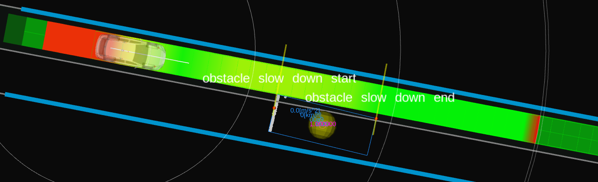

# Debug

## Debug visualization

### Detection area

Green polygons which is a detection area is visualized by `detection_polygons` in the `~/debug/marker` topic.
To determine each behavior (cruise, stop, and slow down), if `behavior_determination.*.max_lat_margin` is not zero, the polygons are expanded with the additional width.

### Collision points

Red points which are collision points with obstacle are visualized by `*_collision_points` for each behavior in the `~/debug/marker` topic.

### Obstacle for cruise

Orange sphere which is an obstacle for cruise is visualized by `obstacles_to_cruise` in the `~/debug/marker` topic.

Orange wall which means a safe distance to cruise if the ego's front meets the wall is visualized in the `~/debug/cruise/virtual_wall` topic.

### Obstacle for stop

Red sphere which is an obstacle for stop is visualized by `obstacles_to_stop` in the `~/debug/marker` topic.

Red wall which means a safe distance to stop if the ego's front meets the wall is visualized in the `~/virtual_wall` topic.

### Obstacle for slow down

Yellow sphere which is an obstacle for slow_down is visualized by `obstacles_to_slow_down` in the `~/debug/marker` topic.

Yellow wall which means a safe distance to slow_down if the ego's front meets the wall is visualized in the `~/debug/slow_down/virtual_wall` topic.

<!-- ### Obstacle ignored to cruise or stop intentionally -->

<!-- Green sphere which is a obstacle ignored intentionally to cruise or stop is visualized by `intentionally_ignored_obstacles` in the `~/debug/marker` topic. -->

<!--  -->
