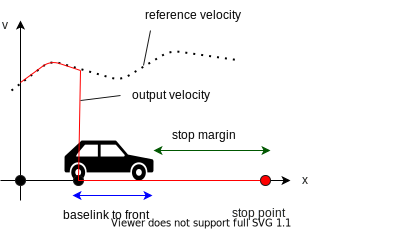
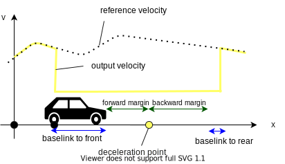
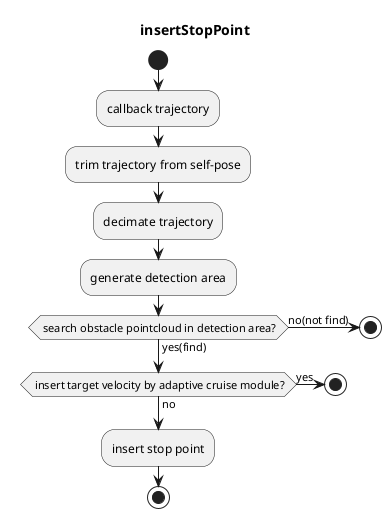
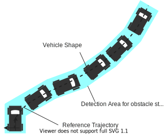
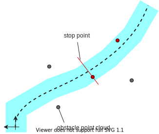
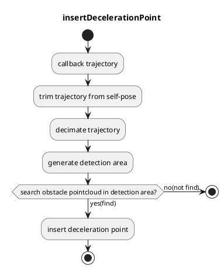
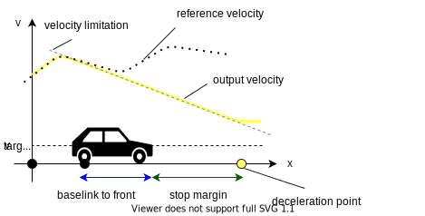
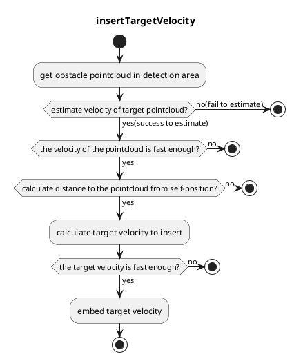
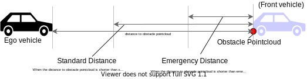

# Obstacle Stop Planner

## Overview

`obstacle_stop_planner` has following modules

- Obstacle Stop Planner
  - inserts a stop point in trajectory when there is a static point cloud on the trajectory.
- Slow Down Planner
  - inserts a deceleration section in trajectory when there is a point cloud near the trajectory.
- Adaptive Cruise Controller (ACC)
  - embeds target velocity in trajectory when there is a dynamic point cloud on the trajectory.

When the stop point that has 0 velocity is inserted, the point is inserted in front of the target point cloud by the distance of `baselink to front` + `stop margin`. The `baselink to front` means the distance between `base_link`(center of rear-wheel axis) and front of the car. `stop margin` is determined by the parameters described below.

When the deceleration section is inserted, the start point of the section is inserted in front of the target point cloud by the distance of `baselink to front` + `slow down forward margin`. the end point of the section is inserted behind the target point cloud by the distance of `slow down backward margin` + `baselink to rear`. The `baselink to rear` means the distance between `base_link` and rear of the car. The velocities of points in the deceleration section are modified to the deceleration velocity. `slow down backward margin` and `slow down forward margin` are determined by the parameters described below.

## Input topics

| Name                        | Type                                            | Description         |
| --------------------------- | ----------------------------------------------- | ------------------- |
| `~/input/pointcloud`        | sensor_msgs::PointCloud2                        | obstacle pointcloud |
| `~/input/trajectory`        | autoware_auto_planning_msgs::Trajectory         | trajectory          |
| `~/input/vector_map`        | autoware_auto_mapping_msgs::HADMapBin           | vector map          |
| `~/input/odometry`          | nav_msgs::Odometry                              | vehicle velocity    |
| `~/input/dynamic_objects`   | autoware_auto_perception_msgs::PredictedObjects | dynamic objects     |
| `~/input/expand_stop_range` | autoware_planning_msgs::msg::ExpandStopRange    | expand stop range   |

## Output topics

| Name                   | Type                                    | Description                            |
| ---------------------- | --------------------------------------- | -------------------------------------- |
| `~output/trajectory`   | autoware_auto_planning_msgs::Trajectory | trajectory to be followed              |
| `~output/stop_reasons` | autoware_planning_msgs::StopReasonArray | reasons that cause the vehicle to stop |

## Modules

### Obstacle Stop Planner

#### Role

`Obstacle Stop Planner` module inserts a stop point in trajectory when there is a static point cloud on the trajectory. This module does not work when `Adaptive Cruise Controller` works.

| Parameter                               | Type   | Description                                                                   |
| --------------------------------------- | ------ | ----------------------------------------------------------------------------- |
| `stop_planner.stop_margin`              | double | stop margin distance from obstacle on the path [m]                            |
| `stop_planner.min_behavior_stop_margin` | double | stop margin distance when any other stop point is inserted in stop margin [m] |
| `stop_planner.step_length`              | double | step length for pointcloud search range [m]                                   |
| `stop_planner.extend_distance`          | double | extend trajectory to consider after goal obstacle in the extend_distance [m]  |
| `stop_planner.expand_stop_range`        | double | margin of vehicle footprint [m]                                               |

#### Flowchart

First, this module cut off the trajectory behind the car and decimates the points of trajectory for reducing computational costs.

Then, a detection area is generated by the decimated trajectory as following figure. The detection area means the area through which the vehicle-body passes.

The module searches the obstacle pointcloud within detection area. When the pointcloud is found, `Adaptive Cruise Controller` modules starts to work. only when `Adaptive Cruise Controller` modules does not insert target velocity, the stop point is inserted to the trajectory. The stop point means the point with 0 velocity.

### Slow Down Planner

#### Role

`Slow Down Planner` module inserts a deceleration point in trajectory when there is a point cloud near the trajectory.

| Parameter                                     | Type   | Description                                                                                    |
| --------------------------------------------- | ------ | ---------------------------------------------------------------------------------------------- |
| `slow_down_planner.slow_down_forward_margin`  | double | margin distance from slow down point to vehicle front [m]                                      |
| `slow_down_planner.slow_down_backward_margin` | double | margin distance from slow down point to vehicle rear [m]                                       |
| `slow_down_planner.expand_slow_down_range`    | double | offset from vehicle side edge for expanding the search area of the surrounding point cloud [m] |
| `slow_down_planner.max_slow_down_vel`         | double | max slow down velocity [m/s]                                                                   |
| `slow_down_planner.min_slow_down_vel`         | double | min slow down velocity [m/s]                                                                   |

#### Flowchart

First, this module cut off the trajectory behind the car and decimates the points of trajectory for reducing computational costs. ( This is the same process as that of `Obstacle Stop planner` module. )

Then, a detection area is generated by the decimated trajectory as following figure. The detection area in this module is the extended area of the detection area used in `Obstacle Stop Planner` module. The distance to be extended depends on the above parameter `expand_slow_down_range`.

The module searches the obstacle pointcloud within detection area. When the pointcloud is found, the deceleration point is inserted to the trajectory.

The deceleration point means the point with low velocity; the value of the velocity $v_{target}$ is determined as follows.

$v_{target} = v_{min} + \frac{l_{ld} - l_{vw}/2}{l_{er}} (v_{max} - v_{min} )$

- $v_{min}$ is minimum target value of `Slow Down Planner` module. The value of $v_{min}$ depends on the parameter `min_slow_down_vel`.
- $v_{max}$ is maximum target value of `Slow Down Planner` module. The value of $v_{max}$ depends on the parameter `max_slow_down_vel`.
- $l_{ld}$ is the lateral deviation of the target pointcloud.
- $l_{vw}$ is the vehicle width.
- $l_{er}$ is the expand range of detection area. The value of $l_{er}$ depends on the parameter `expand_slow_down_range`

The above method means that the smaller the lateral deviation of the pointcloud, the lower the velocity of the deceleration point.

<!-- Moreover, to avoid sudden deceleration, If the current velocity of vehicle is higher than $v_{target}$, the deceleration is planned based on the current velocity. This indicates that there are cases where it is not possible to decelerate according to $v_{target}$ in such a situation that a point cloud in the detection area is suddenly appeared near the vehicle. -->

<!--  -->

### Adaptive Cruise Controller

#### Role

`Adaptive Cruise Controller` module embeds maximum velocity in trajectory when there is a dynamic point cloud on the trajectory. The value of maximum velocity depends on the own velocity, the velocity of the point cloud ( = velocity of the front car), and the distance to the point cloud (= distance to the front car).

| Parameter                                                        | Type   | Description                                                                                                     |
| ---------------------------------------------------------------- | ------ | --------------------------------------------------------------------------------------------------------------- |
| `adaptive_cruise_control.use_object_to_estimate_vel`             | bool   | use dynamic objects for estimating object velocity or not                                                       |
| `adaptive_cruise_control.use_pcl_to_estimate_vel`                | bool   | use raw pointclouds for estimating object velocity or not                                                       |
| `adaptive_cruise_control.consider_obj_velocity`                  | bool   | consider forward vehicle velocity to calculate target velocity in adaptive cruise or not                        |
| `adaptive_cruise_control.obstacle_velocity_thresh_to_start_acc`  | double | start adaptive cruise control when the velocity of the forward obstacle exceeds this value [m/s]                |
| `adaptive_cruise_control.obstacle_velocity_thresh_to_stop_acc`   | double | stop acc when the velocity of the forward obstacle falls below this value [m/s]                                 |
| `adaptive_cruise_control.emergency_stop_acceleration`            | double | supposed minimum acceleration (deceleration) in emergency stop [m/ss]                                           |
| `adaptive_cruise_control.emergency_stop_idling_time`             | double | supposed idling time to start emergency stop [s]                                                                |
| `adaptive_cruise_control.min_dist_stop`                          | double | minimum distance of emergency stop [m]                                                                          |
| `adaptive_cruise_control.obstacle_emergency_stop_acceleration`   | double | supposed minimum acceleration (deceleration) in emergency stop [m/ss]                                           |
| `adaptive_cruise_control.max_standard_acceleration`              | double | supposed maximum acceleration in active cruise control [m/ss]                                                   |
| `adaptive_cruise_control.min_standard_acceleration`              | double | supposed minimum acceleration (deceleration) in active cruise control [m/ss]                                    |
| `adaptive_cruise_control.standard_idling_time`                   | double | supposed idling time to react object in active cruise control [s]                                               |
| `adaptive_cruise_control.min_dist_standard`                      | double | minimum distance in active cruise control [m]                                                                   |
| `adaptive_cruise_control.obstacle_min_standard_acceleration`     | double | supposed minimum acceleration of forward obstacle [m/ss]                                                        |
| `adaptive_cruise_control.margin_rate_to_change_vel`              | double | rate of margin distance to insert target velocity [-]                                                           |
| `adaptive_cruise_control.use_time_compensation_to_calc_distance` | bool   | use time-compensation to calculate distance to forward vehicle                                                  |
| `adaptive_cruise_control.p_coefficient_positive`                 | double | coefficient P in PID control (used when target dist -current_dist >=0) [-]                                      |
| `adaptive_cruise_control.p_coefficient_negative`                 | double | coefficient P in PID control (used when target dist -current_dist &lt;0) [-]                                    |
| `adaptive_cruise_control.d_coefficient_positive`                 | double | coefficient D in PID control (used when delta_dist >=0) [-]                                                     |
| `adaptive_cruise_control.d_coefficient_negative`                 | double | coefficient D in PID control (used when delta_dist &lt;0) [-]                                                   |
| `adaptive_cruise_control.object_polygon_length_margin`           | double | The distance to extend the polygon length the object in pointcloud-object matching [m]                          |
| `adaptive_cruise_control.object_polygon_width_margin`            | double | The distance to extend the polygon width the object in pointcloud-object matching [m]                           |
| `adaptive_cruise_control.valid_estimated_vel_diff_time`          | double | Maximum time difference treated as continuous points in speed estimation using a point cloud [s]                |
| `adaptive_cruise_control.valid_vel_que_time`                     | double | Time width of information used for speed estimation in speed estimation using a point cloud [s]                 |
| `adaptive_cruise_control.valid_estimated_vel_max`                | double | Maximum value of valid speed estimation results in speed estimation using a point cloud [m/s]                   |
| `adaptive_cruise_control.valid_estimated_vel_min`                | double | Minimum value of valid speed estimation results in speed estimation using a point cloud [m/s]                   |
| `adaptive_cruise_control.thresh_vel_to_stop`                     | double | Embed a stop line if the maximum speed calculated by ACC is lower than this speed [m/s]                         |
| `adaptive_cruise_control.lowpass_gain_of_upper_velocity`         | double | Lowpass-gain of target velocity                                                                                 |
| `adaptive_cruise_control.use_rough_velocity_estimation:`         | bool   | Use rough estimated velocity if the velocity estimation is failed                                               |
| `adaptive_cruise_control.rough_velocity_rate`                    | double | In the rough velocity estimation, the velocity of front car is estimated as self current velocity \* this value |

#### Flowchart

This module works only when the obstacle pointcloud is found in the detection area of the `Obstacle stop planner` module.
At first, the velocity of the pointcloud is estimated. The velocity estimation uses the velocity information of dynamic objects, or the distance to the point cloud found in the previous step.

Only when the estimation is succeeded and the estimated velocity exceeds the value of `obstacle_stop_velocity_thresh_*`, the distance to the pointcloud from self-position is calculated. For prevent chattering in the mode transition, `obstacle_velocity_thresh_to_start_acc` is used for the threshold to start adaptive cruise, and `obstacle_velocity_thresh_to_stop_acc` is used for the threshold to stop adaptive cruise. When the calculated distance value exceeds the emergency distance $d\_{emergency}$ calculated by emergency_stop parameters, target velocity to insert is calculated.

The emergency distance $d\_{emergency}$ is calculated as follows.

$d_{emergency} = d_{margin_{emergency}} + t_{idling_{emergency}} \cdot v_{ego} + (-\frac{v_{ego}^2}{2 \cdot  a_{ego_{emergency}}}) - (-\frac{v_{obj}^2}{2 \cdot a_{obj_{emergency}}})$

- $d_{margin_{emergency}}$ is a minimum margin to the obstacle pointcloud. The value of $d_{margin_{emergency}}$ depends on the parameter `min_dist_stop`
- $t_{idling_{emergency}}$ is a supposed idling time. The value of $t_{idling_{emergency}}$ depends on the parameter `emergency_stop_idling_time`
- $v_{ego}$ is a current velocity of own vehicle
- $a_{ego_{_{emergency}}}$ is a minimum acceleration (maximum deceleration) of own vehicle. The value of $a_{ego_{_{emergency}}}$ depends on the parameter `emergency_stop_acceleration`
- $v_{obj}$ is a current velocity of obstacle pointcloud.
- $a_{obj_{_{emergency}}}$ is a supposed minimum acceleration of obstacle pointcloud. The value of $a_{obj_{_{emergency}}}$ depends on the parameter `obstacle_emergency_stop_acceleration`
- \*Above $X_{_{emergency}}$ parameters are used only in emergency situation.

The target velocity is determined to keep the distance to the obstacle pointcloud from own vehicle at the standard distance $d\_{standard}$ calculated as following. Therefore, if the distance
to the obstacle pointcloud is longer than standard distance, The target velocity becomes higher than the current velocity, and vice versa. For keeping the distance, a PID controller is used.

$d_{standard} = d_{margin_{standard}} + t_{idling_{standard}} \cdot v_{ego} + (-\frac{v_{ego}^2}{2 \cdot  a_{ego_{standard}}}) - (-\frac{v_{obj}^2}{2 \cdot a_{obj_{standard}}})$

- $d_{margin_{standard}}$ is a minimum margin to the obstacle pointcloud. The value of $d_{margin_{standard}}$ depends on the parameter `min_dist_stop`
- $t_{idling_{standard}}$ is a supposed idling time. The value of $t_{idling_{standard}}$ depends on the parameter `standard_stop_idling_time`
- $v_{ego}$ is a current velocity of own vehicle
- $a_{ego_{_{standard}}}$ is a minimum acceleration (maximum deceleration) of own vehicle. The value of $a_{ego_{_{standard}}}$ depends on the parameter `min_standard_acceleration`
- $v_{obj}$ is a current velocity of obstacle pointcloud.
- $a_{obj_{_{standard}}}$ is a supposed minimum acceleration of obstacle pointcloud. The value of $a_{obj_{_{standard}}}$ depends on the parameter `obstacle_min_standard_acceleration`
- \*Above $X_{_{standard}}$ parameters are used only in non-emergency situation.

If the target velocity exceeds the value of `thresh_vel_to_stop`, the target velocity is embedded in the trajectory.

## Known Limits

- It is strongly depends on velocity planning module whether or not it moves according to the target speed embedded by `Adaptive Cruise Controller` module. If the velocity planning module is updated, please take care of the vehicle's behavior as much as possible and always be ready for overriding.

- The velocity estimation algorithm in `Adaptive Cruise Controller` is depend on object tracking module. Please note that if the object-tracking fails or the tracking result is incorrect, it the possibility that the vehicle behaves dangerously.
