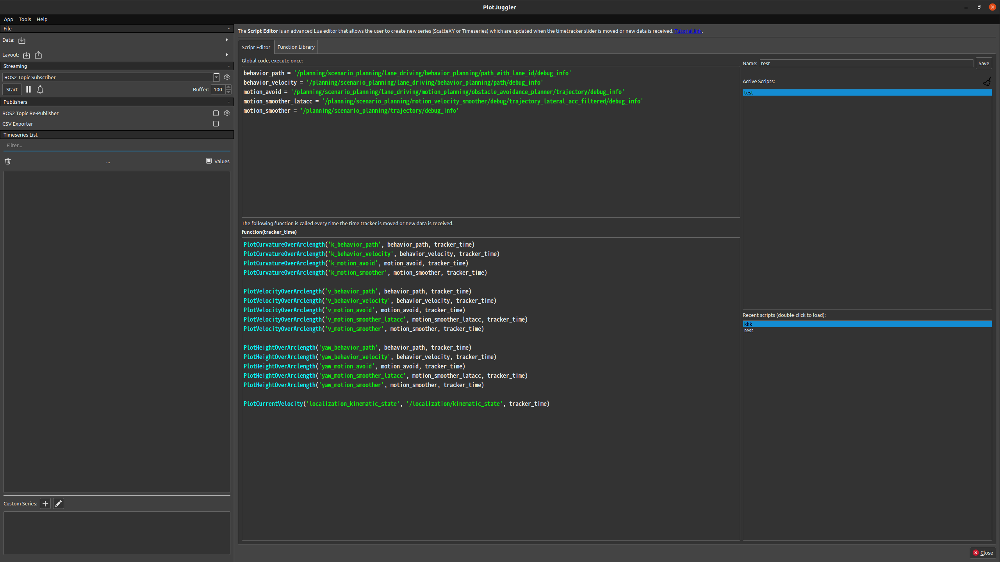
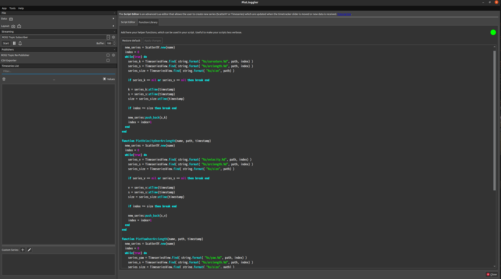

# Planning Debug Tools

This package contains several planning-related debug tools.

- **Trajectory analyzer**: visualizes the information (speed, curvature, yaw, etc) along the trajectory
- **Closest velocity checker**: prints the velocity information indicated by each modules

## Trajectory analyzer

The `trajectory_analyzer` visualizes the information (speed, curvature, yaw, etc) along the trajectory. This feature would be helpful for purposes such as "_investigating the reason why the vehicle decelerates here_". This feature employs the OSS [PlotJuggler](https://www.plotjuggler.io/).


## Stop reason visualizer

This is to visualize stop factor and reason.
[see the details](./doc-stop-reason-visualizer.md)

### How to use

please launch the analyzer node

```bash
ros2 launch planning_debug_tools trajectory_analyzer.launch.xml
```

and visualize the analyzed data on the plot juggler following below.

#### setup PlotJuggler

For the first time, please add the following code to reactive script and save it as the picture below!
(Looking for the way to automatically load the configuration file...)

You can customize what you plot by editing this code.



in Global code

```lua
behavior_path = '/planning/scenario_planning/lane_driving/behavior_planning/path_with_lane_id/debug_info'
behavior_velocity = '/planning/scenario_planning/lane_driving/behavior_planning/path/debug_info'
motion_avoid = '/planning/scenario_planning/lane_driving/motion_planning/obstacle_avoidance_planner/trajectory/debug_info'
motion_smoother_latacc = '/planning/scenario_planning/motion_velocity_smoother/debug/trajectory_lateral_acc_filtered/debug_info'
motion_smoother = '/planning/scenario_planning/trajectory/debug_info'
```

in function(tracker_time)

```lua
PlotCurvatureOverArclength('k_behavior_path', behavior_path, tracker_time)
PlotCurvatureOverArclength('k_behavior_velocity', behavior_velocity, tracker_time)
PlotCurvatureOverArclength('k_motion_avoid', motion_avoid, tracker_time)
PlotCurvatureOverArclength('k_motion_smoother', motion_smoother, tracker_time)

PlotVelocityOverArclength('v_behavior_path', behavior_path, tracker_time)
PlotVelocityOverArclength('v_behavior_velocity', behavior_velocity, tracker_time)
PlotVelocityOverArclength('v_motion_avoid', motion_avoid, tracker_time)
PlotVelocityOverArclength('v_motion_smoother_latacc', motion_smoother_latacc, tracker_time)
PlotVelocityOverArclength('v_motion_smoother', motion_smoother, tracker_time)

PlotAccelerationOverArclength('a_behavior_path', behavior_path, tracker_time)
PlotAccelerationOverArclength('a_behavior_velocity', behavior_velocity, tracker_time)
PlotAccelerationOverArclength('a_motion_avoid', motion_avoid, tracker_time)
PlotAccelerationOverArclength('a_motion_smoother_latacc', motion_smoother_latacc, tracker_time)
PlotAccelerationOverArclength('a_motion_smoother', motion_smoother, tracker_time)

PlotYawOverArclength('yaw_behavior_path', behavior_path, tracker_time)
PlotYawOverArclength('yaw_behavior_velocity', behavior_velocity, tracker_time)
PlotYawOverArclength('yaw_motion_avoid', motion_avoid, tracker_time)
PlotYawOverArclength('yaw_motion_smoother_latacc', motion_smoother_latacc, tracker_time)
PlotYawOverArclength('yaw_motion_smoother', motion_smoother, tracker_time)

PlotCurrentVelocity('localization_kinematic_state', '/localization/kinematic_state', tracker_time)
```

in Function Library


```lua

function PlotValue(name, path, timestamp, value)
  new_series = ScatterXY.new(name)
  index = 0
  while(true) do
    series_k = TimeseriesView.find( string.format( "%s/"..value..".%d", path, index) )
    series_s = TimeseriesView.find( string.format( "%s/arclength.%d", path, index) )
    series_size = TimeseriesView.find( string.format( "%s/size", path) )

    if series_k == nil or series_s == nil then break end

    k = series_k:atTime(timestamp)
    s = series_s:atTime(timestamp)
    size = series_size:atTime(timestamp)

    if index >= size then break end

    new_series:push_back(s,k)
    index = index+1
  end
end

function PlotCurvatureOverArclength(name, path, timestamp)
  PlotValue(name, path, timestamp,"curvature")
end

function PlotVelocityOverArclength(name, path, timestamp)
  PlotValue(name, path, timestamp,"velocity")
end

function PlotAccelerationOverArclength(name, path, timestamp)
  PlotValue(name, path, timestamp,"acceleration")
end

function PlotYawOverArclength(name, path, timestamp)
  PlotValue(name, path, timestamp,"yaw")
end

function PlotCurrentVelocity(name, kinematics_name, timestamp)
  new_series = ScatterXY.new(name)
  series_v = TimeseriesView.find( string.format( "%s/twist/twist/linear/x", kinematics_name))
  if series_v == nil then
    print("error")
    return
  end
  v = series_v:atTime(timestamp)
  new_series:push_back(0.0, v)
end
```

Then, run the plot juggler.

### How to customize the plot

Add Path/PathWithLaneIds/Trajectory topics you want to plot in the `trajectory_analyzer.launch.xml`, then the analyzed topics for these messages will be published with `TrajectoryDebugINfo.msg` type. You can then visualize these data by editing the reactive script on the PlotJuggler.

### Requirements

The version of the plotJuggler must be > `3.5.0`

## Closest velocity checker

This node prints the velocity information indicated by planning/control modules on a terminal. For trajectories calculated by planning modules, the target velocity on the trajectory point which is closest to the ego vehicle is printed. For control commands calculated by control modules, the target velocity and acceleration is directly printed. This feature would be helpful for purposes such as "_investigating the reason why the vehicle does not move_".

You can launch by

```bash
ros2 run planning_debug_tools closest_velocity_checker.py
```


## Trajectory visualizer

The old version of the trajectory analyzer. It is written in Python and more flexible, but very slow.

## For other use case (experimental)

To see behavior velocity planner's internal plath with lane id
add below example value to behavior velocity analyzer and set `is_publish_debug_path: true`

```lua
crosswalk ='/planning/scenario_planning/lane_driving/behavior_planning/behavior_velocity_planner/debug/path_with_lane_id/crosswalk/debug_info'
intersection ='/planning/scenario_planning/lane_driving/behavior_planning/behavior_velocity_planner/debug/path_with_lane_id/intersection/debug_info'
traffic_light ='/planning/scenario_planning/lane_driving/behavior_planning/behavior_velocity_planner/debug/path_with_lane_id/traffic_light/debug_info'
merge_from_private ='/planning/scenario_planning/lane_driving/behavior_planning/behavior_velocity_planner/debug/path_with_lane_id/merge_from_private/debug_info'
occlusion_spot ='/planning/scenario_planning/lane_driving/behavior_planning/behavior_velocity_planner/debug/path_with_lane_id/occlusion_spot/debug_info'
```

```lua
PlotVelocityOverArclength('v_crosswalk', crosswalk, tracker_time)
PlotVelocityOverArclength('v_intersection', intersection, tracker_time)
PlotVelocityOverArclength('v_merge_from_private', merge_from_private, tracker_time)
PlotVelocityOverArclength('v_traffic_light', traffic_light, tracker_time)
PlotVelocityOverArclength('v_occlusion', occlusion_spot, tracker_time)

PlotYawOverArclength('yaw_crosswalk', crosswalk, tracker_time)
PlotYawOverArclength('yaw_intersection', intersection, tracker_time)
PlotYawOverArclength('yaw_merge_from_private', merge_from_private, tracker_time)
PlotYawOverArclength('yaw_traffic_light', traffic_light, tracker_time)
PlotYawOverArclength('yaw_occlusion', occlusion_spot, tracker_time)

PlotCurrentVelocity('localization_kinematic_state', '/localization/kinematic_state', tracker_time)
```
