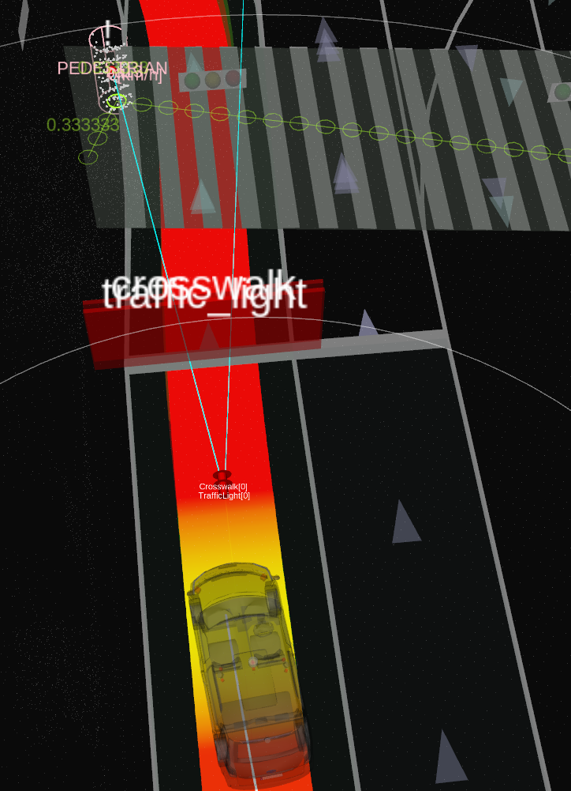
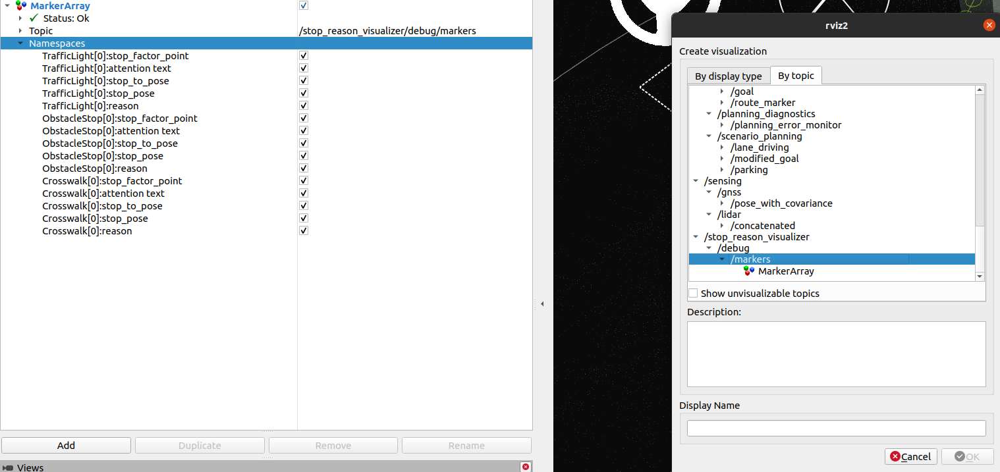

## stop_reason_visualizer

This module is to visualize stop factor quickly without selecting correct debug markers.
This is supposed to use with virtual wall marker like below.


### How to use

Run this node.

```sh
ros2 run planning_debug_tools stop_reason_visualizer_exe
```

Add stop reason debug marker from rviz.



Note: ros2 process can be sometimes deleted only from `killall stop_reason_visualizer_exe`

[Reference](https://answers.ros.org/question/323329/how-to-kill-nodes-in-ros2/?answer=403184#post-id-403184)
