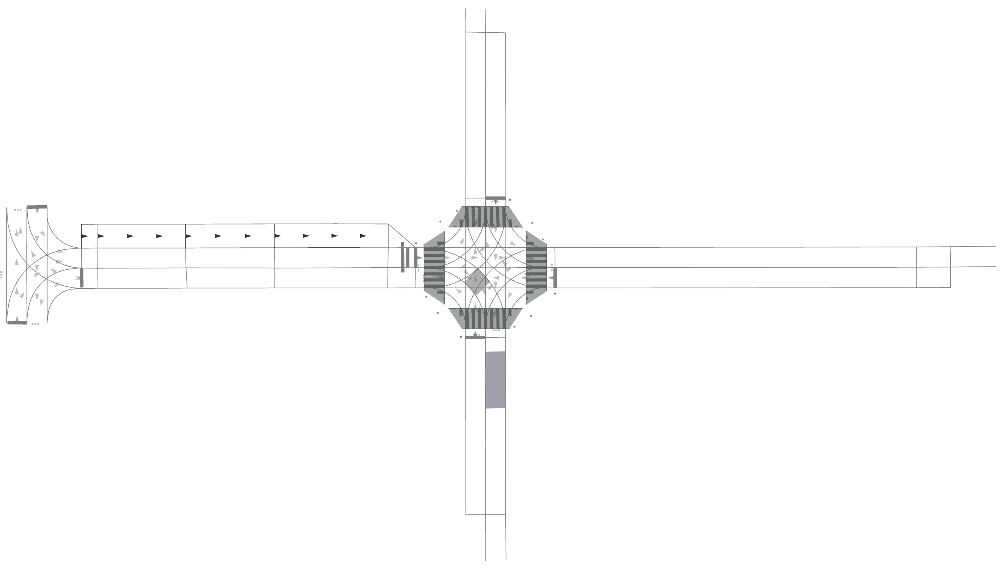
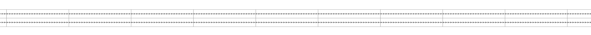
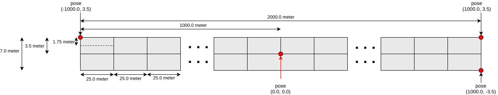

# Test Utils

## Background

Several Autoware's components and modules have already adopted unit testing, so a common library to ease the process of writing unit tests is necessary.

## Purpose

The objective of the `test_utils` is to develop a unit testing library for the Autoware components. This library will include

- commonly used functions
- input/mock data parser
- maps for testing
- common routes and mock data for testing.

## Available Maps

The following maps are available [here](https://github.com/autowarefoundation/autoware.universe/tree/main/planning/planning_test_utils/test_map)

### Common

The common map contains multiple types of usable inputs, including shoulder lanes, intersections, and some regulatory elements. The common map is named `lanelet2_map.osm` in the folder.

### 2 km Straight

The 2 km straight lanelet map consists of two lanes that run in the same direction. The map is named `2km_test.osm`.

The following illustrates the design of the map.

## Example use cases

### Autoware Planning Test Manager

The goal of the [Autoware Planning Test Manager](https://autowarefoundation.github.io/autoware.universe/main/planning/autoware_planning_test_manager/) is to test planning module nodes. The `PlanningInterfaceTestManager` class ([source code](https://github.com/autowarefoundation/autoware.universe/blob/main/planning/autoware_planning_test_manager/src/autoware_planning_test_manager.cpp)) creates wrapper functions based on the `test_utils` functions.
