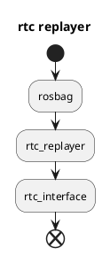

# rtc_replayer

## Purpose

The current issue for RTC commands is that service is not recorded to rosbag, so it's very hard to analyze what was happened exactly.
So this package makes it possible to replay rtc commands service from rosbag rtc status topic to resolve that issue.

## Inputs / Outputs

### Input

| Name                | Type                                      | Description                                     |
| ------------------- | ----------------------------------------- | ----------------------------------------------- |
| `/debug/rtc_status` | tier4_rtc_msgs::msg::CooperateStatusArray | CooperateStatusArray that is recorded in rosbag |

### Output

| Name                             | Type                                   | Description                                        |
| -------------------------------- | -------------------------------------- | -------------------------------------------------- |
| `/api/external/set/rtc_commands` | tier4_rtc_msgs::msg::CooperateCommands | CooperateCommands that is replayed by this package |

## Inner-workings / Algorithms

## Assumptions / Known limits

This package can't replay CooperateCommands correctly if CooperateStatusArray is not stable.
And this replay is always later one step than actual however it will not affect much for behavior.

## Future extensions / Unimplemented parts

tbd.
