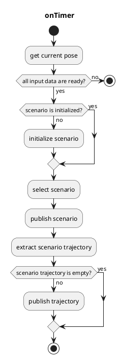
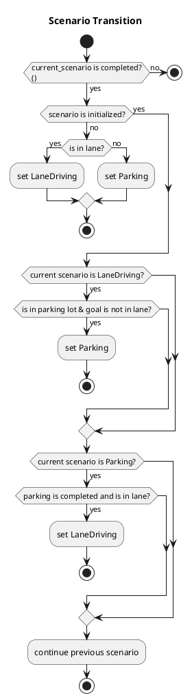

# scenario_selector

## scenario_selector_node

`scenario_selector_node` is a node that switches trajectories from each scenario.

### Input topics

| Name                             | Type                                    | Description                                           |
| -------------------------------- | --------------------------------------- | ----------------------------------------------------- |
| `~input/lane_driving/trajectory` | autoware_auto_planning_msgs::Trajectory | trajectory of LaneDriving scenario                    |
| `~input/parking/trajectory`      | autoware_auto_planning_msgs::Trajectory | trajectory of Parking scenario                        |
| `~input/lanelet_map`             | autoware_auto_mapping_msgs::HADMapBin   |                                                       |
| `~input/route`                   | autoware_planning_msgs::LaneletRoute    | route and goal pose                                   |
| `~input/odometry`                | nav_msgs::Odometry                      | for checking whether vehicle is stopped               |
| `is_parking_completed`           | bool (implemented as rosparam)          | whether all split trajectory of Parking are published |

### Output topics

| Name                 | Type                                    | Description                                    |
| -------------------- | --------------------------------------- | ---------------------------------------------- |
| `~output/scenario`   | tier4_planning_msgs::Scenario           | current scenario and scenarios to be activated |
| `~output/trajectory` | autoware_auto_planning_msgs::Trajectory | trajectory to be followed                      |

### Output TFs

None

### How to launch

1. Write your remapping info in `scenario_selector.launch` or add args when executing `roslaunch`
2. `roslaunch scenario_selector scenario_selector.launch`
   - If you would like to use only a single scenario, `roslaunch scenario_selector dummy_scenario_selector_{scenario_name}.launch`

### Parameters

| Parameter                  | Type   | Description                                                                     |
| -------------------------- | ------ | ------------------------------------------------------------------------------- |
| `update_rate`              | double | timer's update rate                                                             |
| `th_max_message_delay_sec` | double | threshold time of input messages' maximum delay                                 |
| `th_arrived_distance_m`    | double | threshold distance to check if vehicle has arrived at the trajectory's endpoint |
| `th_stopped_time_sec`      | double | threshold time to check if vehicle is stopped                                   |
| `th_stopped_velocity_mps`  | double | threshold velocity to check if vehicle is stopped                               |

### Flowchart

