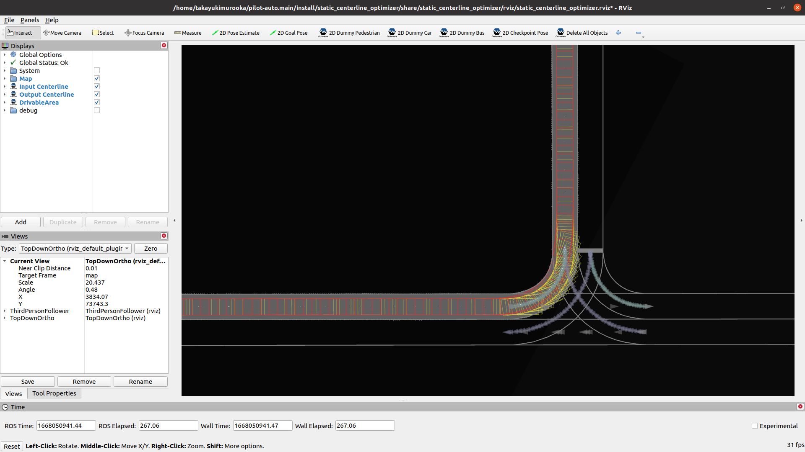

# Static Centerline Generator

## Purpose

This package statically calculates the centerline satisfying path footprints inside the drivable area.

On narrow-road driving, the default centerline, which is the middle line between lanelets' right and left boundaries, often causes path footprints outside the drivable area.
To make path footprints inside the drivable area, we use online path shape optimization by [the obstacle_avoidance_planner package](https://github.com/autowarefoundation/autoware.universe/tree/main/planning/obstacle_avoidance_planner/).

Instead of online path shape optimization, we introduce static centerline optimization.
With this static centerline optimization, we have following advantages.

- We can see the optimized centerline shape in advance.
  - With the default autoware, path shape is not determined until the vehicle drives there.
  - This enables offline path shape evaluation.
- We do not have to calculate a heavy and sometimes unstable path optimization since the path footprints are already inside the drivable area.

## Use cases

There are two interfaces to communicate with the centerline optimizer.

### Vector Map Builder Interface

Note: This function of Vector Map Builder has not been released. Please wait for a while.
Currently there is no documentation about Vector Map Builder's operation for this function.

The optimized centerline can be generated from Vector Map Builder's operation.

We can run

- path planning server
- http server to connect path planning server and Vector Map Builder

with the following command by designating `<vehicle_model>`

```sh
ros2 launch static_centerline_generator run_planning_server.launch.xml vehicle_model:=<vehicle-model>
```

FYI, port ID of the http server is 4010 by default.

### Command Line Interface

The optimized centerline can be generated from the command line interface by designating

- `<input-osm-path>`
- `<output-osm-path>` (not mandatory)
- `<start-lanelet-id>`
- `<end-lanelet-id>`
- `<vehicle-model>`

```sh
ros2 launch static_centerline_generator static_centerline_generator.launch.xml run_backgrond:=false lanelet2_input_file_path:=<input-osm-path> lanelet2_output_file_path:=<output-osm-path> start_lanelet_id:=<start-lane-id> end_lanelet_id:=<end-lane-id> vehicle_model:=<vehicle-model>
```

The default output map path containing the optimized centerline locates `/tmp/lanelet2_map.osm`.
If you want to change the output map path, you can remap the path by designating `<output-osm-path>`.

## Visualization

When launching the path planning server, rviz is launched as well as follows.


- The yellow footprints are the original ones from the osm map file.
  - FYI: Footprints are generated based on the centerline and vehicle size.
- The red footprints are the optimized ones.
- The gray area is the drivable area.
- You can see that the red footprints are inside the drivable area although the yellow ones are outside.

### Unsafe footprints

Sometimes the optimized centerline footprints are close to the lanes' boundaries.
We can check how close they are with `unsafe footprints` marker as follows.

Footprints' color depends on its distance to the boundaries, and text expresses its distance.


By default, footprints' color is

- when the distance is less than 0.1 [m] : red
- when the distance is less than 0.2 [m] : green
- when the distance is less than 0.3 [m] : blue
