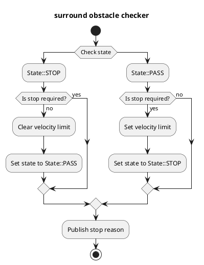
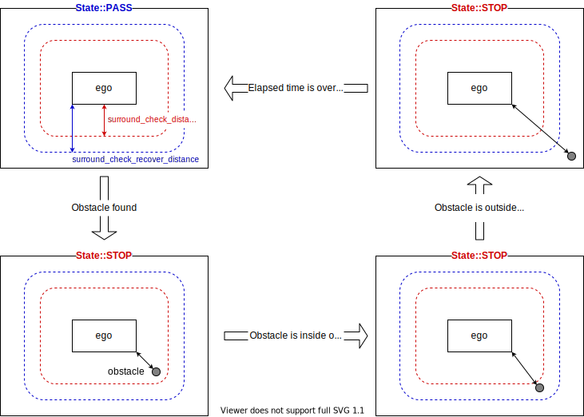

# Surround Obstacle Checker

## Purpose

This module subscribes required data (ego-pose, obstacles, etc), and publishes zero velocity limit to keep stopping if any of stop conditions are satisfied.

## Inner-workings / Algorithms

### Flow chart

  

### Algorithms

### Check data

Check that `surround_obstacle_checker` receives no ground pointcloud, dynamic objects and current velocity data.

### Get distance to nearest object

Calculate distance between ego vehicle and the nearest object.
In this function, it calculates the minimum distance between the polygon of ego vehicle and all points in pointclouds and the polygons of dynamic objects.

### Stop requirement

If it satisfies all following conditions, it plans stopping.

- Ego vehicle is stopped
- It satisfies any following conditions
  1. The distance to nearest obstacle satisfies following conditions
     - If state is `State::PASS`, the distance is less than `surround_check_distance`
     - If state is `State::STOP`, the distance is less than `surround_check_recover_distance`
  2. If it does not satisfies the condition in 1, elapsed time from the time it satisfies the condition in 1 is less than `state_clear_time`

### States

To prevent chattering, `surround_obstacle_checker` manages two states.
As mentioned in stop condition section, it prevents chattering by changing threshold to find surround obstacle depending on the states.

- `State::PASS` : Stop planning is released
- `State::STOP` ：While stop planning

## Inputs / Outputs

### Input

| Name                                           | Type                                                   | Description                                                        |
| ---------------------------------------------- | ------------------------------------------------------ | ------------------------------------------------------------------ |
| `/perception/obstacle_segmentation/pointcloud` | `sensor_msgs::msg::PointCloud2`                        | Pointcloud of obstacles which the ego-vehicle should stop or avoid |
| `/perception/object_recognition/objects`       | `autoware_auto_perception_msgs::msg::PredictedObjects` | Dynamic objects                                                    |
| `/localization/kinematic_state`                | `nav_msgs::msg::Odometry`                              | Current twist                                                      |
| `/tf`                                          | `tf2_msgs::msg::TFMessage`                             | TF                                                                 |
| `/tf_static`                                   | `tf2_msgs::msg::TFMessage`                             | TF static                                                          |

### Output

| Name                                    | Type                                                  | Description                                                                           |
| --------------------------------------- | ----------------------------------------------------- | ------------------------------------------------------------------------------------- |
| `~/output/velocity_limit_clear_command` | `tier4_planning_msgs::msg::VelocityLimitClearCommand` | Velocity limit clear command                                                          |
| `~/output/max_velocity`                 | `tier4_planning_msgs::msg::VelocityLimit`             | Velocity limit command                                                                |
| `~/output/no_start_reason`              | `diagnostic_msgs::msg::DiagnosticStatus`              | No start reason                                                                       |
| `~/output/stop_reasons`                 | `tier4_planning_msgs::msg::StopReasonArray`           | Stop reasons                                                                          |
| `~/debug/marker`                        | `visualization_msgs::msg::MarkerArray`                | Marker for visualization                                                              |
| `~/debug/footprint`                     | `geometry_msgs::msg::PolygonStamped`                  | Ego vehicle base footprint for visualization                                          |
| `~/debug/footprint_offset`              | `geometry_msgs::msg::PolygonStamped`                  | Ego vehicle footprint with `surround_check_distance` offset for visualization         |
| `~/debug/footprint_recover_offset`      | `geometry_msgs::msg::PolygonStamped`                  | Ego vehicle footprint with `surround_check_recover_distance` offset for visualization |

## Parameters

| Name                              | Type     | Description                                                                            | Default value |
| :-------------------------------- | :------- | :------------------------------------------------------------------------------------- | :------------ |
| `use_pointcloud`                  | `bool`   | Use pointcloud as obstacle check                                                       | `true`        |
| `use_dynamic_object`              | `bool`   | Use dynamic object as obstacle check                                                   | `true`        |
| `surround_check_distance`         | `double` | If objects exist in this distance, transit to "exist-surrounding-obstacle" status [m]  | 0.5           |
| `surround_check_recover_distance` | `double` | If no object exists in this distance, transit to "non-surrounding-obstacle" status [m] | 0.8           |
| `state_clear_time`                | `double` | Threshold to clear stop state [s]                                                      | 2.0           |
| `stop_state_ego_speed`            | `double` | Threshold to check ego vehicle stopped [m/s]                                           | 0.1           |
| `stop_state_entry_duration_time`  | `double` | Threshold to check ego vehicle stopped [s]                                             | 0.1           |
| `publish_debug_footprints`        | `bool`   | Publish vehicle footprint with/without offsets                                         | `true`        |

## Assumptions / Known limits

To perform stop planning, it is necessary to get obstacle pointclouds data.
Hence, it does not plan stopping if the obstacle is in blind spot.
