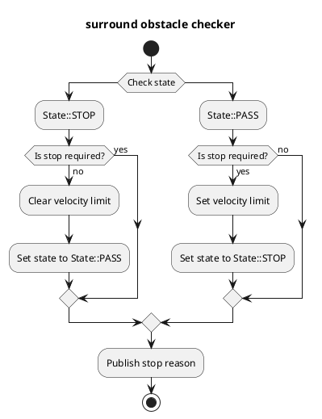

# Surround Obstacle Checker

## Purpose

`surround_obstacle_checker` は、自車が停車中、自車の周囲に障害物が存在する場合に発進しないように停止計画を行うモジュールである。

## Inner-workings / Algorithms

### Flow chart

  

### Algorithms

### Check data

点群、動的物体、自車速度のデータが取得できているかどうかを確認する。

### Get distance to nearest object

自車と最近傍の障害物との距離を計算する。
ここでは、自車のポリゴンを計算し、点群の各点および各動的物体のポリゴンとの距離をそれぞれ計算することで最近傍の障害物との距離を求める。

### Stop condition

次の条件をすべて満たすとき、自車は停止計画を行う。

- 自車が停車していること
- 次のうちいずれかを満たすこと
  1. 最近傍の障害物との距離が次の条件をみたすこと
     - `State::PASS` のとき、`surround_check_distance` 未満である
     - `State::STOP` のとき、`surround_check_recover_distance` 以下である
  2. 1 を満たしていないとき、1 の条件を満たした時刻からの経過時間が `state_clear_time` 以下であること

### States

チャタリング防止のため、`surround_obstacle_checker` では状態を管理している。
Stop condition の項で述べたように、状態によって障害物判定のしきい値を変更することでチャタリングを防止している。

- `State::PASS` ：停止計画解除中
- `State::STOP` ：停止計画中

## Inputs / Outputs

### Input

| Name                                           | Type                                                   | Description                                                        |
| ---------------------------------------------- | ------------------------------------------------------ | ------------------------------------------------------------------ |
| `/perception/obstacle_segmentation/pointcloud` | `sensor_msgs::msg::PointCloud2`                        | Pointcloud of obstacles which the ego-vehicle should stop or avoid |
| `/perception/object_recognition/objects`       | `autoware_auto_perception_msgs::msg::PredictedObjects` | Dynamic objects                                                    |
| `/localization/kinematic_state`                | `nav_msgs::msg::Odometry`                              | Current twist                                                      |
| `/tf`                                          | `tf2_msgs::msg::TFMessage`                             | TF                                                                 |
| `/tf_static`                                   | `tf2_msgs::msg::TFMessage`                             | TF static                                                          |

### Output

| Name                                    | Type                                                  | Description                  |
| --------------------------------------- | ----------------------------------------------------- | ---------------------------- |
| `~/output/velocity_limit_clear_command` | `tier4_planning_msgs::msg::VelocityLimitClearCommand` | Velocity limit clear command |
| `~/output/max_velocity`                 | `tier4_planning_msgs::msg::VelocityLimit`             | Velocity limit command       |
| `~/output/no_start_reason`              | `diagnostic_msgs::msg::DiagnosticStatus`              | No start reason              |
| `~/output/stop_reasons`                 | `tier4_planning_msgs::msg::StopReasonArray`           | Stop reasons                 |
| `~/debug/marker`                        | `visualization_msgs::msg::MarkerArray`                | Marker for visualization     |

## Parameters

| Name                              | Type     | Description                                                                            | Default value |
| :-------------------------------- | :------- | :------------------------------------------------------------------------------------- | :------------ |
| `use_pointcloud`                  | `bool`   | Use pointcloud as obstacle check                                                       | `true`        |
| `use_dynamic_object`              | `bool`   | Use dynamic object as obstacle check                                                   | `true`        |
| `surround_check_distance`         | `double` | If objects exist in this distance, transit to "exist-surrounding-obstacle" status [m]  | 0.5           |
| `surround_check_recover_distance` | `double` | If no object exists in this distance, transit to "non-surrounding-obstacle" status [m] | 0.8           |
| `state_clear_time`                | `double` | Threshold to clear stop state [s]                                                      | 2.0           |
| `stop_state_ego_speed`            | `double` | Threshold to check ego vehicle stopped [m/s]                                           | 0.1           |
| `stop_state_entry_duration_time`  | `double` | Threshold to check ego vehicle stopped [s]                                             | 0.1           |

## Assumptions / Known limits

この機能が動作するためには障害物点群の観測が必要なため、障害物が死角に入っている場合は停止計画を行わない。
