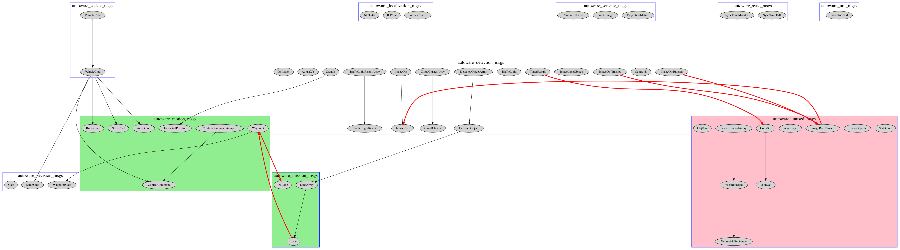
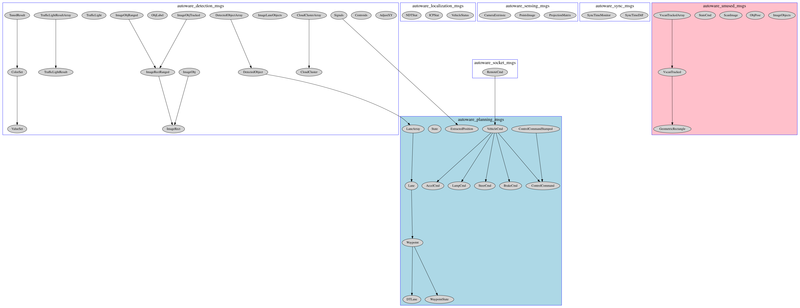

# Autoware Messages Refactoring

## Description

(Tested on develop branch, commit `216cf5f8be63b81d46a90615caebf09d67496172` of Mon Feb 25 17:11:39 2019)

So far, `autoware_msgs` is the sink where all Autoware related messages are created and maintained. 
We decided to refactor the messages into new namespaces more suitable to their purpose.

## Modifications

The following message refactoring will be performed in source code and file structure on `343` different files and over `1500` lines of code and documentation:

1. Defining new namespaces `autoware_xxx_msgs` for each existing message type, where `xxx` corresponds to the new namespace, ex. actuation, decision, detection, localization, mission, etc. (see tables below)
2. Create the new message packages and get rid of old `autoware_msgs` package.
3. Replace the contents `autoware_msgs[::|/| import ]SOME_MGS_TYPE` to `autoware_NAMESPACE_msgs[::|/| import ]SOME_MGS_TYPE` in all sources (cpp,h,py) and documentation.
4. For all packages' `package.xml` and `CMakeLists.txt` files, replace build/run dependencies of `autoware_msgs` for the corresponding `autoware_NAMESPACE_msgs` actually used by the package (a package may use several messages from different namespaces), or append the dependencies when missing.
5. Allow reverting all the changes to their original state (simply rm FILE; git checkout FILE) to do tests.


### Message types to new namespace associations

Namespace of existing message types in `src/msgs/autoware_msgs/msg/` will change as follows:

| New namespace                 | Associated messages      |
| ----------------------------- | ------------------------ |
|`autoware_decision_msgs`|`autoware_msgs/LampCmd`,`autoware_msgs/WaypointState`,`autoware_msgs/State`|
|`autoware_detection_msgs`|`autoware_msgs/DetectedObjectArray`,`autoware_msgs/Centroids`,`autoware_msgs/ImageObjRanged`,`autoware_msgs/ImageLaneObjects`,`autoware_msgs/CloudClusterArray`,`autoware_msgs/ImageRect`,`autoware_msgs/TrafficLightResult`,`autoware_msgs/TrafficLight`,`autoware_msgs/ImageObj`,`autoware_msgs/ImageObjTracked`,`autoware_msgs/Signals`,`autoware_msgs/DetectedObject`,`autoware_msgs/TrafficLightResultArray`,`autoware_msgs/TunedResult`,`autoware_msgs/AdjustXY`,`autoware_msgs/CloudCluster`,`autoware_msgs/ObjLabel`|
|`autoware_localization_msgs`|`autoware_msgs/VehicleStatus`,`autoware_msgs/ICPStat`,`autoware_msgs/NDTStat`|
|`autoware_mission_msgs`|`autoware_msgs/DTLane`,`autoware_msgs/LaneArray`,`autoware_msgs/Lane`|
|`autoware_motion_msgs`|`autoware_msgs/ControlCommandStamped`,`autoware_msgs/Waypoint`,`autoware_msgs/ExtractedPosition`,`autoware_msgs/ControlCommand`,`autoware_msgs/BrakeCmd`,`autoware_msgs/AccelCmd`,`autoware_msgs/SteerCmd`|
|`autoware_sensing_msgs`|`autoware_msgs/ProjectionMatrix`,`autoware_msgs/PointsImage`,`autoware_msgs/CameraExtrinsic`|
|`autoware_socket_msgs`|`autoware_msgs/VehicleCmd`,`autoware_msgs/RemoteCmd`|
|`autoware_sync_msgs`|`autoware_msgs/SyncTimeDiff`,`autoware_msgs/SyncTimeMonitor`|
|`autoware_unused_msgs`|`autoware_msgs/StateCmd`,`autoware_msgs/ImageObjects`,`autoware_msgs/ImageRectRanged`,`autoware_msgs/VscanTracked`,`autoware_msgs/ScanImage`,`autoware_msgs/ValueSet`,`autoware_msgs/ColorSet`,`autoware_msgs/VscanTrackedArray`,`autoware_msgs/ObjPose`,`autoware_msgs/GeometricRectangle`|
|`autoware_util_msgs`|`autoware_msgs/IndicatorCmd`|


The following is a different view of the above table, to ease finding messages to their new namespace.

| Current message               | New namespace            |
| ----------------------------- | ------------------------ |
|`autoware_msgs/AccelCmd`|`autoware_motion_msgs`|
|`autoware_msgs/AdjustXY`|`autoware_detection_msgs`|
|`autoware_msgs/BrakeCmd`|`autoware_motion_msgs`|
|`autoware_msgs/CameraExtrinsic`|`autoware_sensing_msgs`|
|`autoware_msgs/Centroids`|`autoware_detection_msgs`|
|`autoware_msgs/CloudCluster`|`autoware_detection_msgs`|
|`autoware_msgs/CloudClusterArray`|`autoware_detection_msgs`|
|`autoware_msgs/ControlCommand`|`autoware_motion_msgs`|
|`autoware_msgs/ControlCommandStamped`|`autoware_motion_msgs`|
|`autoware_msgs/DTLane`|`autoware_mission_msgs`|
|`autoware_msgs/DetectedObject`|`autoware_detection_msgs`|
|`autoware_msgs/DetectedObjectArray`|`autoware_detection_msgs`|
|`autoware_msgs/ExtractedPosition`|`autoware_motion_msgs`|
|`autoware_msgs/ICPStat`|`autoware_localization_msgs`|
|`autoware_msgs/ImageLaneObjects`|`autoware_detection_msgs`|
|`autoware_msgs/ImageObj`|`autoware_detection_msgs`|
|`autoware_msgs/ImageObjRanged`|`autoware_detection_msgs`|
|`autoware_msgs/ImageObjTracked`|`autoware_detection_msgs`|
|`autoware_msgs/ImageRect`|`autoware_detection_msgs`|
|`autoware_msgs/IndicatorCmd`|`autoware_util_msgs`|
|`autoware_msgs/LampCmd`|`autoware_decision_msgs`|
|`autoware_msgs/Lane`|`autoware_mission_msgs`|
|`autoware_msgs/LaneArray`|`autoware_mission_msgs`|
|`autoware_msgs/NDTStat`|`autoware_localization_msgs`|
|`autoware_msgs/ObjLabel`|`autoware_detection_msgs`|
|`autoware_msgs/PointsImage`|`autoware_sensing_msgs`|
|`autoware_msgs/ProjectionMatrix`|`autoware_sensing_msgs`|
|`autoware_msgs/RemoteCmd`|`autoware_socket_msgs`|
|`autoware_msgs/Signals`|`autoware_detection_msgs`|
|`autoware_msgs/State`|`autoware_decision_msgs`|
|`autoware_msgs/SteerCmd`|`autoware_motion_msgs`|
|`autoware_msgs/SyncTimeDiff`|`autoware_sync_msgs`|
|`autoware_msgs/SyncTimeMonitor`|`autoware_sync_msgs`|
|`autoware_msgs/TrafficLight`|`autoware_detection_msgs`|
|`autoware_msgs/TrafficLightResult`|`autoware_detection_msgs`|
|`autoware_msgs/TrafficLightResultArray`|`autoware_detection_msgs`|
|`autoware_msgs/TunedResult`|`autoware_detection_msgs`|
|`autoware_msgs/VehicleCmd`|`autoware_socket_msgs`|
|`autoware_msgs/VehicleStatus`|`autoware_localization_msgs`|
|`autoware_msgs/Waypoint`|`autoware_motion_msgs`|
|`autoware_msgs/WaypointState`|`autoware_decision_msgs`|

## Procedure

To test whether the proposed approach works, please follow these steps:

1. Get a fresh copy of Autoware `develop` branch, ex. `git clone https://github.com/CPFL/Autoware.git -b develop --recurse-submodules [AUTOWARE_PATH]`.
2. Make sure the original builds correctly: run `./catkin_make_release` (follow the steps in [How to build](https://github.com/CPFL/Autoware/wiki/Source-Build) ).
3. Switch to `feature/autoware_msgs_refactoring` branch, ex. `git checkout feature/autoware_msgs_refactoring` and pull for changes `git pull`.
3. Run the autoware messages refactoring script as `./fix-autoware-msgs.py --fix` from the `[AUTOWARE_PATH]/ros` folder (it assumes `src` is a subdirectory).
4. Make sure refactored version builds correctly: run again `./catkin_make_release`.
5. (Optionally) If necessary, everything can be reverted to its original unaltered state with `./fix-autoware-msgs.py --recovery`. The recovery file `.autoware_msgs_refactoring_recovery` has a list of modified files, it can be deleted.

## Notes:

Initially `autoware_motion_msgs` and `autoware_mission_msgs` were proposed as independent namespaces and in accordance with the existing categories in the computing group. This, however, caused a problem of circular dependencies on the newly generated message packages, as shown on the following image (lightgreen groups have interdependency and lightred group will be deleted due to lack of use by any package):



To solve this interdependency, both `autoware_motion_msgs` and `autoware_mission_msgs` were replaced by a single namespace `autoware_navigation_msgs`. Also, up to the initial proposal, several messages were not being used by any other package and deemed `unused` and suitable to removal. However we did not consider actual autoware messages interdependencies, this was also fixed by moving some `unused` messages to the corresponding namespace. Both solutions are shown in the following image (new navigation namespace highlighted in lightblue):



## Issues

Please check the following cases:

### Not in use

As to the commit/date stated above, the following messages are not used by any package. The above script will move them to a new namespace `autoware_unused_msgs` temporarily (these messages will be deleted):

* `GeometricRectangle`
* `ImageObjects`
* `ObjPose`
* `ScanImage`
* `StateCmd`
* `VscanTracked`
* `VscanTrackedArray`

Such unused messages can be also verified by the shell command:
```
IFS=$'\n'; for I in `find . -type f`; do egrep -i '(publish|advertise|subscri|import|include)' -H $I | egrep '(ValueSet|ImageObjects|ImageRectRanged|VscanTracked|VscanTrackedArray|StateCmd|ScanImage|ColorSet|ObjPose|GeometricRectangle)'; done
```

### Errors
As to the commit/date stated above, the following messages are referred by a package but its file does not exists in `src/msgs/autoware_msgs/msgs/`

* `ImageObjRange` referred by `src/system/sync/computing/perception/detection/packages/cv_tracker/nodes/kf_track/sync_track.cpp`  `ImageObjRange` does not exist, `ImageObjRanged` does exist. `cv_tracker` has no `package.xml` and `CMakeLists.txt` files therefore it's not built and can be removed.


### Others

The following issues were found, we corrected them.

* File `src/driveworks/packages/autoware_driveworks_interface/package.xml` depends on `autoware_msgs` but the package does not use it
* File `src/simulation/lgsvl_simulator_bridge/package.xml` depends on `autoware_msgs` but the package does not use it
* File `src/sensing/fusion/packages/autoware_camera_lidar_calibrator/package.xml` depends on `autoware_msgs` but the package does not use it
* File `src/common/libs/amathutils_lib/package.xml` depends on `autoware_msgs` but the package does not use it
* File `src/common/libs/state_machine_lib/package.xml` depends on `autoware_msgs` but the package does not use it
* Package `src/computing/planning/mission/packages/op_global_planner` depends on `autoware_msgs` but file `package.xml` does not declare the dependency
* Package `src/computing/planning/mission/packages/way_planner` depends on `autoware_msgs` but file `package.xml` does not declare the dependency
* Package `src/computing/planning/motion/packages/lattice_planner` depends on `autoware_msgs` but file `package.xml` does not declare the dependency
* Package `src/computing/planning/motion/packages/dp_planner` depends on `autoware_msgs` but file `package.xml` does not declare the dependency

