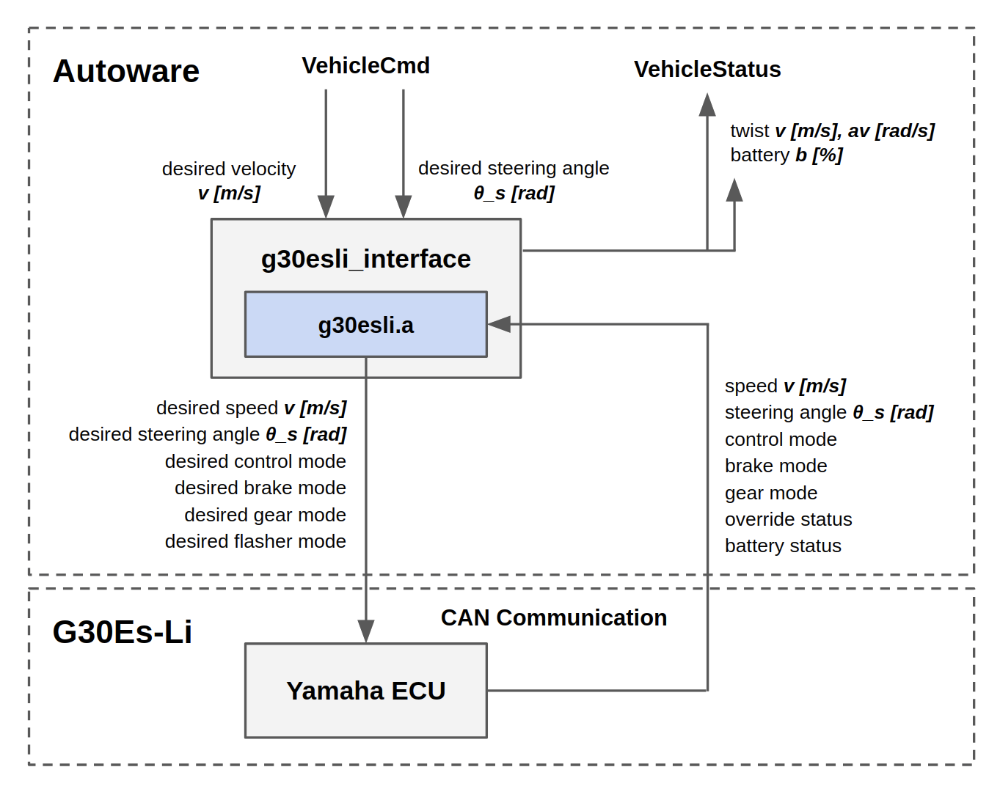
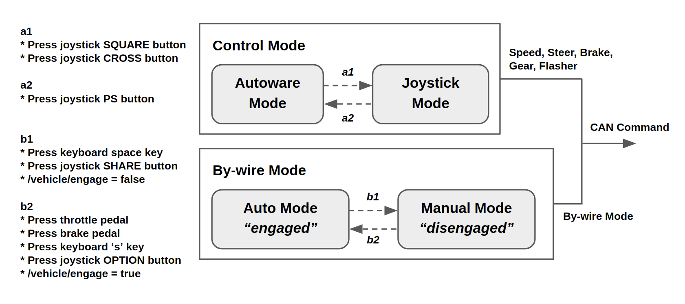

# YMC
The controller package for vehicles manufactured by Yamaha Motor Co., Ltd.

## g30esli_interface
Yamaha Golfcar [Academic Pack](https://www.macnica.co.jp/release/2019/detail20190109.html) version of [G30Es-Li](https://www.yamaha-motor.co.jp/golfcar/lineup/g30es-li/index.html) has the By-wire ECU based on CAN communication.
CAN message format is private, so we provide CAN communication and parsing functions as a binary `g30esli.a` in ymc package.



This node has two modes and some condition of transition as in this figure.
If you press throttle or brake pedal, By-wire mode is forced to transition to Manual Mode (override function).

- Control Mode: If you use a joystick, the command to a vehicle is able to be selected.
  - Autoware Mode: CAN commands are generated following `/vehicle_cmd` topic.
  - Joystick Mode: CAN commands are generated following `/ds4` topic.
- By-wire Mode: You can change to enable/disable By-wire mode.
  - Auto Mode: A vehicle allows to be controlled by CAN commands.
  - Manual Mode: You can drive as usual.



### How to Use
1. Confirm safety around your vehicle.

2. Launch Autoware nodes and check to correctly provide `/vehicle_cmd` topic.

3. Connect and setup CAN interface. (NOTE: We generally use [PEAK System PCAN-USB](https://www.peak-system.com/PCAN-USB.199.0.html?&L=1))
```
$ rosrun ymc canset up canX
```

4-1. Launch `g30esli_interface` node.
```
$ roslaunch ymc g30esli_interface.launch device:=canX
```
And then your car should move by `vehicle_cmd` topic.

4-2. If you want to use [DS4 joystick](https://www.playstation.com/en-us/explore/accessories/gaming-controllers/dualshock-4), launch with `use_ds4` option and connect your joystick controller.
```
$ roslaunch ymc g30esli_interface.launch device:=canX use_ds4:=true ds4_wired:=true   ## USB
```
or
```
$ roslaunch ymc g30esli_interface.launch device:=canX use_ds4:=true ds4_wired:=false  ## Bluetooth
```
And then, your car should move by joystick controller. For controlling by `vehicle_cmd`, press PS button.

### DS4 Button Binding
| Button | Description |
| --- | --- |
| CROSS | Send speed ( 3 <= v <= 19 [km/h] ), change to JOYSTICK mode |
| SQUARE | Smooth brake, change to JOYSTICK mode |
| CIRCLE | Semi-emergency brake |
| TRIANGLE | Emergency brake |
| R1 | Reverse shift |
| L1 | Neutral shift |
| R2 | Change speed linearly ( v = 16 * R2 + 3 [km/h] ) |
| L2 | Change max steering linearly ( theta = (17 * L2 + 20) * ANALOG_L [deg] ) |
| ANALOG_L | Steering angle ( -37 <= theta <= +37 [deg] ) |
| DIGITAL_UP / LEFT / RIGHT / DOWN | Blinker clear / left / right / hazard |
| SHARE | Engage vehicle |
| OPTION | Disengage vehicle |
| PS | change to AUTO mode |

Please see [ds4 package](https://github.com/tier4/ds4) to know installation and details.

### Parameters

| Parameter | Type | Description | Default |
| --- | --- | --- | --- |
| `engaged` | *Bool* | Enable Auto Mode at startup | `true` |
| `device` | *String* | CAN interface name | `can0` |
| `steering_offset_deg` | *Double* | Steering offset [deg] | `0.0` |
| `command_timeout` | *Int* | `vehicle_cmd` timeout [ms] | `1000` |
| `use_ds4` | *Bool* | Enable DS4 joystick and start in joystick mode | `false` |
| `ds4_wired` | *Bool* | Select DS4 connection (true = USB, false = Bluetooth) | `false` |
| `ds4_timeout` | *Int* | Bluetooth timeout in `ds4_driver` [ms] | `1000` |

### Subscriptions/Publications

```
Node [/g30esli_interface]
Publications:
 * /vehicle/battery [std_msgs/Float32]
 * /vehicle/twist [geometry_msgs/TwistStamped]
 * /vehicle_status [autoware_msgs/VehicleStatus]

Subscriptions:
 * /vehicle/engage [std_msgs/Bool]
 * /vehicle_cmd [autoware_msgs/VehicleCmd]
```
