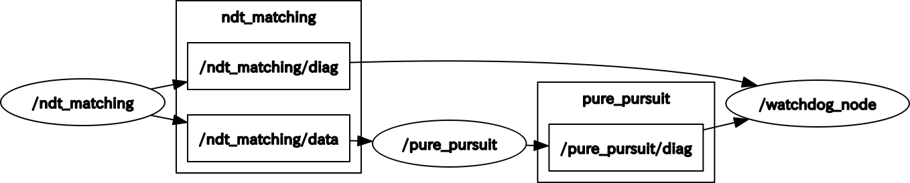

# diagnostic_lib

## diagnostic packages for Autoware.

### packages
1. diag_lib  
packages contain diag_manager.

1. diag_msgs  
original messages for diagnostic

1. fake_autoware_nodes  
test fake nodes and samples  

### How to test
```
roslaunch fake_autoware_nodes diag_sample.launch
```

### How to use
1. add diag_lib,diag_msgs to your package dependency.

1. #include <diag_lib/diag_manager.h> to your source code.

1. create diag_manager class instance in your source code.

1. define error code to yaml file (sample: <diag_lib>/config/error_code_sample_config.yaml)

### Compile options
1. -DSTRICT_ERROR_CODE_CHECK=(ON or OFF)  
if you set this option ON, check error code infomation and when it was wrong, error message was shown and the wrong node was killed. 

### How it works
diag_manager instance which attatched to your C++ ROS node publish <your_node_name>/diag topic (type:diag_msgs/diag_error).  
You can define errors in .yaml setting file.  
Each diag_manager and watchdog node read .yaml setting file and load error codes.  
The watchdog node check allive or dead all the nodes in the .yaml setting file and aggregate /diag topic which comes from diag_managers.  

 

### How to attach diag_manager class
Please read source codes in fake_autoware_nodes

### required parameters(rosparam)
error_code_config_path (type:String) : full path of error code config file path.

#### public member functions
#### constructer and destructer

1. constructer
```
diag_manager::diag_manager();
```

2. destructor
```
diag_manager::diag_manager();
```

#### diag functions 
Note : argument num is the error number you defined in the error code setting yaml file. 
1. DIAG_ASSERT_VALUE_RANGE
```
template<typename T>
void DIAG_ASSERT_VALUE_RANGE(T min, T max, T value, int num)
```
If value is not in the range, send diag message.  
When you use this function , you expected the value satisfy the conditional expression "min < value < max".  
num is the error number you defined in the error code setting yaml file.  

2. DIAG_ASSERT_VALUE_MIN
```
template<typename T>
void DIAG_ASSERT_VALUE_MIN(T min, T value, int num)
```
If value is not in the range, send diag message.  
When you use this function , you expected the value satisfy the conditional expression "min < value".  
num is the error number you defined in the error code setting yaml file.  

3. DIAG_ASSERT_VALUE_MAX
```
template<typename T>
void DIAG_ASSERT_VALUE_MIN(T max, T value, int num)
```
If value is not in the range, send diag message.  
When you use this function , you expected the value satisfy the conditional expression "max < value".  
num is the error number you defined in the error code setting yaml file.  

4. DIAG_ASSERT_EXCEPTION
```
template<class T>
void DIAG_ASSERT_EXCEPTION(T exception,int num)
```
You shold call this function in catch block in your source code.  
When this function was called, diag_manager send a EXCEPTION diag message.

5. DIAG_RESOURCE
```
void DIAG_RESOURCE(std::string target_resource_path, int num);
```
When the function was called, diag_manager check the target resource file exist.  
If diag_manager failed to find the file, diag_manager kill the target ROS node.  
I strongly recommend that you should call this function in the initialize function.  
num is the error number you defined in the error code setting yaml file.  

6. DIAG_RATE_CHECK
```
void DIAG_RATE_CHECK(int num);
```
Put this function where you want to know operation cycle.  
num is the error number you defined in the error code setting yaml file.  

7. DIAG_LOW_RELIABILITY
```
void DIAG_LOW_RELIABILITY(int num);
```
You call this function when your node output is low reliability.  
num is the error number you defined in the error code setting yaml file.  

#### logging function
1. WRITE_LOG
Write log file to /tmp/Autoware/Diag/Log/<nodename>/log.txt  
The log remains in such format.  
```
[2018-09-13T03:25:25.340543] : in /ndt_matching: topic /nft_matching/data subscribe rate was low (Warn)
[2018-09-13T03:25:25.341312] : in /ndt_matching: The input value hogehoge is out of range.
[2018-09-13T03:25:25.441295] : in /ndt_matching: The input value hogehoge is out of range.
[2018-09-13T03:25:25.541326] : in /ndt_matching: The input value hogehoge is out of range.
[2018-09-13T03:25:25.641427] : in /ndt_matching: The input value hogehoge is out of range.
[2018-09-13T03:25:25.741318] : in /ndt_matching: The input value hogehoge is out of range.
[2018-09-13T03:25:25.841311] : in /ndt_matching: The input value hogehoge is out of range.
[2018-09-13T03:25:25.941436] : in /ndt_matching: The input value hogehoge is out of range.
[2018-09-13T03:25:26.041322] : in /ndt_matching: The input value hogehoge is out of range.
[2018-09-13T03:25:26.141353] : in /ndt_matching: The input value hogehoge is out of range.
[2018-09-13T03:25:26.340464] : in /ndt_matching: topic /nft_matching/data subscribe rate was low (Warn)
[2018-09-13T03:25:27.340491] : in /ndt_matching: topic /nft_matching/data subscribe rate was low (Warn)
[2018-09-13T03:25:28.241331] : in /ndt_matching: exception was catched
[2018-09-13T03:25:28.241375] : in /ndt_matching: Divided by zero.
[2018-09-13T03:25:28.340549] : in /ndt_matching: topic /nft_matching/data subscribe rate was low (Warn)
[2018-09-13T03:25:29.340556] : in /ndt_matching: topic /nft_matching/data subscribe rate was low (Warn)
[2018-09-13T03:25:30.340551] : in /ndt_matching: topic /nft_matching/data subscribe rate was low (Warn)
[2018-09-13T03:25:30.341377] : in /ndt_matching: The input value hogehoge is out of range.
[2018-09-13T03:25:30.441393] : in /ndt_matching: The input value hogehoge is out of range.
[2018-09-13T03:25:30.541348] : in /ndt_matching: The input value hogehoge is out of range.
[2018-09-13T03:25:30.641382] : in /ndt_matching: The input value hogehoge is out of range.
```