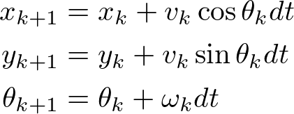
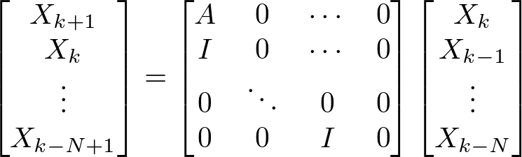

# Overview
This package generates robust less-noisy self_pose/twist integrating pose and twist messages with vehicle model. By default, this package is applicable when `/ndt_pose` and `/can_twist` are published. (`/can_twist` is converted from `/vehicle_status` by `vehicle_status_converter` in twist_generator package.) The `ekf_localizer` generates estimated pose `/ekf_pose`. You can set this value to `/current_pose` in `vel_pose_connect` so that `/ekf_pose` is used for other nodes.

Some other features include
 - time delay compensation : for sensor delay, predict current position from vehicle dynamics. The delay is usually calculated by comparing the header time stamp with the current time, but additional delay time can be set with the parameter.
 - mahalanobis gate : for sensor outlier detection, Mahalanobis distance is used.
 - yaw angle compensation : yaw angle bias is estiamted, which is caused by sensor mounting error.

# Input and Output
- input
    - geometry_msgs::PoseStamped ego_pose (default: `/ndt_pose`)
    - geometry_msgs::TwistStamped ego_twist (default: `/can_twist`))
    
- output
    - tf base_link : broadcasted with *tf_rate* [Hz]
    - estimated pose (geometry_msgs::PoseStamped) : filtered pose
    - estimated twist (geometry_msgs::TwistStamped) : filtered twist

# Functions

## in timer callback with *predict_frequency*
Calculate *predict* and *update* at constant intervals in timer callback. The purpose of perform *update* at timer callback is to avoid large position (or velocity) changes due to low period measurement, such as NDT matching. If the callback period is faster than the sensor period, the same sensor value is used for update. Note that since the algorithm can deal with sensor time delay, there is no lack of consistency in using the same sensor data. 

## measurement data callback

The subscribed data is saved and used for *update* of kalman filter in timer callback. The Mahalanobis distance is calculated for the received data, and it is removed as an outlier if the value is over limit.

# Parameter description

they are set in `launch/ekf_localizer.launch` 

## for Node

|Name|Type|Description|Default value|
|:---|:---|:---|:---|
|show_debug_info|bool|display debug info|false|
|predict_frequency|double|filtering and publish frequency [Hz]|50.0|
|tf_rate|double|frqcuency for tf broadcasting [Hz]|10.0|
|extend_state_step|int|max delay step which can be dealt with in EKF. Large number increases computational cost. |50|
|enable_yaw_bias_estimation| bool |enable yaw bias estimation for LiDAR mount error|true|

## for pose measurement

|Name|Type|Description|Default value|
|:---|:---|:---|:---|
|pose_additional_delay|double|Additional delay time for pose measurement [s]|0.0|
|pose_measure_uncertainty_time|double|Used for covariance calculation [s]|0.01|
|pose_rate|double|used for covariance calculation [Hz]|10.0|
|pose_gate_dist|double|limit of Mahalanobis distance used for outliers detection|10000.0|
|pose_stddev_x|double|standard deviation for pose position x [m]|0.05|
|pose_stddev_y|double|standard deviation for pose position y [m]|0.05|
|pose_stddev_yaw|double|standard deviation for pose yaw angle [rad]|0.025|
|use_pose_with_covariance|bool|use covariance in pose_with_covarianve message|false|

## for twist measurement
|Name|Type|Description|Default value|
|:---|:---|:---|:---|
|twist_additional_delay|double|Additional delay time for twist [s]|0.0|
|twist_rate|double|used for covariance calculation [Hz]|10.0|
|twist_gate_dist|double|limit of Mahalanobis distance used for outliers detection|10000.0|
|twist_stddev_vx|double|standard deviation for twist linear x [m/s] |0.2|
|twist_stddev_wz|double|standard deviation for twist angular z [rad/s] |0.03|

## for process noise
|Name|Type|Description|Default value|
|:---|:---|:---|:---|
|proc_stddev_vx_c|double|standard deviation of process noise in time differentiation expression of linear velocity x, noise for d_vx = 0|2.0|
|proc_stddev_wz_c|double|standard deviation of process noise in time differentiation expression of angular velocity z, noise for d_wz = 0|0.2|
|proc_stddev_yaw_c|double|standard deviation of process noise in time differentiation expression of yaw, noise for d_yaw = omege |0.005|
|proc_stddev_yaw_bias_c|double|standard deviation of process noise in time differentiation expression of yaw_bias, noise for d_yaw_bias = 0|0.001|

note: process noise for position x & y are calculated automatically dealing with nonlinear equation.

# How to turn EKF parameters

0. Preliminaries
 - Check header time in pose and twist message is set to sensor time appropriatelly, because time delay is calculated from this value. If it is difficult to set appropriate time due to timer synchronization problem, use `twist_additional_delay` and `pose_additional_delay` to correct the time.
 - Check the relation between measurement pose and twist is appropriate (whether the derivative of pose has similar value to twist). This discrepancy is caused mainly by unit error (such as radian-degree) or bias noise, and it causes large estimation errors. If you are using `/ndt_pose` from `ndt_matching` as a pose measurement, you can use `/estimate_twist` (derivative of `/ndt_pose`) to compare to twist measurement.

1. Set sensor parameters (sensor-rate, standard-deviation) which can be set to appropriate value from the basic information of the sensor. Default values are set as pose measurement with ndt matching with LiDAR, and twist measurement with CAN info. The `pose_measure_uncertainty_time` is for noise of header timestamp data.

 - `pose_measure_uncertainty_time`
 - `pose_rate`
 - `pose_stddev_x`
 - `pose_stddev_y`
 - `pose_stddev_yaw`
 - `twist_rate`
 - `twist_stddev_vx`
 - `twist_stddev_wz`

2. Set process model parameters as follows.

 - `proc_stddev_vx_c` : set to maximum linear acceleration
 - `proc_stddev_wz_c` : set to maximum angular acceleration
 - `proc_stddev_yaw_c` : This parameter relates estimation between yaw and yaw-speed. Large value means yaw transition does not related to yaw-speed. If set this to 0, it means yaw differential is equal to yaw angle speed. If the relation of "differentiation of yaw measurement value = measurement value of yaw-speed" includes any modeling error other than measurement noise based on normal distribution (such as angular velocity bias), increase this value.
 - `proc_stddev_yaw_bias_c` : This parameter is related to the rate of change of yaw angle bias. In most cases, yaw bias is constant, so it can be very small. If there is a yaw angle bias, not to set zero. (Zero means bias is constant with initial value, which is set to zero)

 3. Turn sensor standard deviation parameters of sensor with rosbag simulation.
 
 If the position measurement seems more reliable, make these parameters smaller. If the estimated position seems to be noisy due to pose measurement noise, make these values bigger. 

  - `pose_stddev_x`
  - `pose_stddev_y`
  - `pose_stddev_yaw`

 If the twist measurement seems more reliable, make these parameters smaller. If the estimated twist seems to be noisy due to pose measurement noise, make these values bigger. 
  - `twist_stddev_vx`
  - `twist_stddev_wz`

# kalman filter model

## kinematics model in update function

## time delay model

