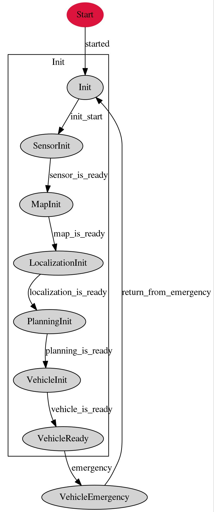
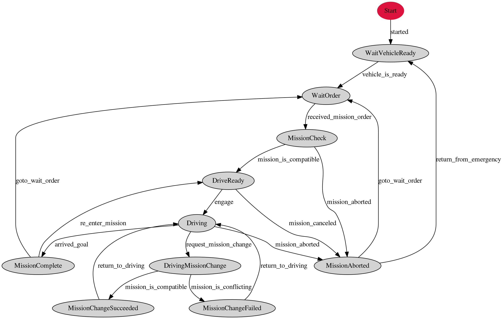
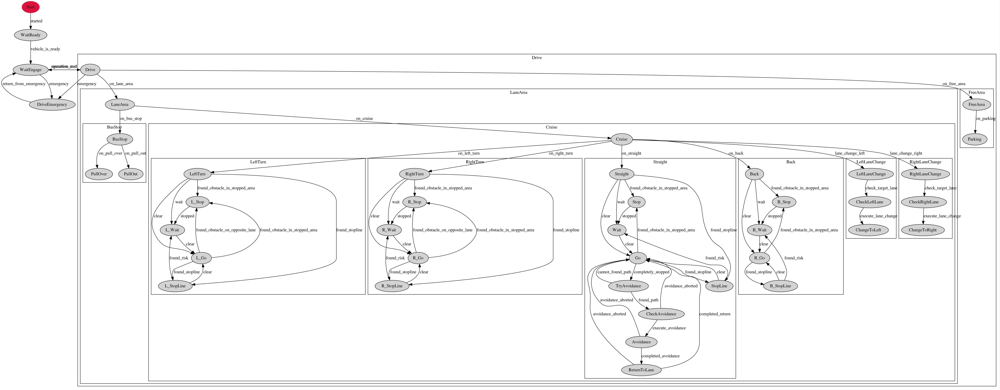

# Decision Maker

## Overview
**This feature is experimental.** 
Autoware package that manages the Vehicle status, given Mission(waypoints) status, and Driving(Motion) status.
Each status is managed by state machine.
<!-- Autoware package that visualize internal state and publish some commands. -->
### Vehicle

### Mission

### Driving

## Runtime Manager Parameters
Parameter|Type|Description
--|---|--
auto_mission_reload|Bool|(default: *false*) If this is set true, decision maker automatically reloads mission as new mission after previous mission is completed.
auto_engage|Bool|(default: *false*) If this is set true, decision maker automatically engage immediately after ready to drive.
auto_mission_change|Bool|(default: *false*) If this is set true, decision maker automatically change the mission(waypoint) without state_cmd when new mission is loaded while driving.
use_fms|Bool|(default: *false*) This must be true in order to incoorporate with [Autoware Management System](https://github.com/CPFL/AMS)
disuse_vector_map|Bool|(default: *false*)  If set *true*, decision_maker will exit "MapInitState" even if vector map is not successfully loaded.
num_of_steer_behind|Int|(default: *20*)  lookup distance along waypoints to determine steering state(straight, turning right, or turning left)
change_threshold_dist|Double|(default: *1*)  This is relevent only if *use_fms* is *true*.  If the distance from vehicle to closest waypoint in the new mission is further than *change_threshold_dist* [m], mission change fails.
change_threshold_angle|Double|(default:*15*) This is relevent only if *use_fms* is *true*.  If the angle from vehicle to closest waypoint in the new mission is further than this *change_threshold_dist* [deg], mission change fails.
time_to_avoidance|Double|(default: *3*)  If the vehicle is stuck for *time_to_avoidance* seconds (e.g. due to obstacles), the state transits to from "Go" to "Avoidance".
goal_threshold_dist|Double|(default: *3*)  Threshold used to check if vehicle has reached to the goal (i.e. end of waypoints). The vehicle must be less than *goal_threshold_dist* [m] to the goal.
goal_threshold_vel|Double|(default: *0.1*)  Threshold used to check if vehicle has reached to the goal (i.e. end of waypoints). The vehicle must be less than *goal_threshold_vel* [m/s] to be treated as goal arrival.

## ROS Parameters
Parameter|Type|Description
--|---|--
state_vehicle_file_name|string|file that defines vehicle state transition
state_mission_file_name|string|file that defines mission state transition
state_drive_file_name|string|file that defines drive state transition
stopline_reset_count|int|This parameter is used if the vehicle stops at the stop line and moves backward without crossing the stop line. When the vehicle moves backward by this count of the waypoints, the stop line is recognized again.

## Subscribed topics
Topic|Type|Objective
--|---|--
/based/lane_waypoints_array|autoware_msgs/LaneArray|waypoints for the vehicle to follow. (e.g. waypoints given from waypoint_loader node)
/change_flag|std_msgs/Int32|Vehicle will try to change lane if this flag is set. Publishes /lamp_cmd to change blinkers according to this flag. (0=straight, 1=right, 2=left)
/closest_waypoint|std_msgs/Int32|Closest waypoint index in waypoints given by /based/lane_waypoints_array.
/config/decision_maker|autoware_config_msgs::ConfigDecisionMaker|Parameters set from runtime manager
/current_pose|geometry_msgs/PoseStamped|Current pose of vehicle
/current_velocity|geometry_msgs/TwistStamped|Current velocity of vehicle
/filtered_points|sensor_msgs/PointCloud2|Used to check if sensor data is ready. This is meant to give pointcloud data used for ndt_matching.
/final_waypoints|autoware_msgs/Lane|resultant waypoints from planner nodes, e.g. from velocity_set node.
/obstacle_waypoint|std_msgs/Int32|Obstacle waypoint index. Used in "Go" state.
/state_cmd|std_msgs/String|Decision_maker will try to transit state according to the key given through this topic.
/vector_map_info/area|vector_map_msgs/AreaArray|Area information from vector map.  This is ignored unless area, cross_road, line, point, road_sign, stop_line, and vector are subscribed.
/vector_map_info/cross_road|vector_map_msgs/CrossRoadArray|Cross road information from vector map.  This is ignored unless area, cross_road, line, point, road_sign, stop_line, and vector are subscribed.
/vector_map_info/line|vector_map_msgs/LineArray|Line information from vector map.  This is ignored unless area, cross_road, line, point, road_sign, stop_line, and vector are subscribed.
/vector_map_info/point|vector_map_msgs/PointArray|Point information from vector map. This is ignored unless area, cross_road, line, point, road_sign, stop_line, and vector are subscribed.  
/vector_map_info/road_sign|vector_map_msgs/RoadSignArray|Road sign information from vector map.  This is ignored unless area, cross_road, line, point, road_sign, stop_line, and vector are subscribed.
/vector_map_info/stop_line|vector_map_msgs/StopLineArray|Stop line information from vector map. This is ignored unless area, cross_road, line, point, road_sign, stop_line, and vector are subscribed.
/vector_map_info/vector|vector_map_msgs/VectorArray|Vector information from vector map.  This is ignored unless area, cross_road, line, point, road_sign, stop_line, and vector are subscribed.

## Published topics
Topic|Type|Objective
--|---|--
/decision_maker/available_transition|std_msgs/String|available transition from current state
/decision_maker/operator_help_text|jsk_rviz_plugins/OverlayText|Help message during operation
/decision_maker/state|std_msgs/String|current state for "Vehicle", "Mission", and "Drive" state machine.
/decision_maker/state_msg|autoware_msgs/State|current state for "Vehicle", "Mission", and "Drive" state machine with header.
/lamp_cmd|autoware_msgs/LampCmd|blinker command to vehicle (0=straight, 1=right, 2=left)
/lane_waypoints_array|autoware_msgs/LaneArray|waypoints passed down to following planners. (e.g. lane_rule)
/light_color_managed|autoware_msgs/TrafficLight|meant to publish light_color status. Not implemented yet.
/decision_maker/state_overlay|jsk_rviz_plugins/OverlayText|Current state as overlay_txt.
/state/stopline_wpidx|std_msgs/Int32|Index of waypoint for the vehicle to stop.
/decision_maker/target_velocity_array|std_msgs/Float64MultiArray| Array of target velocity obtained from final_waypoints.

## State Description
### Vehicle States
State name|Required topic|Description|Implementation
--|--|---|--
Init|-|The parent state of the following states.|-
SensorInit|/filtered_points|Waits until all sensors are ready.|Waits until /filtered_points is received unless wf_simulator node is launched.  
MapInit||Waits until vector map is ready|Waits until vector_map is subscribed if disuse_vector_map is set false.
LocalizationInit|/current_pose|Waits until localizer is ready | Waits until current_pose is converged. (i.e. ndt_matching is stable.)
PlanningInit|/closest_waypoint|Waits unil planners are ready | Subscriber is set for /closest_waypoint.
VehicleInit|-|Waits until vehicle is ready for departure.|No implementation goes directly to vehilce ready state.
VehicleReady|-|Vehicle is ready to move.|Exits to VehicleEmergency when `emergency` key is given by state_cmd from other states, or if `emergency_flag` is set true by other states.
VehicleEmergency|-|Emergency is detected somewhere in the system. |Waits until `return_from_emergency` or `return_to_ready`  key is by /state_cmd (e.g. by DecisionMakerPanel)

### Mission States
State name|Required topic|Description|Implementation
--|--|---|--
WaitVehicleReady|-|Waits until vehicle setup is done|Waits until vehicle_is_ready key is given from Vehicle State Machine
WaitOrder|/based_lane_array|wayits until mission is given. | waits until base_lane_array is received.
MissionCheck|/final_waypoints  /current_waypoint|Waits until all the planners are ready. |Waits until /final_waypoints (from planner nodes) and /current_waypoint are received.
DriveReady|-|Given Mission is approved and vehicle is ready to move. |Waits until engage or mission_canceled key is given.
Driving|-|The vehicle is driving. According to the planner nodes|Sets operation_start key. Goes to MissionAborted in case of emergency.
DrivingMissionChange|/based/lane_waypoints_array|Waits for new mission while the vehicle keeps driving. | Waits until new /based/lane_waypoints_array is sent from management system. Then, checks if the waypoint is compatible or not depending on change_threshold_dist and change_threshold_angle parameters. Publish the new mission as /lane_waypoints_array if compatible.
MissionChangeSucceeded|-|New waypoints are compatible and vehicle will start following the new mission. | Throws return_to_driving key after 1 second if use_fms is set false.
MissionChangeFailed|-|New waypoints are NOT compatible and vehicle will continue following the old mission. | Throws return_to_driving key after 1 second if use_fms is set false.
MissionComplete|-|Vehicle has reached the goal.|If use_fms is false and auto_mission_reload is true, go to MissionCheck state. Otherwise, got to WaitOrder state after 1 second.
MissionAborted|-|Mission is aborted by other nodes(e.g. by AMS). | Throws operation_end to Drving State Machine. Then, go to wait order automatically if use_fms is false, otherwise waits until goto_wait_order key is given by management system.

### Driving States
State name|Required topic|Description|Implementation
--|--|---|--
WaitReady|-|Waits until vehicle setup is done|Waits until vehicle_is_ready key is given from Vehicle State Machine
WaitEngage|-|Waits for engage button in DecisionMakerPanel to be pressed|Waits until engage key is given by DecisionMakerPanel
DriveEmergency|-|Vehicle is stopping due to emergency |Throws mission_aborted key
Drive|/closest_waypoint|Vehicle drives according to the waypoint|mission_aborted key if waypoint is far from the vehicle.(i.e. vehicle moves out of the waypoint) Throws arrived_goal key if vehicle is near the end of the waypoints.  
LaneArea|/final_waypoints|Vehicle is driving within lanes| Throws on_bus_stop key if waypoint state has bus stop event, otherwise, throws on_cruise key.
Cruise|-|Vehicle Drives along the waypoint|Throws on_left_turn, on_right_turn, on_straight, lane_change_left, or lane_change_right key depending on waypoint state and change flags.
Straight|-|Vehicle is driving along lane (i.e. not turning at intersection)| publish /lamp_cmd to clear blinkers
Stop|-|vehicle is stopping since stop signal is sent from other nodes (e.g. by stop button on decisionMakerPanel)|Publishes /state/stopline_wpidx with the index = closest_waypoint + 1.
Wait|-|Vehilce is waiting (e.g. due to safety reason)|Publishes /state/stopline_wpidx with the index = closest_waypoint + 1.
Go|-|Vehicle is moving|Throws found_stopline if stopline is nearby. Throws completely_stopped if vehicle stops due to obstacle.
StopLine|/vector_map_info/stop_line|Vehicle is stopping due to stop line|Throws clear key after vehicle stops for 0.5 seconds.
LeftTurn|-|Vehicle is turning left at intersection. Change blinker to left. | Publish /lamp_cmd to change blinker.
L_Stop|-|Same as Stop State|Same as Stop State
L_Wait|-|Same as Wait State|Same as Wait State
L_Go|-|Same as Go State|Same as Go State
L_StopLine|-|Same as StopLine State|Same as StopLine State
RightTurn|-|Vehicle is turning right at intersection. Change blinker to right. | Publish /lamp_cmd to change blinker.
R_Stop|-|Same as Stop State|Same as Stop State
R_Wait|-|Same as Wait State|Same as Wait State
R_Go|-|Same as Go State|Same as Go State
R_StopLine|-|Same as StopLine State|Same as StopLine State  
Back|-|Vehicle is moving backwards|Publish /lamp_cmd to clear blinkers
B_Stop|-|Same as Stop State|Same as Stop State
B_Wait|-|Same as Wait State|Same as Wait State
B_Go|-|Same as Go State|Same as Go State
B_StopLine|-|Same as StopLine State|Same as StopLine State
LeftLaneChange|-|Vehicle is switching to left lane|publish /lamp_cmd to change blinker to left.
CheckLeftLane|-|Check if it is safe to change lane to left|No implementation.
ChangeToLeft|-|Change to left lane|No implementation.
RightLaneChange|-|Vehicle is switching to right lane|publish /lamp_cmd to change blinker to right.
CheckRightLane|-|Check if it is safe to change lane to left|No implementation.
ChangeToRight|-|Change to left lane|No implementation.
BusStop|-|Vehicle is approaching to bus stop(not supported yet)| No implementation.
PullIn|-|Vehicle is pulling in to bus stop| publish /lamp_cmd to change blinker to left.
PullOut|-|Vehicle is pulling out from bus stop|publish /lamp_cmd to change blinker to right.
FreeArea|-|Vehicle is driving in free space(e.g. parking area)(not supported yet)|No implementation.
Parking|-|Vehicle is parking|Publish /lamp_cmd to change blinker to hazard.  

## Basic Usage in Autoware

### Start Driving
1. Launch Autoware and localization on real vehicle or wf_simulator
2. Launch `decision_maker` and lane_planner, astar_planner, waypoint_follower
3. When `VehicleReady` and `WaitOrder` state, launch `waypoint_loader`
4. On `DriveReady` state, push `Engage` button on DecisionMakerPannel
5. When the vehicle reaches the end of waypoint and stops, state Mission state transits to `WaitOrder` via the `MissionComplete`
6. You can repeat from 3. with other waypoint

### Lane change
  1. Start Normal driving with waypoint files necessary for lane change
  2. On `CheckLeft` or `RightLane` state, push `Execute LaneChange` button on DecisionMakerPannel
  3. The vehicle start lane change

### Driving mission change
  1. Prepare waypoint files to change, and start Normal driving
  2. On `Driving` state, push `Request mission change` button on DecisionMakerPannel
  3. When the state becomes `DrivingMissionChange`, please load another waypoint for change
  4. If it is possible to change the waypoint will switch, otherwise it will not be changed
