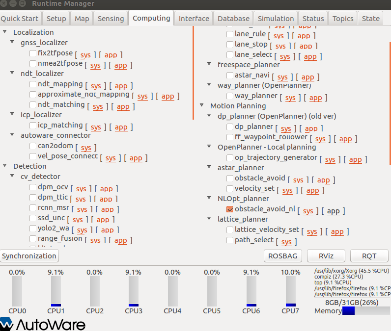

# Motion Planner Description
Obstacle avoidance algorithm described [in this paper](https://scholar.google.com/citations?user=aJBQ8dwAAAAJ&hl=en) which I can now solve in real time using an official julia package that I developed called [NLOptControl](https://github.com/JuliaMPC/NLOptControl.jl).

# Motivation
If a vehicle needs to drive quickly and avoid moving obstacles then NLOptControl is well suited to solve the trajectory planning problem. Where A* and OpenPlanner are path planning algorithms and are mostly concerned with satisfying kinematic/geometric constraints, they can identify a path to follow, but without a temporal component, they do not tell you how to follow the path. While, trajectory planning also considers how you can follow the path. So, for instance, what are the optimal steering and throttle trajectories (not simply what are the X and Y waypoints).

NLOptControl is designed as a high level tool, so resarchers can easily define their own optimization problems, see my documentation [here](https://juliampc.github.io/MPCDocs.jl/latest/index.html).


# Testing
Currently it should work as a stand alone module and can be launched through the gui by clicking the button as show in the picture below:



This button launches ``demo.launch`` a file that provides a simple and complete example is provided that assumes all perfect knowledge of the obstacles and the state of the vehicle, but args can be set if this is not the case and more realistic simulations can be ran.  

## Expected output
After a few minutes, the terminal should say:
```
initializing nloptcontrol_planner node ...

******************************************************************************
This program contains Ipopt, a library for large-scale nonlinear optimization.
Ipopt is released as open source code under the Eclipse Public License (EPL).
For more information visit http://projects.coin-or.org/Ipopt
******************************************************************************

nloptcontrol_planner has been initialized.
Running model for the: 1 time
Running model for the: 2 time
Running model for the: 3 time
Running model for the: 4 time
Running model for the: 5 time
Running model for the: 6 time
Running model for the: 7 time
Running model for the: 8 time
Running model for the: 9 time
Running model for the: 10 time
Running model for the: 11 time
goal is in range
Running model for the: 12 time
goal is in range
Running model for the: 13 time
goal is in range
Running model for the: 14 time
goal is in range
Running model for the: 15 time
goal is in range
Goal Attained!
```

This indicates a successful test.

## Notes

  * A large optimization problem needs to be initilized
  * caching the functions upon start-up takes a few minutes


# ROS Parameters
These parameters can be seen by typing ``rosparam list``.

## Flags and Settings
Name | Description
--- | ---
`/nloptcontrol_planner/case_name` | name of configuration file for solver settings
`/nloptcontrol_planner/obstacle_name` | name of configuration file for obstacle field
`/nloptcontrol_planner/flags/3DOF_plant` | indicates if the 3DOF plant model in VehicleModels.jl will be used
`/nloptcontrol_planner/flags/init` | indicates if the planner has finished initilization
`/nloptcontrol_planner/flags/known_environment` | indicates if the obstacle information is assumed to be known

Parameters are broken into two categories; ``Outputs`` and ``Inputs``. In the demo, the inputs are also generated, but flags can be set to let the node know that the user will be setting these ``rosparams`` externally.

## Outputs

### Trajectories
The purpose of this node is to publish reference state trajectories (vectors) as

Name | Description
--- | ---
`/nloptcontrol_planner/traj/t`| time (s)
`/nloptcontrol_planner/traj/x`| global x position trajectory (m)
`/nloptcontrol_planner/traj/y`| global y position trajectory (m)
`/nloptcontrol_planner/traj/psi`| global heading angle trajectory (rad)
`/nloptcontrol_planner/traj/sa`| steering angle trajectory at the tire (rad)
`/nloptcontrol_planner/traj/vx`| velocity trajectory in the x direction (vehicle frame) (m/s)

## Inputs

### Obstacles

Currently the obstacles are assumed to be represented by circles and their data is to be published to the vectors in the following ``rosparam``

Name | Description
--- | ---
`/obstacle/radius` | radius of obstacle in (m)
`/obstacle/vx` | global velocity in global x direction in (m/s)
`/obstacle/vy`| global velocity in global y direction in (m/s)
`/obstacle/x`| current global x (m) position of vehicle in (m)
`/obstacle/y`| current global y (m) position of vehicle in (m)

### Vehicle State
If an actual vehicle is used or an external model of the vehicle is used, `/nloptcontrol_planner/flags/3DOF_plant` should be set to ``false``. And the following ``rosparam`` states (points) should be set:

Name | Description
--- | ---
`/state/x`| global x position (m)
`/state/y`| global y position (m)
`/state/psi`| global heading angle (rad)
`/state/sa`| steering angle at the tire (rad)
`/state/ux`| velocity in the x direction (vehicle frame) in (m/s)
`/state/ax`| acceleration in the x direction (vehicle frame) in (m/s^s)
`/state/r`| yaw rate about the z direction in (rad/s)
