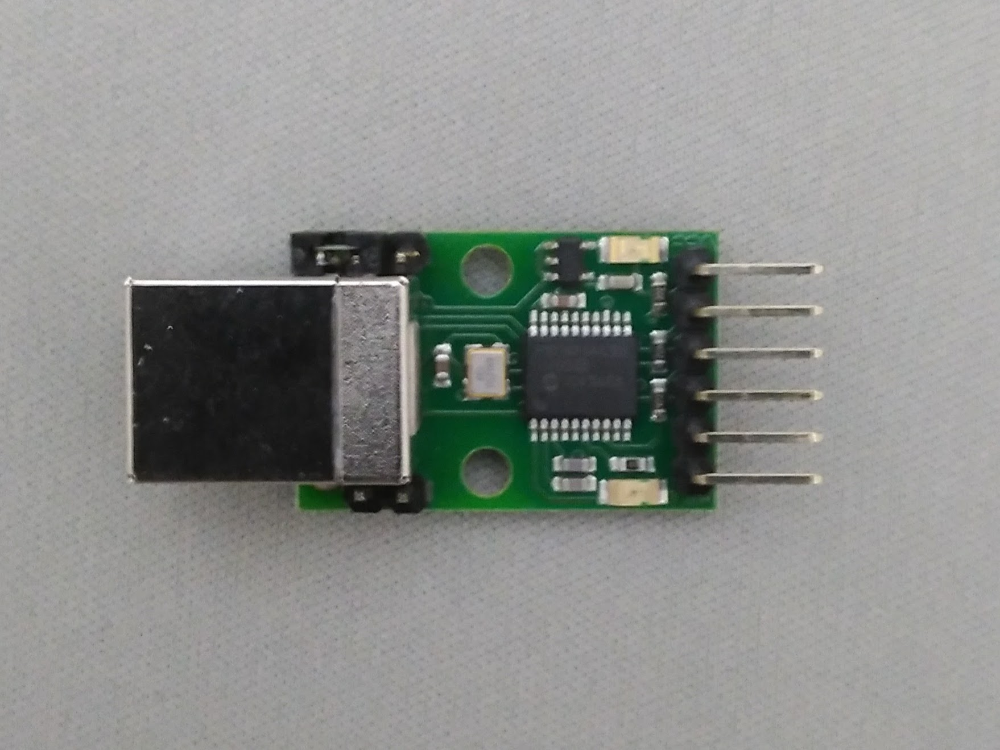
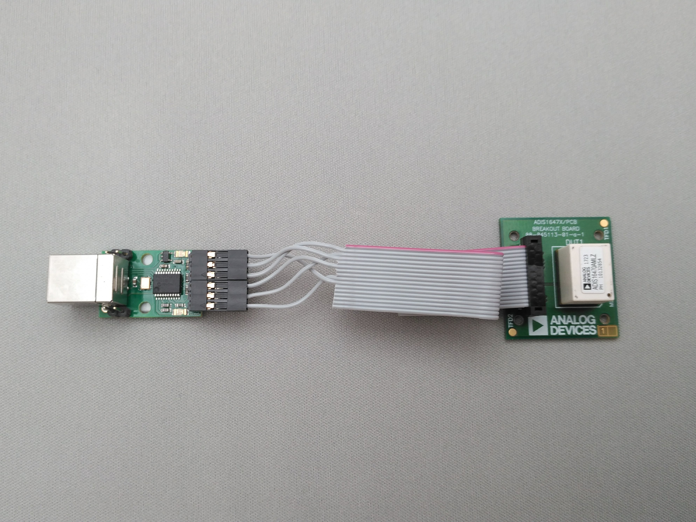
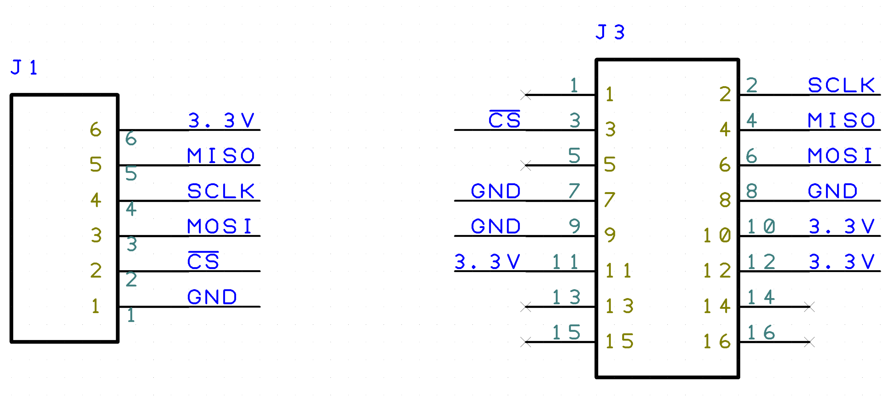
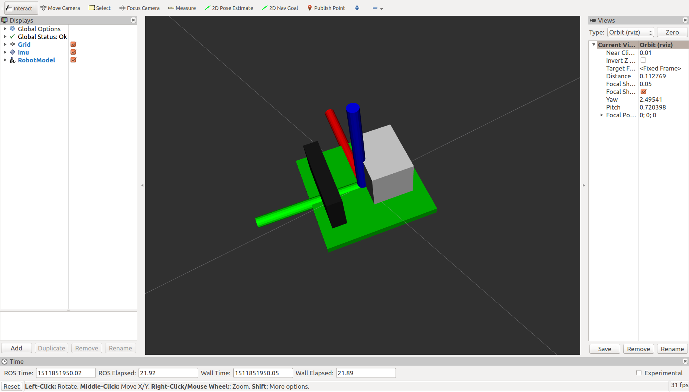
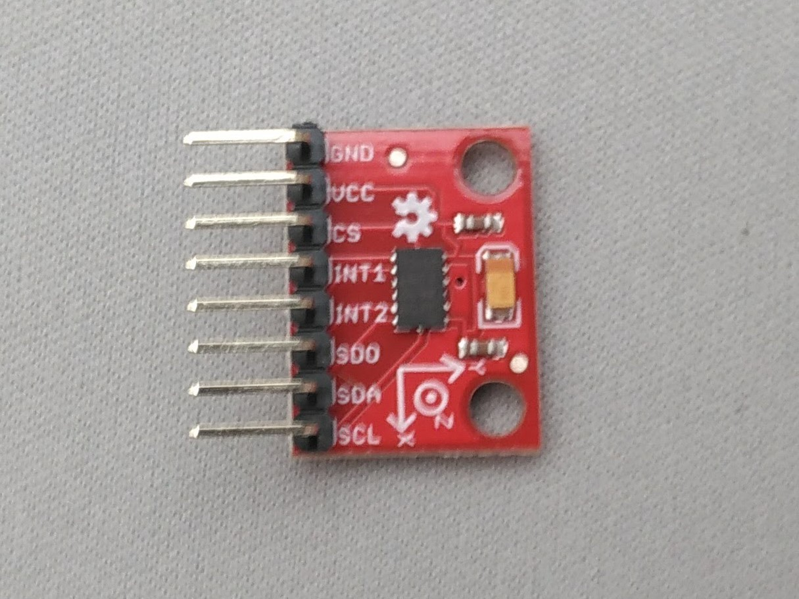
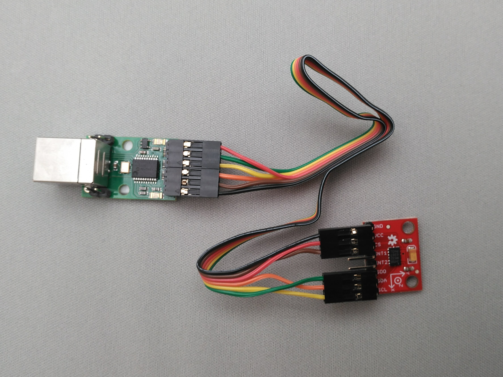

Autoware's adi_driver Subtree
=============================

This directory is part of a subtree fetched from https://github.com/CPFL/adi_driver on the **Autoware** branch, a fork from the original https://github.com/ros-drivers/velodyne

This repo adds specific functions for Autoware.
If you need to modify **any** file inside this folder structure, please use the following commands to either push or fetch changes from the subtree.
All the commands written here will suppose you're in the root of Autoware path.

## Pulling in commits from the repository subtree

Bring latest commits from https://github.com/CPFL/adi_driver

`git subtree pull --prefix ros/src/sensing/drivers/imu/packages/analog_devices https://github.com/CPFL/adi_driver Autoware --squash`

## Pushing changes to the repository subtree

If you made any modification to the subtree you are encouraged to commit and publish your changes to the fork. You can do with the following command.

`git subtree push --prefix ros/src/sensing/drivers/imu/packages/analog_devices https://github.com/CPFL/adi_driver Autoware`


**Original README below**

# adi_driver [](https://travis-ci.org/tork-a/adi_driver)

This package contains ROS driver nodes for Analog Devices(ADI) sensor
products mainly communicate by SPI(Serial Periferal Interface).

Currently supported devices are:

- [ADIS16470](http://www.analog.com/en/products/mems/inertial-measurement-units/adis16470.html)
  - Wide Dynamic Range Mini MEMS IMU

- [ADXL345](http://www.analog.com/en/products/mems/accelerometers/adxl345.html):
  - 3-Axis, ±2 g/±4 g/±8 g/±16 g Digital Accelerometer
  - The support for this device is experimental
  
You need a SPI interface on your PC to communicate with device. This
package supports
[Devantech's USB-IIS](https://www.robot-electronics.co.uk/htm/usb_iss_tech.htm)
as the USB-SPI converter.

## USB-IIS

### Overview

<div align="center">
  
</div>

[USB-IIS](https://www.robot-electronics.co.uk/htm/usb_iss_tech.htm) is
a USB to Serial/I2C/SPI converter, simple, small and easy to use. You
don't need any extra library like libusb or libftdi. The device is
available on /dev/ttyACM* as modem device.

Please consult the
[product information](https://www.robot-electronics.co.uk/htm/usb_iss_tech.htm)
and
[SPI documentation](https://www.robot-electronics.co.uk/htm/usb_iss_spi_tech.htm)
for the detail.

### Tips

You need to remove the jumper block on ``Power link`` pins to provide
3.3V for the device.

You need to add your user to dialout group to acces /dev/ttyACM* .

``` $ sudo adduser your_user_name dialout ```

If it takes several seconds until /dev/ttyACM* available, you need to
uninstall modemmanager as:

``` $ sudo apt remove modemmanager ```

## ADIS16470

### Overview

[ADIS16470](http://www.analog.com/en/products/mems/inertial-measurement-units/adis16470.html)
is a complete inertial system that includes a triaxis gyroscope and a
triaxis accelerometer.

<div align="center">
  
</div>

You can use
[Breakout board](http://www.analog.com/en/design-center/evaluation-hardware-and-software/evaluation-boards-kits/EVAL-ADIS16470.html)
for easy use.

### Connection

<div align="center">
  
</div>

You need to build a flat cable to connect the USB-ISS and the
ADIS16470 breakout board. The picture shows a implementation.

Very simple schematic is here. J1 is the USB-ISS pin and J2 is the 2mm
pin headers on the ADIS16470 breakout board.

<div align="center">
  
</div>

Note: you only need to connect one of the power-line(3.3V and
GND). They are connected in the breakout board.

### BOM
- J1: 2550 Connector 6pin
  - Available at [Akiduki](http://akizukidenshi.com/catalog/g/gC-12155/)
- J2: FCI Connector for 1.0mm pitch ribon cables
  - Available at [RS Components](https://jp.rs-online.com/web/p/idc-connectors/6737749/)
- 1.0 mm pitch ribon cable
  - Available at [Aitendo](http://www.aitendo.com/product/11809)

### Quick start

Connect your sensor to USB port. Run the launch file as:

``` $ roslaunch adi_driver adis16470.launch ```

You can see the model of ADIS16470 breakout board in rviz panel.

<div align="center">
  
</div>

## ADXL345

### Overview

<div align="center">
  
</div>

<div align="center">
  
</div>

The ADXL345 is a small, thin, low power, 3-axis accelerometer with
high resolution (13-bit) measurement at up to ±16g. At this moment,
support for this device is experimental.
