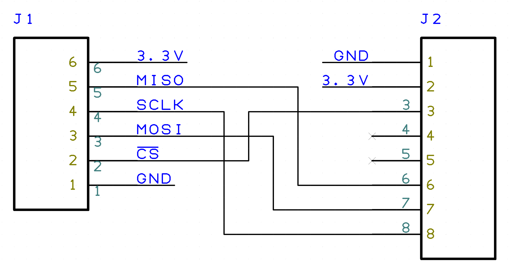
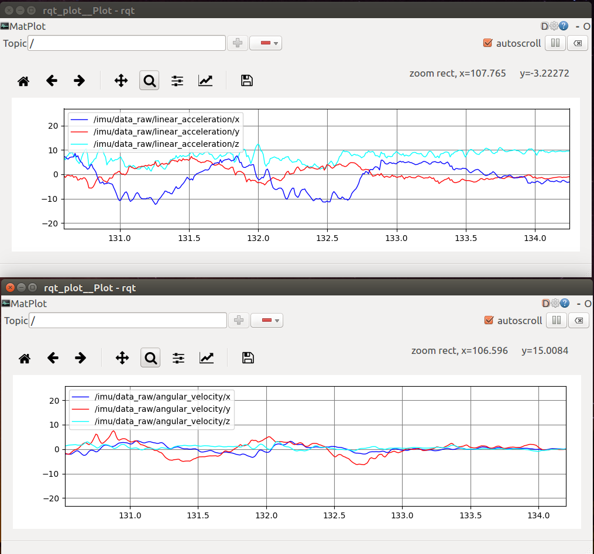

==========
 Overview
==========

The ``adi_driver`` pacakge contains driver nodes, configuration files
and launch files for Analog Devices Inc.(ADI)'s sensor products such
as accelerometers, gyroscopic sensors and IMUs (Inertial Mesurement
Units).

Currently these sensor devices are supported:

- `ADIS16470`_

  - Wide Dynamic Range Mini MEMS IMU

- `ADXL345`_

  - 3-Axis, ±2 g/±4 g/±8 g/±16 g Digital Accelerometer
  - The support for this device is experimental

You need this interface hardware to connect the sensors and your computer:
    
- `USB-ISS`_

  - USB to SPI/I2C/Serial converter by Devantec

==============
 Prerequisite
==============

This package has been tested on the following environment:

- `ROS Kinetic Kame <http://wiki.ros.org/kinetic>`_ and Ubuntu Linux 16.04 "Xenial" 64bit
- `ROS Indigo Igloo <http://wiki.ros.org/indigo>`_ and Ubuntu Linux 14.04 "Trusty" 64bit

Install ROS
===========

You need to install `ROS`_ system into your computer. If you have
already installed `ROS`_, skip this section.

The following snippet shows a simple way to install `ROS Kinetic` on
Ubuntu linux 16.04 `Xenial`. For completeness, you're advised to see
`ROS wiki <http://wiki.ros.org/kinetic/Installation/Ubuntu>`_. 

.. code-block:: bash

   sudo sh -c 'echo "deb http://packages.ros.org/ros/ubuntu $(lsb_release -sc) main" > \
                /etc/apt/sources.list.d/ros-latest.list'
   sudo apt-key adv --keyserver hkp://ha.pool.sks-keyservers.net:80 \
                --recv-key 421C365BD9FF1F717815A3895523BAEEB01FA116
   sudo apt-get update && sudo apt-get install -y python-rosdep
   sudo rosdep init && rosdep update

   echo "### For ROS setting" >> ~/.bashrc
   echo "source /opt/ros/kinetic/setup.bash" >> ~/.bashrc
   source ~/.bashrc

If you need older version ROS Indigo, also please consult `ROS wiki
<http://wiki.ros.org/indigo/Installation/Ubuntu>`_.

Install ``adi_driver`` from Internet(Recommended)
=================================================

The ``adi_driver`` is released to ROS `Indigo` and `Kinetic`. You can
install the package by ordinally apt-get command as:

.. code-block:: bash

   sudo apt-get install ros-<kinetic or indigo>-adi-driver

Install ``adi_driver`` from Debian package files
================================================

Note that you should install from Internet if you want automatic
upgrading of the pacakge.

When you are going to install the package from a deb file, place it
under current directory and run:

.. code-block:: bash

   sudo apt-get install -y gdebi
   sudo gdebi -n ros-kinetic-adi-driver_1.0.0-0xenial_amd64.deb

``gdebi`` command helps to install all packages which the target
package depends on. 

==========================
 USB-SPI Adapter: USB-ISS
==========================
		
.. image:: USB-ISS.jpg
   :align: center
   :width: 60%
        
`USB-ISS`_ is a USB to Serial/I2C/SPI converter by Devantec, simple,
small and easy to use.  You don't need any extra library such as
libusb and libftdi. Once plugged, the device is available on
/dev/ttyACM* as a modem device.

`USB-ISS`_ provides 3.3V or 5V power to the sensor device from USB
bus, so you don't need external power source if the sensor consume low
current.

You need to remove the jumper block on ``Power link`` pins to provide
3.3V for the device. ADIS16470 and ADXL345 are in operation with 3.3V.

Please consult the `product information
<https://www.robot-electronics.co.uk/htm/usb_iss_tech.htm>`_ and `SPI
documentation
<https://www.robot-electronics.co.uk/htm/usb_iss_spi_tech.htm>`_ for
detail.

This product is widely on sale in the world, so that you can choose
the distributer in your country.

- `Amazon.com - https://www.amazon.com/Devantec-Usb-I2C-Serial-Interface/dp/B01BD9JZHU <https://www.amazon.com/Devantec-Usb-I2C-Serial-Interface/dp/B01BD9JZHU>`_
- `Robot Shop - https://www.robotshop.com/jp/ja/devantec-usb-i2c-spi-serial-interface.html <https://www.robotshop.com/jp/ja/devantec-usb-i2c-spi-serial-interface.html>`_

===========
 ADIS16470
===========

`ADIS16470`_ is a complete inertial system that includes a triaxis
gyroscope and a triaxis accelerometer. It has a SPI interface.

.. image:: ADIS16470_Breakout.jpg
   :width: 60%
   :align: center
	
The sensor device is a BGA mounted chip, so it should be easier to use
`the breakout board
<http://www.analog.com/en/design-center/evaluation-hardware-and-software/evaluation-boards-kits/EVAL-ADIS16470.html>`_
. The following section assumes to use this breakout board.

Connection
==========

.. image:: ADIS16470_Connection.jpg
   :align: center
   :width: 60%

You need to build a flat cable to connect the USB-ISS and the
ADIS16470 breakout board. The picture shows an implementation.

Very simple schematic is here. J1 is the USB-ISS pin and J2 is the 2mm
pin headers on the ADIS16470 breakout board.

.. image:: ADIS16470_Cable.png
   :align: center
   :width: 60%

Minimum pins are used and each pin is directly corresponds to
another's. Note that you only need to connect one of the
power-line(3.3V and GND), because they are connected in the breakout
board.

Parts list
==========

The parts list of the cable is here:

- J1: 2550 Connector 6pin
  
  - `Akiduki denshi: http://akizukidenshi.com/catalog/g/gC-12155/ <http://akizukidenshi.com/catalog/g/gC-12155/>`_
  
- J2: FCI Connector for 1.0mm pitch ribon cable

  - `RS Components: https://jp.rs-online.com/web/p/idc-connectors/6737749/ <https://jp.rs-online.com/web/p/idc-connectors/6737749/>`_ 

- 1.0 mm pitch ribon cable

    - `Aitendo: http://www.aitendo.com/product/11809 <http://www.aitendo.com/product/11809>`_

=========
 ADXL345
=========

`ADXL345`_ is a three axis accerometer sensor. It has a SPI interface.
The following section assumes to use this breakout board.

- ADXL345 Breakout board

  - SparkFun: https://www.sparkfun.com/products/9836 <https://www.sparkfun.com/products/9836>`_

.. image:: ADXL345_Breakout.jpg
   :align: center
   :width: 60%

Connection
==========

You need to build a flat cable to connect the `USB-ISS`_ and the
ADXL345 breakout board. The picture shows an implementation.

.. image:: ADXL345_Connection.jpg
   :align: center
   :width: 60%

The connection schematic is here.

J1 is for USB-ISS and J2 is for the ADXL345 breakout board.

- J1: 2550 Connector 6pin
- J2: 2550 Connector 8pin
- A ribon cable

========================
 How to use the package
========================

Check the connection
====================

Assuming `USB-ISS`_ and the sensor are connected to your PC with a USB
cable. Make sure you can see the device file at ``/dev/ttyACM*``.

.. code-block:: bash

   $ ls /dev/ttyACM*
   /dev/ttyACM0

You need your user account is in the ``dialout`` group to acces
/dev/ttyACM* . Check if you are already in the ``dialout`` group by
``groups`` command.

.. code-block:: bash

   $ groups
   your_user_name adm dialout cdrom sudo dip plugdev lpadmin sambashare

If you don't find ``dialout`` there, you should add the user into the
group by ``adduser`` command.
**Note that you need to _restart_ after you added the user into the ``dialout`` group**
   
.. code-block:: bash

   $ sudo adduser your_user_name dialout

If a software called `modemmanager` is installed in your PC, it takes
several seconds until /dev/ttyACM* available. You can avoid it to
uninstall the modemmanager.

.. code-block:: bash

   $ sudo apt remove modemmanager

Start AIDS16470 nodes
=====================
                
You can use a launch file to run the sensor nodes with visulalizer as:

.. code-block:: bash

   $ roslaunch adi_driver adis16470.launch with_rviz:=true

This launch file has several arguments which configure the system.

- ``with_filter``: Start a filter node of ``imu_filter_madgwick``
  package to estimate the IMU's pose using Extended Kalman
  Filter. Default is ``true``.
- ``with_rviz``: Start a viewer to visualize the pose of the
  IMU. Default is ``false``.
- ``with_plot``: Start a viewer to plot the graph of angular velocity
  and acceleration. Default is ``false``.
- ``device``: Specify the device file name for USB-ISS. Default is
  ``/dev/ttyACM0``.
- ``frame_id``: Specify the name of frame of the sensor. Default is
  ``imu``
- ``burst_read``: If true, the sensor node uses the ``burst read
  mode`` which is on the `ADIS16470`_ 's manual. Default is ``false``.
- ``rate``: It define the sampling rate of the IMU in Hz. Default
is 100.

Senesor data topics
===================

Once the system launched, the sensor data keep published on ROS
topics. You can see the list of the ROS topic by ``rostopic`` command.
  
.. code-block:: bash

  $ rostopic list
  /imu/data
  /imu/data_raw
  /imu_filter/parameter_descriptions
  /imu_filter/parameter_updates
  /rosout
  /rosout_agg
  /tf

The sensor data are on these two topics:
  
- ``/imu/data_raw``: The raw sensor data from ADIS16470, which
  contains only angular velocities and linear accelerations.

- ``/imu/data``: The sensor data proceeded by EKF using
  ``imu_filter_node`` from ``imu_filter_madgwick`` package. It
  contains orientation information in addition to the angular
  velocities and linear accelerations.

Check sensor data
=================

You can see the sensor data streaming by ``rostopic`` command.

.. code-block:: bash

   $ rostopic echo /imu/data
   ---
   header: 
    seq: 2541
    stamp: 
      secs: 1513238708
      nsecs: 838857288
    frame_id: "imu"
   orientation: 
     x: -0.0111724457234
     y: -0.0125930607599
     z: -0.710443497794
     w: 0.703552860643
   orientation_covariance: [0.0, 0.0, 0.0, 0.0, 0.0, 0.0, 0.0, 0.0, 0.0]
   angular_velocity: 
     x: 0.00750825006126
     y: -0.0128681014395
     z: 0.000681076817177
   angular_velocity_covariance: [0.0, 0.0, 0.0, 0.0, 0.0, 0.0, 0.0, 0.0, 0.0]
   linear_acceleration: 
     x: 0.3929231987
     y: 0.00754166793823
     z: 10.0754171448
   linear_acceleration_covariance: [0.0, 0.0, 0.0, 0.0, 0.0, 0.0, 0.0, 0.0, 0.0]
   ---

Type of the sensor data
=======================

``sensor_msgs/Imu`` is the sensor message type for IMUs.
    
.. code-block:: bash

   $ rosmsg show sensor_msgs/Imu
   
   std_msgs/Header header
       uint32 seq
       time stamp
       string frame_id
   geometry_msgs/Quaternion orientation
       float64 x
       float64 y
       float64 z
       float64 w
   float64[9] orientation_covariance
   geometry_msgs/Vector3 angular_velocity
       float64 x
       float64 y
       float64 z
   float64[9] angular_velocity_covariance
   geometry_msgs/Vector3 linear_acceleration
       float64 x
       float64 y
       float64 z
       float64[9] linear_acceleration_covariance

Visulaization
=============
       
You can see the model of ADIS16470 breakout board in rviz
panel. ``launch/imu.rviz`` is the config file for rviz.

.. code-block:: bash
                
   $ roslaunch adi_driver adis16470.launch with_rviz:=true

.. image:: img_rviz.png
   :align: center
   :width: 60%

You can plot the magnitude of sensor value on graphs using
``rqt_plot``.

.. code-block:: bash

   $ roslaunch adi_driver adis16470.launch with_plot:=true
           

Start ADXL345 nodes
===================

You can use a launch file to run the sensor nodes with graph plot as:

.. code-block:: bash

   $ roslaunch adi_driver adxl345.launch with_plot:=true
           
.. _ROS: http://ros.org/
.. _ADIS16470: http://www.analog.com/en/products/mems/inertial-measurement-units/adis16470.html
.. _ADXL345: http://www.analog.com/en/products/mems/accelerometers/adxl345.html
.. _USB-ISS: https://www.robot-electronics.co.uk/htm/usb_iss_tech.htm
