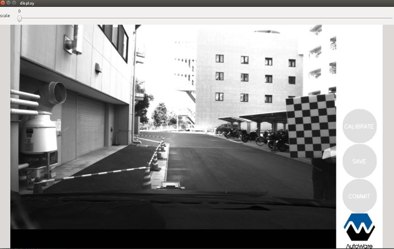
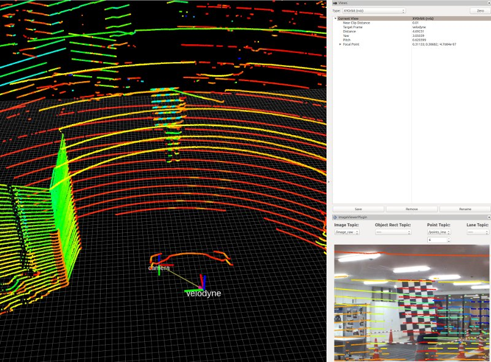

# Autoware Camera LiDAR calibration package

## How to calibrate

Calibration is performed in two steps:
1. Camera Intrinsic
1. Camera-LiDAR Extrinsic

## Camera intrinsic calibration
The instrinsics are obtained using the `autoware_camera_calibration`, which is a fork of the official ROS calibration tool.

### How to launch
1. In a sourced terminal:
`rosrun autoware_camera_lidar_calibrator cameracalibrator.py --square SQUARE_SIZE --size MxN image:=/image_topic`

1. Play a rosbag or stream from a camera in the selected topic name.
1. Move the checkerboard around the field of view of the camera until the bars turn green
1. Press the `CALIBRATE` button.
1. The output and result of the calibration will be shown in the terminal.
1. Press the `SAVE` button.
1. The file will be saved in your home directory with the name `YYYYmmdd_HHMM_autoware_camera_calibration.yaml`  
1. This file will contain the intrinsic calibration to rectify the image.

### Parameters available

Parameter| Type| Description|
----------|-----|--------
|`SQUARE_SIZE`|*double* |Defines the size of the checkerboard square in meters.|
|`MxN`|*string* |Defines the layout size of the checkerboard (Inner size).|
|`image`|*string* |Topic name of the camera image source topic in `raw` format (color or b&w).|
|`min_samples`|*integer* |Defines the minimum samples required to allow calibration.|

For extra details please visit: http://www.ros.org/wiki/camera_calibration

#### Matlab checkerboard engine detection
This node supports additionally Matlab engine for chessboard detection.

1. Go to Matlab python setup path `/PATH/TO/MATLAB/R201XY/extern/engines/python`
1. Run `python setup.py install` to setup Matlab bindings

To use this engine add `--detection matlab` to the list of arguments. i.e.

`rosrun autoware_camera_lidar_calibrator cameracalibrator.py --detection matlab --square SQUARE_SIZE --size MxN image:=/image_topic`

---

## Camera-LiDAR extrinsic calibration

LiDAR extrinsics are done clicking the corresponding poins in the image and the pointcloud.

This node uses `clicked_point` from `rviz`, and `screenpoint` from `image_view2` packages.

### How to launch

Get the intrinsic calibration using Camera intrinsic calibration tool described above (`YYYYmmdd_HHMM_autoware_camera_calibration.yaml`)
1. In a sourced terminal:
`roslaunch autoware_camera_lidar_calibrator camera_lidar_calibration.launch intrinsics_file:=/PATH/TO/YYYYmmdd_HHMM_autoware_camera_calibration.yaml image_src:=/image`
1. An image viewer will be displayed.
1. Open Rviz and show the point cloud and the correct fixed frame.
1. Analyse the image and the point cloud simultaneously.
1. Find a point that correspond between the image and the point cloud.
1. Click the pixel in the image.
1. Click the corresponding 3D point in Rviz using the *Publish Point*.
1. Repeat this at least 9 times.
1. Once finished the file will be saved in your home directory with the name 
`YYYYmmdd_HHMM_autoware_lidar_camera_calibration.yaml`.
1. This file cna be used with Autoware's Calibration Publisher to publish and register the transformation 
between the LiDAR and Camera.

### Parameters available

Parameter| Type| Description|
----------|-----|--------
|`image_src`|*string* |Topic name of the camera image source topic. Default `/image_raw`|
|`camera_id`|*string* |If working with more than one camera, set this to the correct camera namespace, i.e. `/camera0`.|
|`intrinsics_file`|*string* |Topic name of the camera image source topic in `raw` format (color or b&w).|
|`compressed_stream`|*bool* |If set to true it will launch a node to convert the image from a compressed stream to an uncompressed one.|

### Camera-Lidar calibration example

