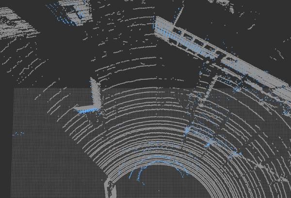

# Multi LiDAR Calibrator

This package allows to obtain the extrinsic calibration between two PointClouds with the help of the NDT algorithm.

The `multi_lidar_calibrator` node receives two `PointCloud2` messages (parent and child), and an initialization pose.
If possible, the transformation required to transform the child to the parent point cloud is calculated, and output to the terminal.

## How to launch

1. **You'll need to provide an initial guess, otherwise the transformation won't converge.**

2. In a sourced terminal:

Using rosrun

`rosrun multi_lidar_calibrator multi_lidar_calibrator _points_child_src:=/lidar_child/points_raw _points_parent_src:=/lidar_parent/points_raw _x:=0.0 _y:=0.0 _z:=0.0 _roll:=0.0 _pitch:=0.0 _yaw:=0.0`

Using roslaunch

`roslaunch multi_lidar_calibrator multi_lidar_calibrator points_child_src:=/lidar_child/points_raw points_parent_src:=/lidar_parent/points_raw x:=0.0 y:=0.0 z:=0.0 roll:=0.0 pitch:=0.0 yaw:=0.0`

3. Play a rosbag with both lidar data `/lidar_child/points_raw` and `/lidar_parent/points_raw`

4. The resulting transformation will be shown in the terminal as shown in the *Output* section.

5. Open RViz and set the fixed frame to the Parent

6. Add both point cloud `/lidar_parent/points_raw` and `/points_calibrated`

7. If the algorithm converged, both PointClouds will be shown in rviz.

## Input topics

|Parameter| Type| Description|
----------|-----|--------
|`points_parent_src`|*String* |PointCloud topic name to subscribe and synchronize with the child.|
|`points_child_src`|*String*|PointCloud topic name to subscribe and synchronize with the parent.|
|`voxel_size`|*double*|Size of the Voxel used to downsample the CHILD pointcloud. Default: 0.5|
|`ndt_epsilon`|*double*|The transformation epsilon in order for an optimization to be considered as having converged to the final solution. Default: 0.01|
|`ndt_step_size`|*double*|Set/change the newton line search maximum step length. Default: 0.1|
|`ndt_resolution`|*double*|Size of the Voxel used to downsample the PARENT pointcloud. Default: 1.0|
|`ndt_iterations`|*double*|The maximum number of iterations the internal optimization should run for. Default: 400|
|`x`|*double*|Initial Guess of the transformation x. Meters|
|`y`|*double*|Initial Guess of the transformation y. Meters|
|`z`|*double*|Initial Guess of the transformation z. Meters|
|`roll`|*double*|Initial Guess of the transformation roll. Radians|
|`pitch`|*double*|Initial Guess of the transformation pitch. Radians|
|`yaw`|*double*|Initial Guess of the transformation yaw. Radians|

## Output

1. Child Point cloud transformed to the Parent frame and published in `/points_calibrated`. 
1. Output in the terminal showing the X,Y,Z,Yaw,Pitch,Roll transformation between child and parent. These values can be used later with the `static_transform_publisher`.


### Output example:

```
transformation from ChildFrame to ParentFrame
This transformation can be replicated using:

rosrun tf static_transform_publisher 1.7096 -0.101048 -0.56108 1.5708 0.00830573  0.843 /ParentFrame /ChildFrame 10
```
The figure below shows two lidar sensors calibrated by this node.
One is shown in gray while the other is show in blue.
Image obtained from rviz.

