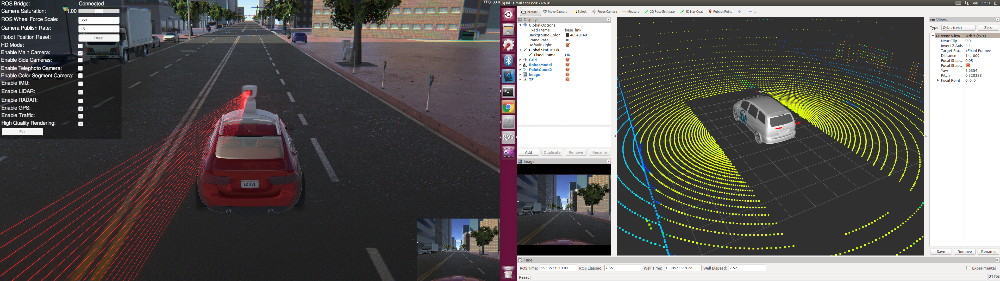

# lgsvl_simulator_bridge package

This package provides lgvsl simulator and Autoware.  
[](http://www.youtube.com/watch?v=NgW1P75wiuA)

## Quick Start 
### initial setup (just first time)
```
roscd lgsvl_simulator_bridge
source quick_setup_sim.bash
```

### launch simulator and bridge
Open simulation tab in runtime manager and click LGSVL Simulator button.

Please choose "SanFrancisco" map and "XE_Rigged-autoware" robot for Autoware.  


 

### launch with simulator you have built
1. set $LGSVL_SIM_DIR_PATH
```
export LGSVL_SIM_DIR_PATH=<lgsvl_sim_binary_directory_path>
```

### download pointcloud map and other datas.
1. install git lfs
```
curl -s https://packagecloud.io/install/repositories/github/git-lfs/script.deb.sh | sudo bash
sudo apt update
sudo apt install git-lfs
```

1. download data from lgsvl repo
```
git clone git@github.com:lgsvl/autoware-data.git
```

2. load pointcloud data  
  

load pointcloud data under this directory.  
```
autoware-data/data/map/pointcloud_map_sf_portion/
```

3. setup in sensing tab
enabele voxel_grid_filter

4. setup in computing tab
enable ndt_matching,vel_pose_connect,lane_rule,lane_sotp,lane_select,obstacle_void,velocity_set,pure_pursuit,twist_filter,waypoint_loader

### demonstration
[](https://www.youtube.com/watch?v=npTvZ09ijPA&t=109s)