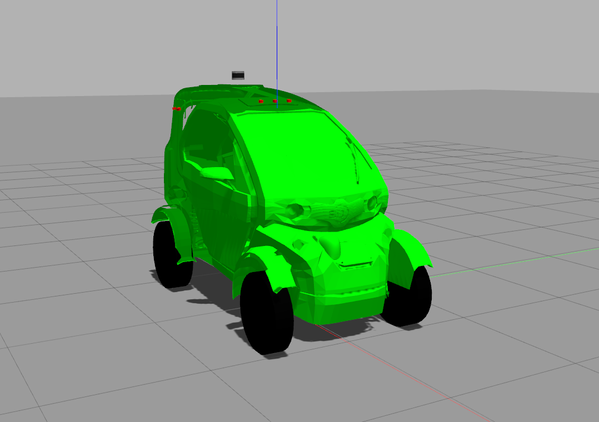

# SD Twizy  Vehicle Simulation

Gazebo simulation packages for the SD Twizy vehicle

### Requirements:

##### - Ubuntu 16.04 LTS
##### - ROS Kinetic [ros-kinetic-desktop-full](http://wiki.ros.org/kinetic/Installation/Ubuntu)
##### - Catkin Command Line Tools [catkin_tools](https://catkin-tools.readthedocs.io/en/latest/installing.html)
##### - Gazebo [ros-kinetic-gazebo-ros-pkgs](http://gazebosim.org/tutorials?tut=ros_installing)  
This model has been tested with Gazebo 7.14.0. Run `gazebo --version` to make sure you have the correct version installed.  
To update to Gazebo 7.14.0, do:  
```
sudo sh -c 'echo "deb http://packages.osrfoundation.org/gazebo/ubuntu-stable `lsb_release -cs` main" > /etc/apt/sources.list.d/gazebo-stable.list'
wget http://packages.osrfoundation.org/gazebo.key -O - | sudo apt-key add -
sudo apt update && sudo apt upgrade
```
##### - ROS packages:
```
sudo apt-get install ros-kinetic-joint-state-publisher ros-kinetic-robot-state-publisher ros-kinetic-ackermann-msgs ros-kinetic-ros-control ros-kinetic-ros-controllers ros-kinetic-twist-mux ros-kinetic-joy ros-kinetic-controller-manager ros-kinetic-robotnik-msgs ros-kinetic-velodyne-simulator ros-kinetic-effort-controllers ros-kinetic-velocity-controllers ros-kinetic-joint-state-controller ros-kinetic-gazebo-ros-control

```

### Setup your workspace:
#### A. Create a catkin workspace:
```
source /opt/ros/kinetic/setup.bash
mkdir -p ~/catkin_ws/src
cd ~/catkin_ws/
catkin build
source devel/setup.bash
```
For more information, visit [create_a_workspace](http://wiki.ros.org/catkin/Tutorials/create_a_workspace)

#### B. Initialize your catkin workspace:
Navigate to the root of your catkin workspace, if you are not already with `cd ~/catkin_ws`.
Initialize your workspace:
```
catkin init
```

#### C. Clone this repository or copy its contents at your `~/catkin_ws/src` folder of the catkin workspace you just initialized.
#### D. Navigate to your workspace and build the simulation
```
cd ~/catkin_ws
catkin build sd_robot sd_control
```
If you have previously built your workspace with catkin_make:
Either clean your workspace with `catkin clean` and rebuild with `catkin build`
or build the SD Twizy Gazebo packages in isolation with `catkin_make --pkg sd_robot sd_control`.
After the built has successfully finished, do:
```
source devel/setup.bash
```
#### E. Launch the simulation:
This launches the vehicle model in Gazebo and RViz for visualizing the sensors' output.
```
roslaunch sd_robot sd_twizy_empty.launch
```

<p align="center"> 

</p>

You might need to update your ignition-math version `sudo apt upgrade libignition-math2`

##### Display the robot only in Gazebo:
To only launch the model in Gazebo, do:
```
roslaunch sd_robot sd_twizy_empty_gazebo.launch 
```

##### Known Issues:
* On Gazebo7 the model logs an error on the p-gain of the wheels' velocity controllers. This does not affect the performance of the model and has only been detected when running the gazebo-ros-control package for Gazebo7. If you choose to build and run the model in Gazebo8 with gazebo8-ros-control, the problem disappears.

### Controlling the Robot:
#### Joystick:
The robot supports the generic Linux [joystick](http://wiki.ros.org/joy) controllers.  
To publish the `cmd_vel` topic [[geometry_msgs/Twist]](http://docs.ros.org/api/geometry_msgs/html/msg/Twist.html), clone or copy the contents of the ROS package [teleop_twist_joy](https://github.com/ros-teleop/teleop_twist_joy) at the `~/catkin_ws/src` folder of your catkin workspace. Then build the package by doing `catkin build` or `catkin_make`, depending on what you previously used to build the simulation model. After you have built the package, do: `source devel/setup.bash`  
To launch the controller, do `roslaunch teleop_twist_joy teleop.launch`

##### A. Microsoft Xbox 360 Controller for Linux:
To control the vehicle, keep the Xbox Guide button pressed (Index 8) and use the Left Stick (Index 9) to navigate

##### B. Logitech Wireless Gamepad F710 (DirectInput Mode):
To control the vehicle, keep the Back button (Index 8) pressed and use the Start button (Index 9) to navigate

#### Keyboard:
To install the ROS package [teleop_twist_keyboard](http://wiki.ros.org/teleop_twist_keyboard), do: `sudo apt-get install ros-kinetic-teleop-twist-keyboard`.  
To launch the ROS package, do: `rosrun teleop_twist_keyboard teleop_twist_keyboard.py `

#### Autoware:
Autoware is a ROS-based open-source software, enabling self-driving mobility to be deployed in open city areas. For more information you can visit the [wiki](https://github.com/CPFL/Autoware/wiki) page
Autoware publishes the `twist_cmd` topic [geometry_msgs/TwistStamped](http://docs.ros.org/jade/api/geometry_msgs/html/msg/TwistStamped.html)

### Display the robot only in rviz:
First, make sure you have rviz installed, by doing:
```
cd ~/catkin_ws
roscore
rviz
```
If you don't have rviz installed, do `sudo apt-get install ros-kinetic-rviz*`.  
The configuration file of the SD Twizy is located at `~/catkin_ws/src/streetdrone_model/sd_robot/config/sd_twizy.rviz`
