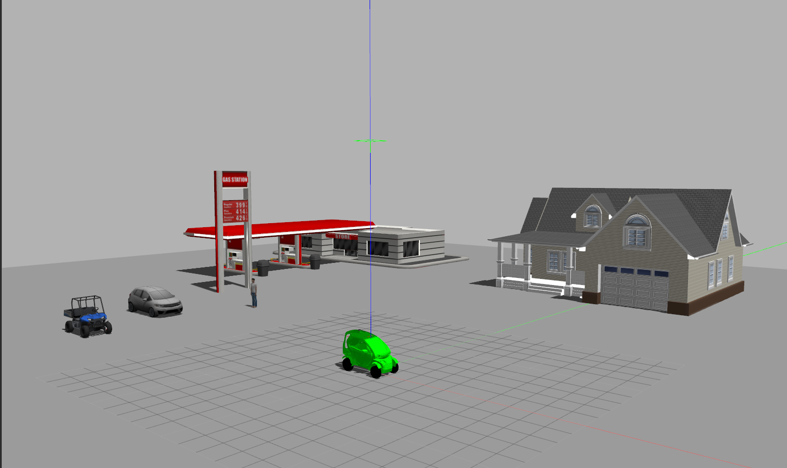
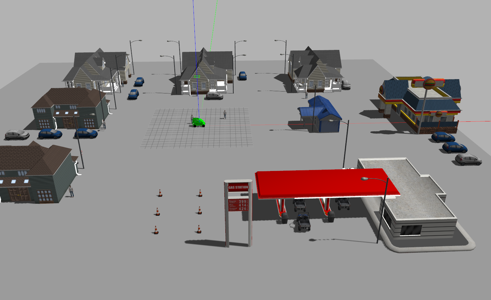

# sd_robot
This package contains all the files necessary for the description of the SD Twizy vehicle: meshes, robot configuration and a set of default worlds.

### Sensors
LiDAR: VLP - 16 Velodyne  
Cameras: 8 x Sekonix SF332X Cameras  
The scripts for the sensors are written based on the common scripts that exist for sensors in Gazebo.

### Launch
The package includes three different world configurations built using the default Gazebo models.
Every launch file automatically opens both Gazebo and rViz, using the configuration: `config/sd_twizy_rviz.rviz`
To launch each world:

##### A. Default
`roslaunch sd_robot sd_twizy_default.launch`

 

##### B. Shapes
`roslaunch sd_robot sd_twizy_shapes.launch`

 

##### C. Large City
`roslaunch sd_robot sd_twizy_large_city.launch`

 

