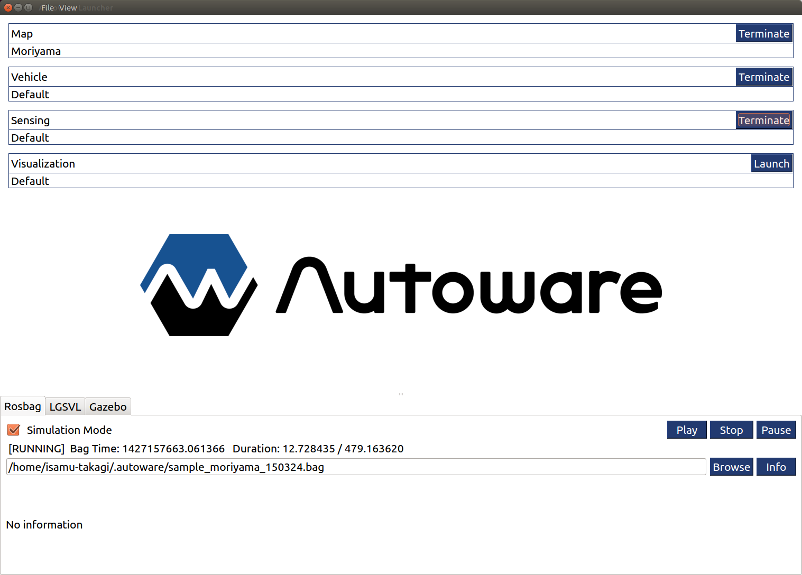
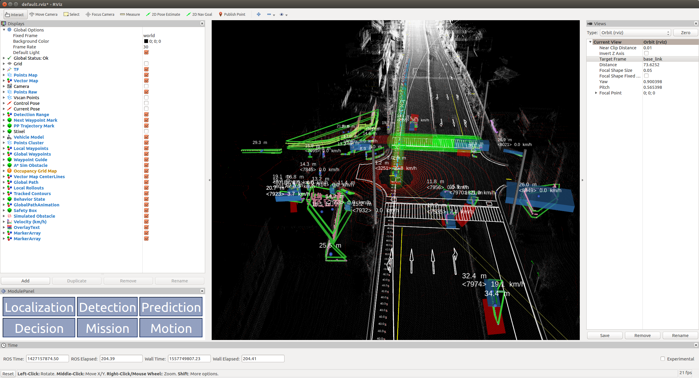

# Autoware Launcher

Autoware Launcher is designed to help users and developers to launch sets of nodes and its parameters. Sets are stored in profile files (in YAML format) that can be shared with other users, or used to quickly launch different set-ups.

## Demos

* [Rosbag Demo](./documents/demos/rosbag.md)

## Develop

Developer mode contains advanced features that allow to customize the profiles. However, this mode is still under heavy development and not widely tested. Please be advised of its instability while using it.
* [Developer Mode](./documents/dev/devmode.md)
* [Create Plugin File](./documents/plugin/create.md)
* [Plugin File Format](./documents/plugin/format.md)
