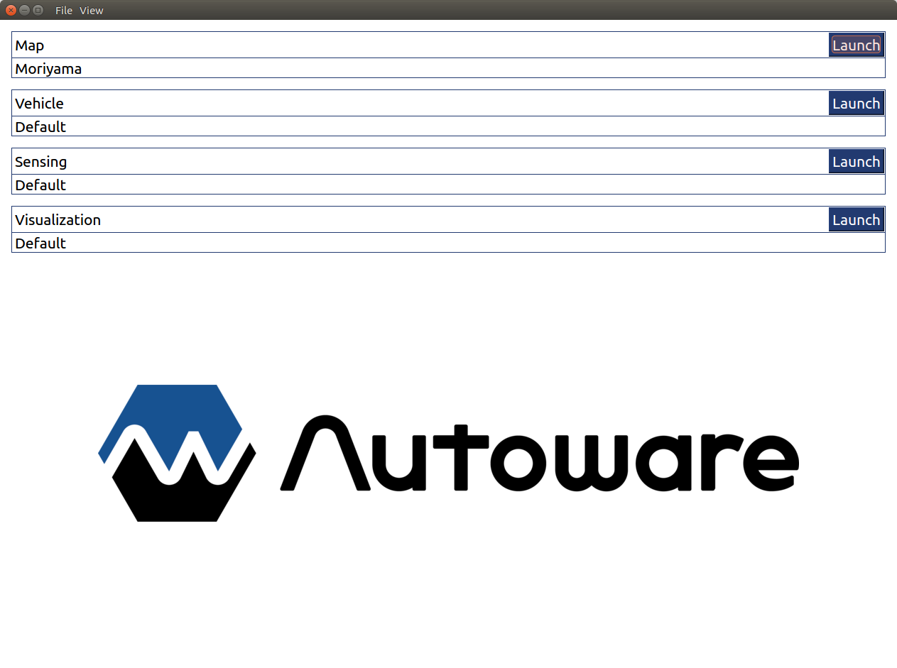
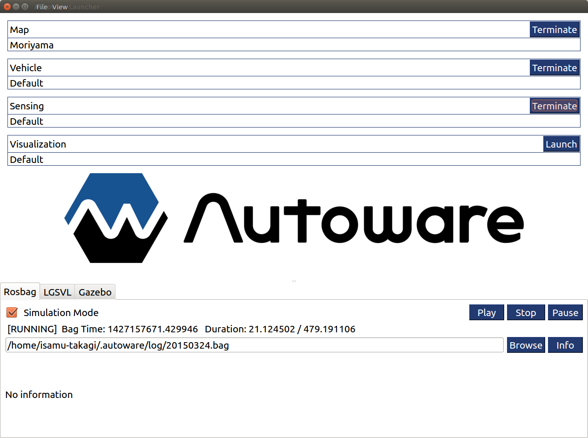
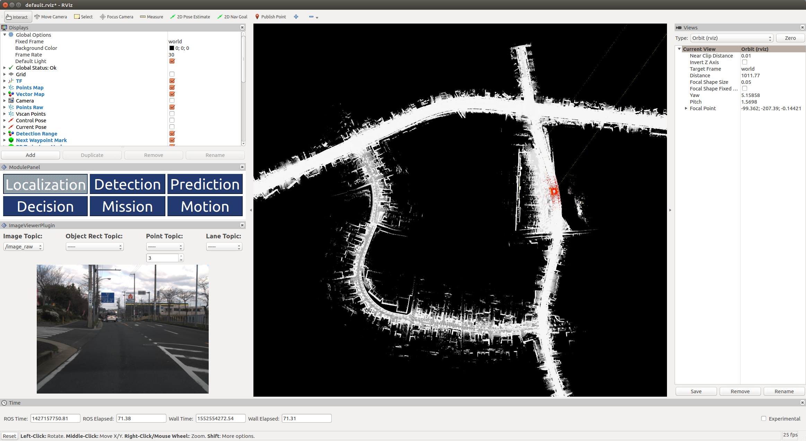
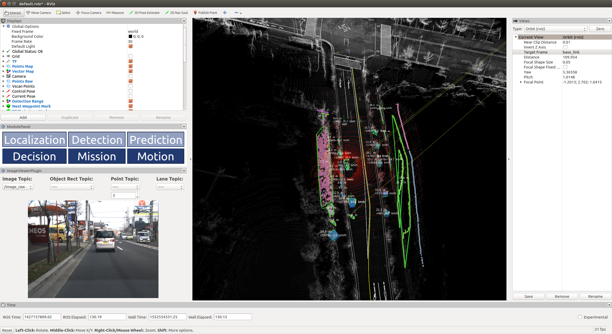
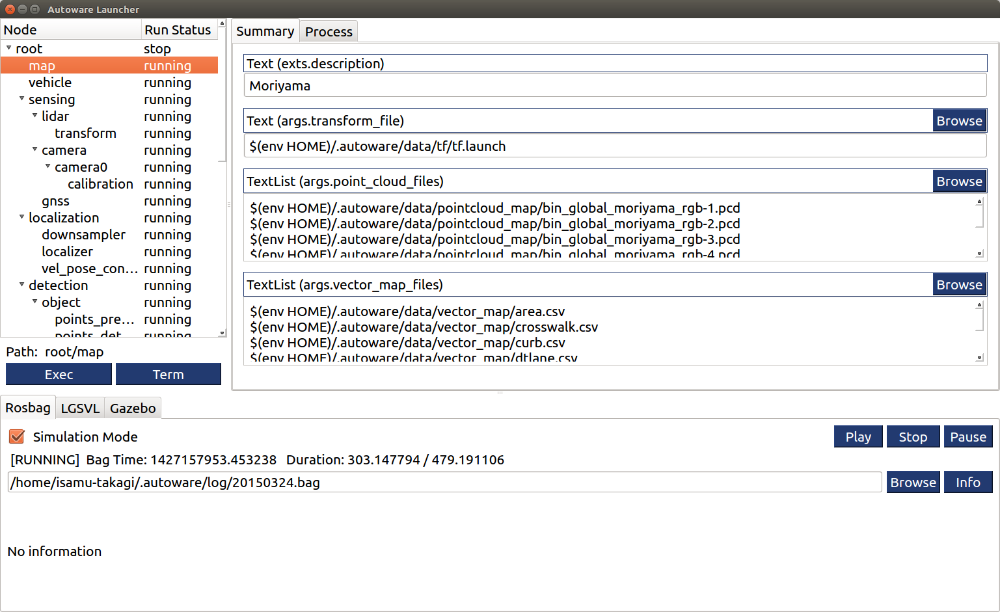

# Autoware Launcher

## Quick Start
1. Put map and rosbag file
```
~/.autoware/data/tf/tf.launch
~/.autoware/data/pointcloud_map/*.pcd
~/.autoware/data/vector_map/*.csv
~/.autoware/log/20150324.bag
```
1. Start the Autoware Launcher<br>
```
$ cd Autoware/ros
$ ./run-experimental
```

1. Load a profile if needed<br>
Window Menu -> File -> Load Profile
1. Show simulation panel<br>
Window Menu -> View -> Simulation
1. Play rosbag<br>
Swtich on Simulation Mode check box, then, push Play button.
1. Push launch buttons<br>
Map, Vehicle, Sensing, and Visualization

1. Push Localization button on rviz plugin and check the estimated vehicle pose

1. Push other buttons on rviz plugin<br>
Detection, Prediction, Decision, Mission, and Motion



## Develop
Develop mode is under development and very unstable (Window Menu -> View -> Develop Mode).<br>


NOTICE
* On treeview widget, R key is run, T key is terminate.
* On summary panel, I key initialize the parameters to default.
* Use "save as" instead of "save".
* Choose .launch file when you save/load profile.

## Plugins
If you want to use your launch file. Create the plugin file.
* [Plugin File Format](./documents/plugin/format.md).

For example, you can add ndt matching as following.
1. Create plugin file template by text editor (e.g. autoware_launcher/plugins/refs/ndt_matching.yaml)
```
    format: Autoware Launcher Plugin Version 0.1
    rosxml: $(find lidar_localizer)/launch/ndt_matching.launch
```
1. Launch plugin file generate tool<br>
`rosrun autoware_launcher tool refs/ndt_matching`
1. Set type and default value<br>

1. Push export button. The tool will set the text to clipboard. Paste it to yaml file.<br>
```
    format: Autoware Launcher Plugin Version 0.1
    rosxml: $(find lidar_localizer)/launch/ndt_matching.launch
    args:
    - {name: method_type, type: int, default: 0}
    - {name: use_gnss, type: int, default: 1}
    - {name: use_odom, type: bool, default: false}
    ...
    panel:
      widget: node.panel
      frames:
      - {target: args.method_type, widget: basic.int}
      - {target: args.use_gnss, widget: basic.int}
      - {target: args.use_odom, widget: basic.bool}
      ...
```
1. Add new plugin path to parent plugin file by text editor (e.g. autoware_launcher/plugins/node/localization.yaml).
```
    format: Autoware Launcher Plugin Version 0.1
    rules:
    - { name: downsampler,      plugin: leaf/voxel_grid_filter  }
    - { name: localizer,        plugin: refs/ndt_matching }
    - { name: vel_pose_connect, plugin: refs/vel_pose_connect }
```
