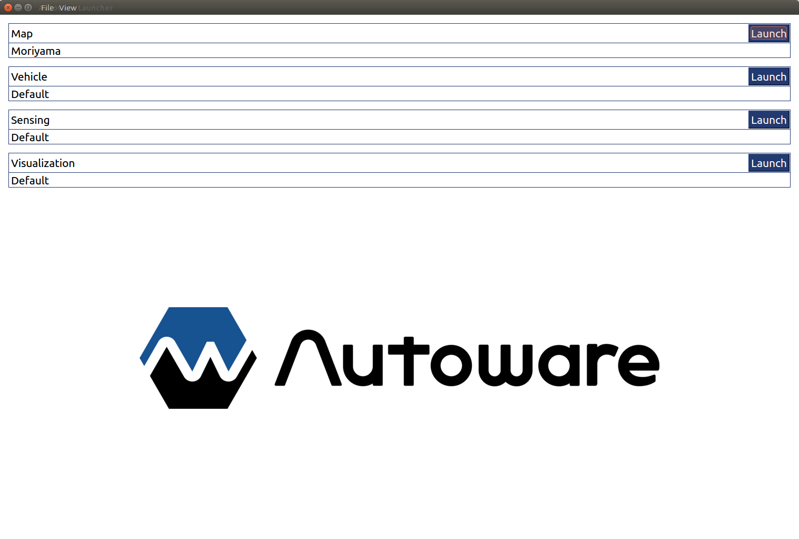
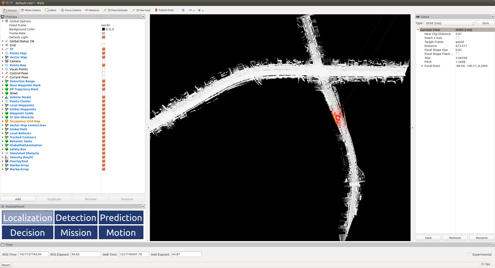
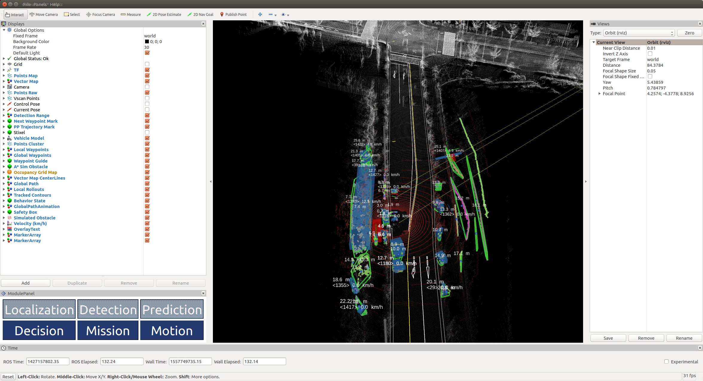

# Rosbag Demo

## Example Data
1. Download the following files from https://drive.google.com/open?id=1ZwNQIJolJ2ogzpNprh89jCj6NocLi78f.<br>
    * sample_moriyama_data.tar.gz
    * sample_moriyama_150324.tar.gz
1. Create the `.autoware` directory in your home directory.<br>
1. Inside this, extract the previously downloaded files.<br>

    ```
    ~/.autoware/data/tf/tf.launch
    ~/.autoware/data/map/pointcloud_map/*.pcd
    ~/.autoware/data/map/vector_map/*.csv
    ~/.autoware/sample_moriyama_150324.bag
    ```

## Demo Run
1. Start the Autoware Launcher.<br>

    ```
    $ cd Autoware/ros
    $ ./run-experimental
    ```
    

1. If you previously created a profile, you can load it selecting *Load Profile* from the *File* menu.<br>
1. Open the simulation panel selecting *Simulation* from the *View* menu.<br>
1. To play the rosbag, click the *Simulation Mode* check box,<br>
1. Press the *Browse* Button, and select the previously downloaded example rosbag.<br>
1. Once loaded, press the *Play* button<br>
1. Press the buttons labeled as *Launch* to the right of the "Map", "Vehicle", "Sensing", and "Visualization" sections.<br>
    
1. Select "Localization" button on rviz plugin and check the estimated vehicle pose.<br>
    
1. Select "Detection" and "Prediction" buttons on rviz plugin.<br>
    
1. Select "Decision", "Mission", and "Motion" buttons on rviz plugin.<br>
    
