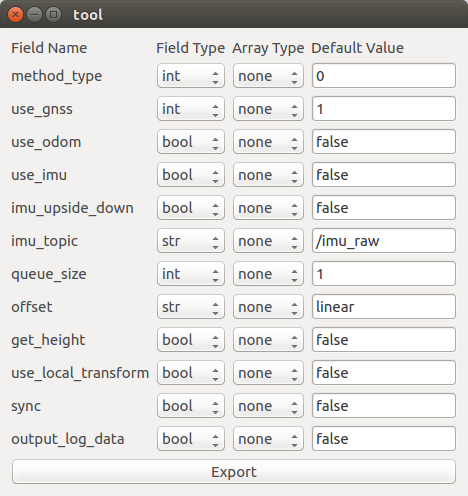

## Create Plugin File

If you want to use your launch file. Create the plugin file. For example, you can add ndt matching as following.<br>

1. Create a text file located in `autoware_launcher/plugins/refs/ndt_matching.yaml` containing the following text:<br>

    ```
    format: Autoware Launcher Plugin Version 0.1
    rosxml: $(find lidar_localizer)/launch/ndt_matching.launch
    ```

1. To launch the newly created plugin file, execute in a sourced terminal:<br>
    `rosrun autoware_launcher tool refs/ndt_matching`

1. Set type and default value.<br>
    

1. Once configuration is set, press the *Export* button below. This will copy the configuration to the clipboard. Open again the plugin file and paste the new configuration.<br>

    ```
    format: Autoware Launcher Plugin Version 0.1
    rosxml: $(find lidar_localizer)/launch/ndt_matching.launch
    args:
    - {name: method_type, type: int, default: 0}
    - {name: use_gnss, type: int, default: 1}
    - {name: use_odom, type: bool, default: false}
    ...
    panel:
      widget: node.panel
      frames:
      - {target: args.method_type, widget: basic.int}
      - {target: args.use_gnss, widget: basic.int}
      - {target: args.use_odom, widget: basic.bool}
      ...
    ```

1. Add new plugin path to parent plugin file by text editor (e.g. autoware_launcher/plugins/node/localization.yaml).

    ```
    format: Autoware Launcher Plugin Version 0.1
    rules:
    - { name: downsampler,      plugin: leaf/voxel_grid_filter  }
    - { name: localizer,        plugin: refs/ndt_matching }
    - { name: vel_pose_connect, plugin: refs/vel_pose_connect }
    ```

## Plugin File Directories

The subdirectories contained under the `plugins` directory have the following applications:

| Directory | Description |
|-----------|-------------|
| root | Contains the first level entries of the sub-tree. These might be either `node` (another subtree), or `leaf` (final entry)  |
| node | Contains the entries for plugin tree node files (another plugin tree node or leaf) |
| leaf | Contains the plugin leaf files (entries calling a ros launch file contained in the same directory) |
| refs | Contains plugin leaf files referencing entries on other packages (entries calling launch files contained in other package in the workspace) |

Autoware Launcher constructs a plugin tree from the file under the `root` subdirectory.
Files other than root can be placed anywhere under the `plugins` directory.
It is recommended to follow this table for maintainability.
