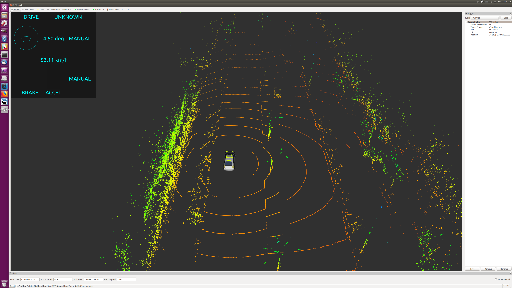

# Autoware rviz plugins

rviz plugins for Autoware.  
plugins in this package visualize vehicle status and vehicle command.  

## VehicleStatusMonitor
 

VehicleStatusMonitor plugins shows Vehicle Status (type:autoware_msgs/VehicleStatus) topic and Control Mode (std_msgs/String) topic.  
Vehicle Status topic usually published by can_status_translator node in autoware_connector package.  
Control Mode topic usually published by twist_gate node in waypoint_folloer package.  
