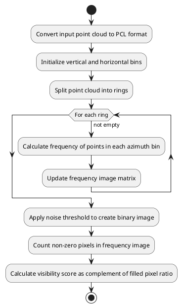

# ring_outlier_filter

## Purpose

The purpose is to remove point cloud noise such as insects and rain.

## Inner-workings / Algorithms

A method of operating scan in chronological order and removing noise based on the rate of change in the distance between points

Another feature of this node is that it calculates visibility score based on outlier pointcloud and publish score as a topic.

### visibility score calculation algorithm

The pointcloud is divided into vertical bins (rings) and horizontal bins (azimuth divisions).
The algorithm starts by splitting the input point cloud into separate rings based on the ring value of each point. Then, for each ring, it iterates through the points and calculates the frequency of points within each horizontal bin. The frequency is determined by incrementing a counter for the corresponding bin based on the point's azimuth value.
The frequency values are stored in a frequency image matrix, where each cell represents a specific ring and azimuth bin. After calculating the frequency image, the algorithm applies a noise threshold to create a binary image. Points with frequency values above the noise threshold are considered valid, while points below the threshold are considered noise.
Finally, the algorithm calculates the visibility score by counting the number of non-zero pixels in the frequency image and dividing it by the total number of pixels (vertical bins multiplied by horizontal bins).

## Inputs / Outputs

This implementation inherits `autoware::pointcloud_preprocessor::Filter` class, please refer [README](../README.md).

## Parameters

### Node Parameters

This implementation inherits `autoware::pointcloud_preprocessor::Filter` class, please refer [README](../README.md).

### Core Parameters

| Name                         | Type    | Default Value | Description                                                                                                                   |
| ---------------------------- | ------- | ------------- | ----------------------------------------------------------------------------------------------------------------------------- |
| `distance_ratio`             | double  | 1.03          |                                                                                                                               |
| `object_length_threshold`    | double  | 0.1           |                                                                                                                               |
| `num_points_threshold`       | int     | 4             |                                                                                                                               |
| `max_rings_num`              | uint_16 | 128           |                                                                                                                               |
| `max_points_num_per_ring`    | size_t  | 4000          | Set this value large enough such that `HFoV / resolution < max_points_num_per_ring`                                           |
| `publish_outlier_pointcloud` | bool    | false         | Flag to publish outlier pointcloud and visibility score. Due to performance concerns, please set to false during experiments. |
| `min_azimuth_deg`            | float   | 0.0           | The left limit of azimuth for visibility score calculation                                                                    |
| `max_azimuth_deg`            | float   | 360.0         | The right limit of azimuth for visibility score calculation                                                                   |
| `max_distance`               | float   | 12.0          | The limit distance for visibility score calculation                                                                           |
| `vertical_bins`              | int     | 128           | The number of vertical bin for visibility histogram                                                                           |
| `horizontal_bins`            | int     | 36            | The number of horizontal bin for visibility histogram                                                                         |
| `noise_threshold`            | int     | 2             | The threshold value for distinguishing noise from valid points in the frequency image                                         |

## Assumptions / Known limits

This nodes requires that the points of the input point cloud are in chronological order and that individual points follow the memory layout specified by [PointXYZIRCAEDT](../../../common/autoware_point_types/include/autoware_point_types/types.hpp#L95-L116).

## (Optional) Error detection and handling

## (Optional) Performance characterization

## (Optional) References/External links

## (Optional) Future extensions / Unimplemented parts
