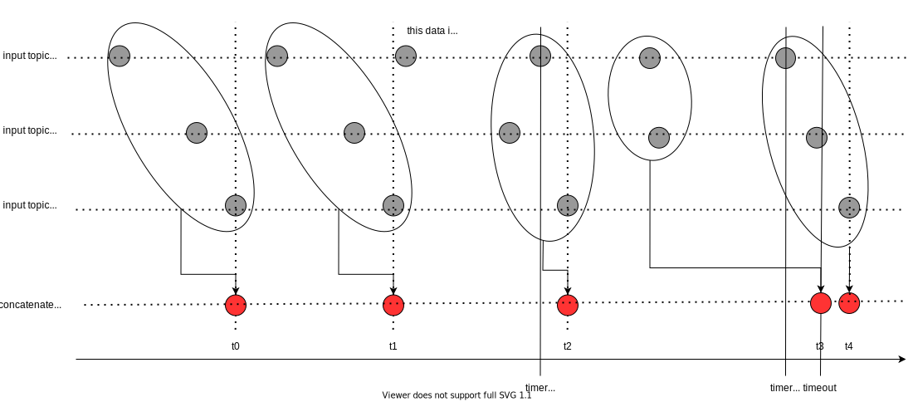

# concatenate_data

## Purpose

Many self-driving cars combine multiple LiDARs to expand the sensing range. Therefore, a function to combine a plurality of point clouds is required.

To combine multiple sensor data with a similar timestamp, the [message_filters](https://github.com/ros2/message_filters) is often used in the ROS-based system, but this requires the assumption that all inputs can be received. Since safety must be strongly considered in autonomous driving, the point clouds concatenate node must be designed so that even if one sensor fails, the remaining sensor information can be output.

## Inner-workings / Algorithms

The figure below represents the reception time of each sensor data and how it is combined in the case.

## Inputs / Outputs

### Input

| Name            | Type                                              | Description                                                                   |
| --------------- | ------------------------------------------------- | ----------------------------------------------------------------------------- |
| `~/input/twist` | `autoware_auto_vehicle_msgs::msg::VelocityReport` | The vehicle odometry is used to interpolate the timestamp of each sensor data |

### Output

| Name              | Type                            | Description               |
| ----------------- | ------------------------------- | ------------------------- |
| `~/output/points` | `sensor_msgs::msg::Pointcloud2` | concatenated point clouds |

## Parameters

| Name             | Type             | Default Value | Description                                                         |
| ---------------- | ---------------- | ------------- | ------------------------------------------------------------------- |
| `input/points`   | vector of string | []            | input topic names that type must be `sensor_msgs::msg::Pointcloud2` |
| `input_frame`    | string           | ""            | input frame id                                                      |
| `output_frame`   | string           | ""            | output frame id                                                     |
| `max_queue_size` | int              | 5             | max queue size of input/output topics                               |

### Core Parameters

| Name          | Type   | Default Value | Description                                                                                                                                                                              |
| ------------- | ------ | ------------- | ---------------------------------------------------------------------------------------------------------------------------------------------------------------------------------------- |
| `timeout_sec` | double | 0.1           | tolerance of time to publish next pointcloud [s] When this time limit is exceeded, the filter concatenates and publishes pointcloud, even if not all the point clouds are subscribed. |

## Assumptions / Known limits

It is necessary to assume that the vehicle odometry value exists, the sensor data and odometry timestamp are correct, and the TF from `base_link` to `sensor_frame` is also correct.
