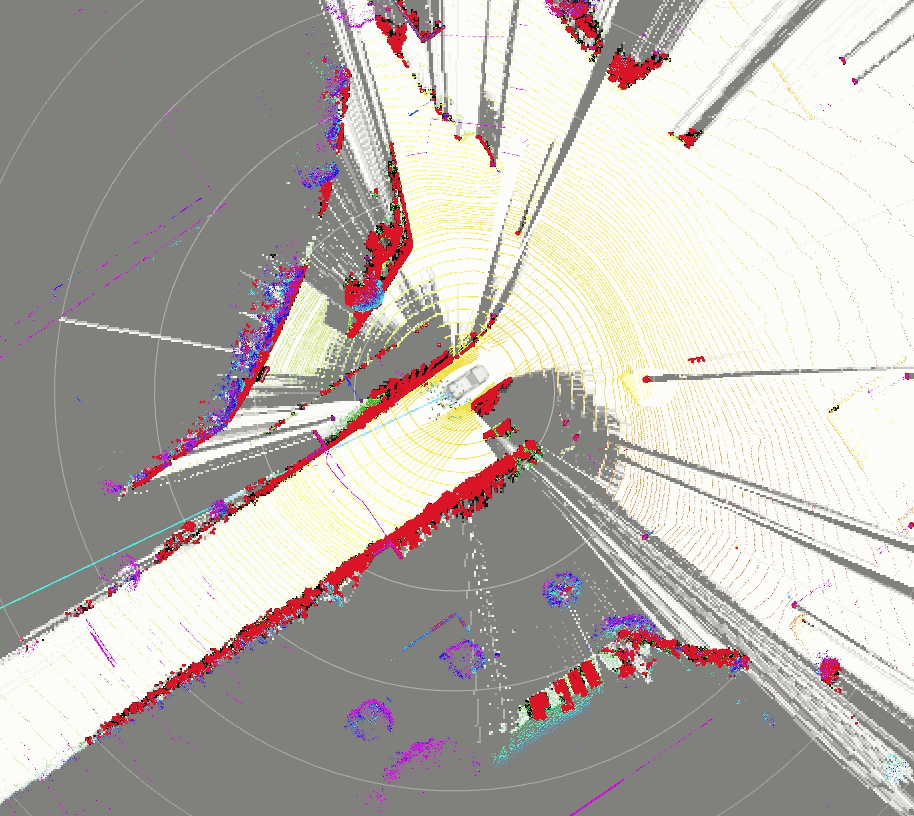

# probabilistic_occupancy_grid_map

## Purpose

This package outputs the probability of having an obstacle as occupancy grid map.

## References/External links

- [Pointcloud based occupancy grid map](pointcloud-based-occupancy-grid-map.md)
- [Laserscan based occupancy grid map](laserscan-based-occupancy-grid-map.md)
