# fault_injection

## Purpose

This package is used to convert pseudo system faults from PSim to Diagnostics and notify Autoware.
The component diagram is as follows:



## Test

```bash
source install/setup.bash
cd fault_injection
launch_test test/test_fault_injection_node.test.py
```

## Inner-workings / Algorithms

## Inputs / Outputs

### Input

| Name                        | Type                                           | Description       |
| --------------------------- | ---------------------------------------------- | ----------------- |
| `~/input/simulation_events` | `tier4_simulation_msgs::msg::SimulationEvents` | simulation events |

### Output

| Name           | Type                                    | Description       |
| -------------- | --------------------------------------- | ----------------- |
| `/diagnostics` | `diagnostic_msgs::msg::DiagnosticArray` | Dummy diagnostics |

## Parameters

None.

### Node Parameters

None.

### Core Parameters

None.

## Assumptions / Known limits

TBD.
