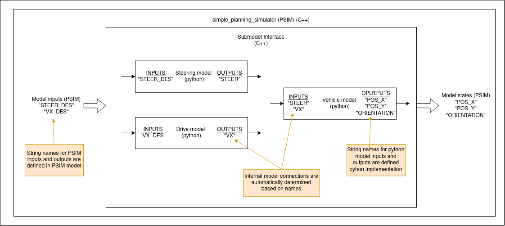

# Learned Model

This is the design document for the Python learned model used in the `simple_planning_simulator` package.

## Purpose / Use cases

<!-- Required -->
<!-- Things to consider:
    - Why did we implement this feature? -->

This library creates an interface between models in Python and PSIM (C++). It is used to quickly deploy learned Python models in PSIM without a need for complex C++ implementation.

## Design

<!-- Required -->
<!-- Things to consider:
    - How does it work? -->

The idea behind this package is that the model we want to use for simulation consists of multiple sub-models (e.g., steering model, drive model, vehicle kinematics, etc.). These sub-models are implemented in Python and can be trainable. Each sub-model has string names for all of its inputs/outputs, which are used to create model interconnections automatically (see image below). This allows us to easily switch sub-models for better customization of the simulator.



## Assumptions / Known limits

<!-- Required -->

To use this package `python3` and `pybind11` need to be installed. The only assumption on Python sub-models is their interface.

```python
class PythonSubmodelInterface:

    def forward(self, action, state):  # Required
        """
        Calculate forward pass through the model and returns next_state.
        """
        return list()

    def get_state_names(self):  # Required
        """
        Return list of string names of the model states (outputs).
        """
        return list()

    def get_action_names(self):  # Required
        """
        Return list of string names of the model actions (inputs).
        """
        return list()

    def reset(self):  # Required
        """
        Reset model. This function is called after load_params().
        """
        pass

    def load_params(self, path):  # Required
        """
        Load parameters of the model.
        Inputs:
            - path: Path to a parameter file to load by the model.
        """
        pass

    def dtSet(self, dt):  # Required
        """
        Set dt of the model.
        Inputs:
            - dt: time step
        """
        pass
```

## API

<!-- Required -->
<!-- Things to consider:
    - How do you use the package / API? -->

To successfully create a vehicle model an InterconnectedModel class needs to be set up correctly.

### InterconnectedModel class

#### `Constructor`

The constructor takes no arguments.

#### `void addSubmodel(std::tuple<std::string, std::string, std::string> model_descriptor)`

Add a new sub-model to the model.

Inputs:

- model_descriptor: Describes what model should be used. The model descriptor contains three strings:
  - The first string is a path to a python module where the model is implemented.
  - The second string is a path to the file where model parameters are stored.
  - The third string is the name of the class that implements the model.

Outputs:

- None

#### `void generateConnections(std::vector<char *> in_names, std::vector<char*> out_names)`

Generate connections between sub-models and inputs/outputs of the model.

Inputs:

- in_names: String names for all of the model inputs in order.
- out_names: String names for all of the model outputs in order.

Outputs:

- None

#### `void initState(std::vector<double> new_state)`

Set the initial state of the model.

Inputs:

- new_state: New state of the model.

Outputs:

- None

#### `std::vector<double> updatePyModel(std::vector<double> psim_input)`

Calculate the next state of the model by calculating the next state of all of the sub-models.

Inputs:

- psim_input: Input to the model.

Outputs:

- next_state: Next state of the model.

#### `dtSet(double dt)`

Set the time step of the model.

Inputs:

- dt: time step

Outputs:

- None

### Example

Firstly we need to set up the model.

```C++
InterconnectedModel vehicle;

// Example of model descriptors
std::tuple<char*, char*, char*> model_descriptor_1 = {
    (char*)"path_to_python_module_with_model_class_1",
    (char*)nullptr,  // If no param file is needed you can pass 'nullptr'
    (char*)"ModelClass1"
    };

std::tuple<char*, char*, char*> model_descriptor_2 =   {
    (char*)"path_to_python_module_with_model_class_2",
    (char*)"/path_to/param_file",
    (char*)"ModelClass2"  // Name of the python class. Needs to use the interface from 'Assumptions'
    };

// Create sub-models based on descriptors
vehicle.addSubmodel(model_descriptor_1);
vehicle.addSubmodel(model_descriptor_2);

// Define STATE and INPUT names of the system
std::vector<char*> state_names = {(char*)"STATE_NAME_1", (char*)"STATE_NAME_2"};
std::vector<char*> input_names = {(char*)"INPUT_NAME_1", (char*)"INPUT_NAME_2"};

// Automatically connect sub-systems with model input
vehicle.generateConnections(input_names, state_names);

// Set the time step of the model
vehicle.dtSet(dt);
```

After the model is correctly set up, we can use it the following way.

```C++
// Example of an model input
std::vector<double> vehicle_input = {0.0, 1.0}; // INPUT_NAME_1, INPUT_NAME_2

// Example of an model state
std::vector<double> current_state = {0.2, 0.5}; // STATE_NAME_1, STATE_NAME_2

// Set model state
vehicle.initState(current_state);

// Calculate the next state of the model
std::vector<double> next_state = vehicle.updatePyModel(vehicle_input);
```

## References / External links

<!-- Optional -->

## Related issues

<!-- Required -->
