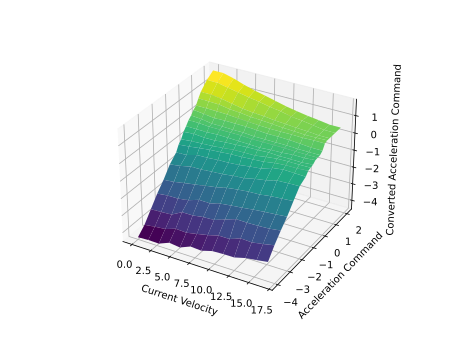
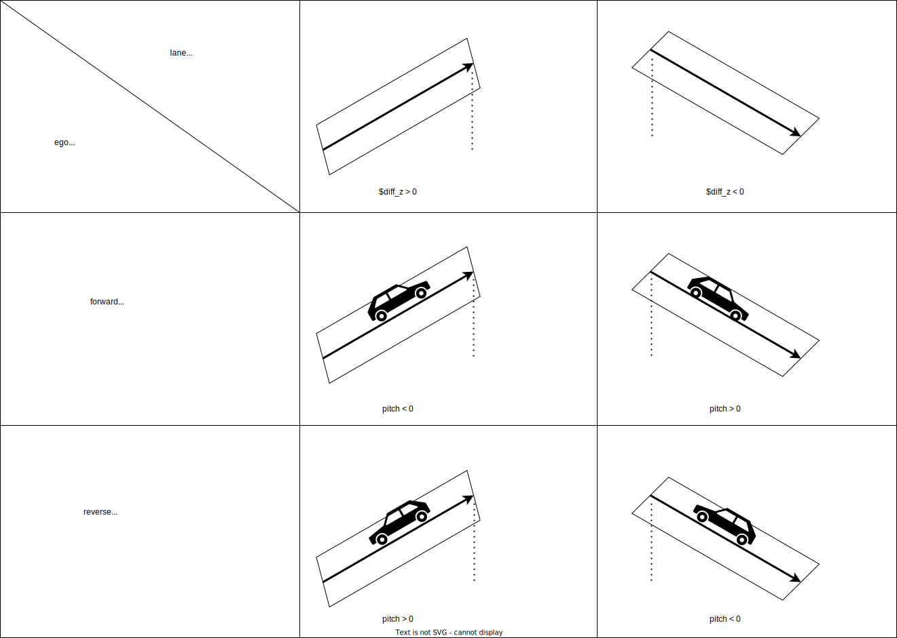

# simple_planning_simulator

## Purpose / Use cases

This node simulates the vehicle motion for a vehicle command in 2D using a simple vehicle model.

## Design

The purpose of this simulator is for the integration test of planning and control modules. This does not simulate sensing or perception, but is implemented in pure c++ only and works without GPU.

## Assumptions / Known limits

- It simulates only in 2D motion.
- It does not perform physical operations such as collision and sensing, but only calculates the integral results of vehicle dynamics.

## Inputs / Outputs / API

### input

- input/initialpose [`geometry_msgs/msg/PoseWithCovarianceStamped`] : for initial pose
- input/ackermann_control_command [`autoware_control_msgs/msg/Control`] : target command to drive a vehicle
- input/manual_ackermann_control_command [`autoware_control_msgs/msg/Control`] : manual target command to drive a vehicle (used when control_mode_request = Manual)
- input/gear_command [`autoware_vehicle_msgs/msg/GearCommand`] : target gear command.
- input/manual_gear_command [`autoware_vehicle_msgs/msg/GearCommand`] : target gear command (used when control_mode_request = Manual)
- input/turn_indicators_command [`autoware_vehicle_msgs/msg/TurnIndicatorsCommand`] : target turn indicator command
- input/hazard_lights_command [`autoware_vehicle_msgs/msg/HazardLightsCommand`] : target hazard lights command
- input/control_mode_request [`tier4_vehicle_msgs::srv::ControlModeRequest`] : mode change for Auto/Manual driving

### output

- /tf [`tf2_msgs/msg/TFMessage`] : simulated vehicle pose (base_link)
- /output/odometry [`nav_msgs/msg/Odometry`] : simulated vehicle pose and twist
- /output/steering [`autoware_vehicle_msgs/msg/SteeringReport`] : simulated steering angle
- /output/control_mode_report [`autoware_vehicle_msgs/msg/ControlModeReport`] : current control mode (Auto/Manual)
- /output/gear_report [`autoware_vehicle_msgs/msg/ControlModeReport`] : simulated gear
- /output/turn_indicators_report [`autoware_vehicle_msgs/msg/ControlModeReport`] : simulated turn indicator status
- /output/hazard_lights_report [`autoware_vehicle_msgs/msg/ControlModeReport`] : simulated hazard lights status

## Inner-workings / Algorithms

### Common Parameters

| Name                  | Type   | Description                                                                                                                                | Default value        |
| :-------------------- | :----- | :----------------------------------------------------------------------------------------------------------------------------------------- | :------------------- |
| simulated_frame_id    | string | set to the child_frame_id in output tf                                                                                                     | "base_link"          |
| origin_frame_id       | string | set to the frame_id in output tf                                                                                                           | "odom"               |
| initialize_source     | string | If "ORIGIN", the initial pose is set at (0,0,0). If "INITIAL_POSE_TOPIC", node will wait until the `input/initialpose` topic is published. | "INITIAL_POSE_TOPIC" |
| add_measurement_noise | bool   | If true, the Gaussian noise is added to the simulated results.                                                                             | true                 |
| pos_noise_stddev      | double | Standard deviation for position noise                                                                                                      | 0.01                 |
| rpy_noise_stddev      | double | Standard deviation for Euler angle noise                                                                                                   | 0.0001               |
| vel_noise_stddev      | double | Standard deviation for longitudinal velocity noise                                                                                         | 0.0                  |
| angvel_noise_stddev   | double | Standard deviation for angular velocity noise                                                                                              | 0.0                  |
| steer_noise_stddev    | double | Standard deviation for steering angle noise                                                                                                | 0.0001               |

### Vehicle Model Parameters

#### vehicle_model_type options

- `IDEAL_STEER_VEL`
- `IDEAL_STEER_ACC`
- `IDEAL_STEER_ACC_GEARED`
- `DELAY_STEER_VEL`
- `DELAY_STEER_ACC`
- `DELAY_STEER_ACC_GEARED`
- `DELAY_STEER_ACC_GEARED_WO_FALL_GUARD`
- `DELAY_STEER_MAP_ACC_GEARED`: applies 1D dynamics and time delay to the steering and acceleration commands. The simulated acceleration is determined by a value converted through the provided acceleration map. This model is valuable for an accurate simulation with acceleration deviations in a real vehicle.
- `LEARNED_STEER_VEL`: launches learned python models. More about this [here](../learning_based_vehicle_model).
- `ACTUATION_CMD`: A simulator model that receives `ACTUATION_CMD`. In this case, the `raw_vehicle_cmd_converter` is also launched.

The `IDEAL` model moves ideally as commanded, while the `DELAY` model moves based on a 1st-order with time delay model. The `STEER` means the model receives the steer command. The `VEL` means the model receives the target velocity command, while the `ACC` model receives the target acceleration command. The `GEARED` suffix means that the motion will consider the gear command: the vehicle moves only one direction following the gear.

The table below shows which models correspond to what parameters. The model names are written in abbreviated form (e.g. IDEAL_STEER_VEL = I_ST_V).

| Name                       | Type   | Description                                                                                                 | I_ST_V | I_ST_A | I_ST_A_G | D_ST_V | D_ST_A | D_ST_A_G | D_ST_A_G_WO_FG | D_ST_M_ACC_G | L_S_V | Default value | unit    |
| :------------------------- | :----- | :---------------------------------------------------------------------------------------------------------- | :----- | :----- | :------- | :----- | :----- | :------- | :------------- | :----------- | :---- | :------------ | :------ |
| acc_time_delay             | double | dead time for the acceleration input                                                                        | x      | x      | x        | x      | o      | o        | o              | o            | x     | 0.1           | [s]     |
| steer_time_delay           | double | dead time for the steering input                                                                            | x      | x      | x        | o      | o      | o        | o              | o            | x     | 0.24          | [s]     |
| vel_time_delay             | double | dead time for the velocity input                                                                            | x      | x      | x        | o      | x      | x        | x              | x            | x     | 0.25          | [s]     |
| acc_time_constant          | double | time constant of the 1st-order acceleration dynamics                                                        | x      | x      | x        | x      | o      | o        | o              | o            | x     | 0.1           | [s]     |
| steer_time_constant        | double | time constant of the 1st-order steering dynamics                                                            | x      | x      | x        | o      | o      | o        | o              | o            | x     | 0.27          | [s]     |
| steer_dead_band            | double | dead band for steering angle                                                                                | x      | x      | x        | o      | o      | o        | o              | x            | x     | 0.0           | [rad]   |
| vel_time_constant          | double | time constant of the 1st-order velocity dynamics                                                            | x      | x      | x        | o      | x      | x        | x              | x            | x     | 0.5           | [s]     |
| vel_lim                    | double | limit of velocity                                                                                           | x      | x      | x        | o      | o      | o        | o              | o            | x     | 50.0          | [m/s]   |
| vel_rate_lim               | double | limit of acceleration                                                                                       | x      | x      | x        | o      | o      | o        | o              | o            | x     | 7.0           | [m/ss]  |
| steer_lim                  | double | limit of steering angle                                                                                     | x      | x      | x        | o      | o      | o        | o              | o            | x     | 1.0           | [rad]   |
| steer_rate_lim             | double | limit of steering angle change rate                                                                         | x      | x      | x        | o      | o      | o        | o              | o            | x     | 5.0           | [rad/s] |
| steer_bias                 | double | bias for steering angle                                                                                     | x      | x      | x        | o      | o      | o        | o              | o            | x     | 0.0           | [rad]   |
| debug_acc_scaling_factor   | double | scaling factor for accel command                                                                            | x      | x      | x        | x      | o      | o        | o              | x            | x     | 1.0           | [-]     |
| debug_steer_scaling_factor | double | scaling factor for steer command                                                                            | x      | x      | x        | x      | o      | o        | o              | x            | x     | 1.0           | [-]     |
| acceleration_map_path      | string | path to csv file for acceleration map which converts velocity and ideal acceleration to actual acceleration | x      | x      | x        | x      | x      | x        | x              | o            | x     | -             | [-]     |
| model_module_paths         | string | path to a python module where the model is implemented                                                      | x      | x      | x        | x      | x      | x        | x              | x            | o     | -             | [-]     |
| model_param_paths          | string | path to the file where model parameters are stored (can be empty string if no parameter file is required)   | x      | x      | x        | x      | x      | x        | x              | x            | o     | -             | [-]     |
| model_class_names          | string | name of the class that implements the model                                                                 | x      | x      | x        | x      | x      | x        | x              | x            | o     | -             | [-]     |

_Note:_ Parameters `model_module_paths`, `model_param_paths`, and `model_class_names` need to have the same length.

The `acceleration_map` is used only for `DELAY_STEER_MAP_ACC_GEARED` and it shows the acceleration command on the vertical axis and the current velocity on the horizontal axis, with each cell representing the converted acceleration command that is actually used in the simulator's motion calculation. Values in between are linearly interpolated.

Example of `acceleration_map.csv`

```csv
default,  0.00,  1.39,  2.78,  4.17,  5.56,  6.94,  8.33,  9.72, 11.11, 12.50, 13.89, 15.28, 16.67
-4.0,    -4.40, -4.36, -4.38, -4.12, -4.20, -3.94, -3.98, -3.80, -3.77, -3.76, -3.59, -3.50, -3.40
-3.5,    -4.00, -3.91, -3.85, -3.64, -3.68, -3.55, -3.42, -3.24, -3.25, -3.00, -3.04, -2.93, -2.80
-3.0,    -3.40, -3.37, -3.33, -3.00, -3.00, -2.90, -2.88, -2.65, -2.43, -2.44, -2.43, -2.39, -2.30
-2.5,    -2.80, -2.72, -2.72, -2.62, -2.41, -2.43, -2.26, -2.18, -2.11, -2.03, -1.96, -1.91, -1.85
-2.0,    -2.30, -2.24, -2.12, -2.02, -1.92, -1.81, -1.67, -1.58, -1.51, -1.49, -1.40, -1.35, -1.30
-1.5,    -1.70, -1.61, -1.47, -1.46, -1.40, -1.37, -1.29, -1.24, -1.10, -0.99, -0.83, -0.80, -0.78
-1.0,    -1.30, -1.28, -1.10, -1.09, -1.04, -1.02, -0.98, -0.89, -0.82, -0.61, -0.52, -0.54, -0.56
-0.8,    -0.96, -0.90, -0.82, -0.74, -0.70, -0.65, -0.63, -0.59, -0.55, -0.44, -0.39, -0.39, -0.35
-0.6,    -0.77, -0.71, -0.67, -0.65, -0.58, -0.52, -0.51, -0.50, -0.40, -0.33, -0.30, -0.31, -0.30
-0.4,    -0.45, -0.40, -0.45, -0.44, -0.38, -0.35, -0.31, -0.30, -0.26, -0.30, -0.29, -0.31, -0.25
-0.2,    -0.24, -0.24, -0.25, -0.22, -0.23, -0.25, -0.27, -0.29, -0.24, -0.22, -0.17, -0.18, -0.12
 0.0,     0.00,  0.00, -0.05, -0.05, -0.05, -0.05, -0.08, -0.08, -0.08, -0.08, -0.10, -0.10, -0.10
 0.2,     0.16,  0.12,  0.02,  0.02,  0.00,  0.00, -0.05, -0.05, -0.05, -0.05, -0.08, -0.08, -0.08
 0.4,     0.38,  0.30,  0.22,  0.25,  0.24,  0.23,  0.20,  0.16,  0.16,  0.14,  0.10,  0.05,  0.05
 0.6,     0.52,  0.52,  0.51,  0.49,  0.43,  0.40,  0.35,  0.33,  0.33,  0.33,  0.32,  0.34,  0.34
 0.8,     0.82,  0.81,  0.78,  0.68,  0.63,  0.56,  0.53,  0.48,  0.43,  0.41,  0.37,  0.38,  0.40
 1.0,     1.00,  1.08,  1.01,  0.88,  0.76,  0.69,  0.66,  0.58,  0.54,  0.49,  0.45,  0.40,  0.40
 1.5,     1.52,  1.50,  1.38,  1.26,  1.14,  1.03,  0.91,  0.82,  0.67,  0.61,  0.51,  0.41,  0.41
 2.0,     1.80,  1.80,  1.64,  1.43,  1.25,  1.11,  0.96,  0.81,  0.70,  0.59,  0.51,  0.42,  0.42
```



##### ACTUATION_CMD model

The simple_planning_simulator usually operates by receiving Control commands, but when the `ACTUATION_CMD` model is selected, it receives Actuation commands instead of Control commands. This model can simulate the motion using the vehicle command that is actually sent to the real vehicle. Therefore, when this model is selected, the `raw_vehicle_cmd_converter` is also launched.

`convert_steer_cmd_method` has two options: "vgr" and "steer_map". If you choose "vgr" (variable gear ratio), it is assumed that the steering wheel angle is sent as the actuation command, and the value is converted to the steering tire angle to move the model. If you choose "steer_map", it is assumed that an arbitrary value is sent as the actuation command, and the value is converted to the steering tire rate to move the model. An arbitrary value is like EPS (Electric Power Steering) Voltage . `enable_pub_steer` determines whether to publish the steering tire angle. If false, it is expected to be converted and published from actuation_status in other nodes (e.g. raw_vehicle_cmd_converter).


```yaml

```

The parameters used in the ACTUATION_CMD are as follows.

| Name                     | Type   | Description                                                                                                                                                              | unit |
| :----------------------- | :----- | :----------------------------------------------------------------------------------------------------------------------------------------------------------------------- | :--- |
| accel_time_delay         | double | dead time for the acceleration input                                                                                                                                     | [s]  |
| accel_time_constant      | double | time constant of the 1st-order acceleration dynamics                                                                                                                     | [s]  |
| brake_time_delay         | double | dead time for the brake input                                                                                                                                            | [s]  |
| brake_time_constant      | double | time constant of the 1st-order brake dynamics                                                                                                                            | [s]  |
| convert_accel_cmd        | bool   | If true, it is assumed that the command is received converted to an accel actuation value, and it is converted back to acceleration value inside the simulator.          | [-]  |
| convert_brake_cmd        | bool   | If true, it is assumed that the command is received converted to a brake actuation value, and it is converted back to acceleration value inside the simulator.           | [-]  |
| convert_steer_cmd        | bool   | If true, it is assumed that the command is received converted to a steer actuation value, and it is converted back to steer rate value inside the simulator.             | [-]  |
| convert_steer_cmd_method | bool   | method to convert steer command. You can choose from "vgr" and "steer_map".                                                                                              | [-]  |
| vgr_coef_a               | double | the value of the coefficient a of the variable gear ratio                                                                                                                | [-]  |
| vgr_coef_b               | double | the value of the coefficient b of the variable gear ratio                                                                                                                | [-]  |
| vgr_coef_c               | double | the value of the coefficient c of the variable gear ratio                                                                                                                | [-]  |
| enable_pub_steer         | bool   | whether to publish the steering tire angle. if false, it is expected to be converted and published from actuation_status in other nodes (e.g. raw_vehicle_cmd_converter) | [-]  |

<!-- deadzone_delta_steer | double | dead zone for the steering dynamics                  | x      | x      | x        | o      | o      | 0.0      | [rad]         |         | -->

_Note_: The steering/velocity/acceleration dynamics is modeled by a first order system with a deadtime in a _delay_ model. The definition of the _time constant_ is the time it takes for the step response to rise up to 63% of its final value. The _deadtime_ is a delay in the response to a control input.

### Example of LEARNED_STEER_VEL model

We created a few basic models to showcase how `LEARNED_STEER_VEL` works.

1. Install [a library](https://github.com/atomyks/control_analysis_pipeline/tree/v0.1_autoware) that contains basic Python models. (branch: `v0.1_autoware`)

2. In a file `src/vehicle/sample_vehicle_launch/sample_vehicle_description/config/simulator_model.param.yaml` set `vehicle_model_type` to `LEARNED_STEER_VEL`. In the same file set the following parameters. These models are for testing and do not require any parameter file.

```yaml
model_module_paths:
  [
    "control_analysis_pipeline.autoware_models.vehicle.kinematic",
    "control_analysis_pipeline.autoware_models.steering.steer_example",
    "control_analysis_pipeline.autoware_models.drive.drive_example",
  ]
model_param_paths: ["", "", ""]
model_class_names: ["KinematicModel", "SteerExample", "DriveExample"]
```

### Default TF configuration

Since the vehicle outputs `odom`->`base_link` tf, this simulator outputs the tf with the same frame_id configuration.
In the simple_planning_simulator.launch.py, the node that outputs the `map`->`odom` tf, that usually estimated by the localization module (e.g. NDT), will be launched as well. Since the tf output by this simulator module is an ideal value, `odom`->`map` will always be 0.

### (Caveat) Pitch calculation

Ego vehicle pitch angle is calculated in the following manner.



NOTE: driving against the line direction (as depicted in image's bottom row) is not supported and only shown for illustration purposes.

## Error detection and handling

The only validation on inputs being done is testing for a valid vehicle model type.

## Security considerations

<!-- Required -->
<!-- Things to consider:
- Spoofing (How do you check for and handle fake input?)
- Tampering (How do you check for and handle tampered input?)
- Repudiation (How are you affected by the actions of external actors?).
- Information Disclosure (Can data leak?).
- Denial of Service (How do you handle spamming?).
- Elevation of Privilege (Do you need to change permission levels during execution?) -->

## References / External links

This is originally developed in the Autoware.AI. See the link below.

<https://github.com/Autoware-AI/simulation/tree/master/wf_simulator>

## Future extensions / Unimplemented parts

- Improving the accuracy of vehicle models (e.g., adding steering dead zones and slip behavior)
- Cooperation with modules that output pseudo pointcloud or pseudo perception results
