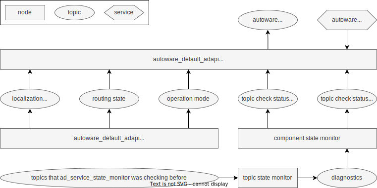

# Autoware state compatibility

## Overview

Since `/autoware/state` was so widely used, this packages creates it from the states of AD API for backwards compatibility.
The diagnostic checks that ad_service_state_monitor used to perform have been replaced by component_state_monitor.
The service `/autoware/shutdown` to change autoware state to finalizing is also supported for compatibility.

## Conversion

This is the correspondence between AD API states and autoware states.
The launch state is the data that this node holds internally.

